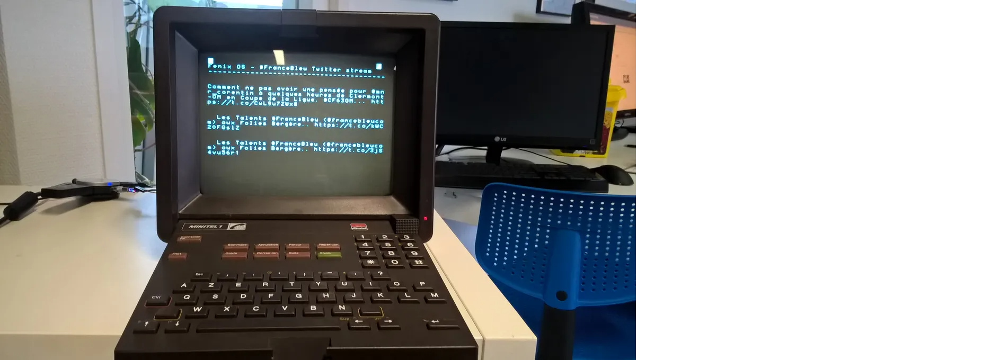
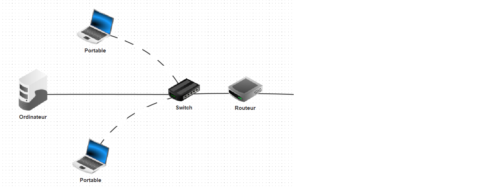
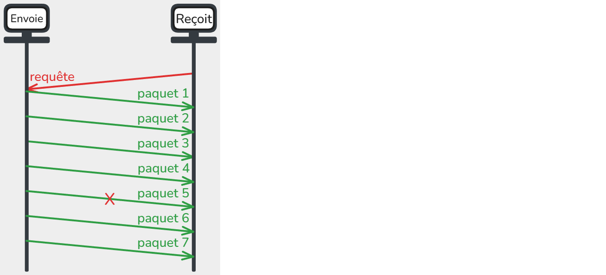

# Les Réseaux

## Histoire des réseaux de communication

### Les tours génoises

Au XVIᵉ siècle, sur les côtes méditerranéennes (notamment en Corse), on érigeait de grandes tours de pierre : les **tours génoises**. Leur rôle n’était pas décoratif, mais stratégique. Elles servaient à **prévenir les attaques de pirates**.

Les guetteurs, postés au sommet, communiquaient entre tours grâce à **des signaux visuels** : de la **fumée le jour**, du **feu la nuit**. Ainsi, un message pouvait parcourir des dizaines de kilomètres en quelques minutes. C’était déjà une forme de **réseau de communication**.

Mais ce réseau avait ses limites : il ne fonctionnait que **si la visibilité était bonne** et nécessitait **une vigilance permanente**. La communication restait donc lente, ponctuelle et tributaire de la météo.


---

### Les sémaphores et le télégraphe optique

Deux siècles plus tard, en pleine Révolution française, un ingénieur nommé **Claude Chappe** imagine un système plus fiable : le **télégraphe optique**, ou **sémaphore**. Chaque tour est équipée d’un grand mât muni de bras articulés. Selon leur position, ils forment des lettres ou des symboles que les opérateurs lisent à la longue-vue avant de les reproduire sur la tour suivante.

En 1794, Chappe parvient à transmettre un message de Paris à Lille en quelques minutes : une prouesse pour l’époque. La France se couvre alors d’un vaste réseau de tours, véritables ancêtres des relais de communication modernes.

Mais le système reste dépendant du jour et du beau temps.


---

### Le télégraphe électrique

Au milieu du XIXᵉ siècle, une révolution se prépare : l’électricité entre en scène. L’Américain **Samuel Morse** met au point un télégraphe capable d’envoyer des **impulsions électriques** à travers un fil métallique. Chaque impulsion correspond à un **point** ou un **trait** : c’est le **code Morse**. Grâce à lui, les messages peuvent être transmis **en temps réel sur des centaines de kilomètres**. En 1858, le premier **câble transatlantique** relie l’Europe à l’Amérique. Le monde commence à se rétrécir.


---

### Le téléphone

En 1876, **Alexander Graham Bell** dépose le brevet du **téléphone**. Pour la première fois, la voix humaine traverse les fils électriques. Les signaux ne sont plus codés : ils deviennent **sonores**.

Le téléphone change la société. Les distances s’effacent, les conversations deviennent immédiates, les relations commerciales s’accélèrent. C’est le premier véritable réseau mondial de communication **interpersonnelle**, celui des lignes téléphoniques.


---

### ARPANET

En 1969, au cœur de la guerre froide, les États-Unis cherchent un moyen de relier leurs ordinateurs pour **échanger des informations même en cas d’attaque**. La **DARPA**, agence du ministère de la Défense, crée **ARPANET**.

Ce réseau relie quatre universités américaines : UCLA, Stanford, Santa Barbara et Utah. Les chercheurs y testent une idée nouvelle : **la commutation de paquets**, qui consiste à découper les données en petits morceaux indépendants. Ce principe, toujours utilisé aujourd’hui, est à la base d’**Internet**.

Le premier message envoyé devait être « LOGIN »… mais le système s’est arrêté après deux lettres. Le premier mot d’Internet fut donc simplement **“LO”** .


---

### Le Minitel

Dans les années 1980, la France développe son propre réseau numérique : le **Minitel**. C’est un petit terminal branché sur la ligne téléphonique qui permet d’accéder à des services en ligne : annuaires, messageries, réservations, banques, petites annonces…

Bien avant Internet, le Minitel met des millions de Français en contact avec le monde numérique. C’est un **précurseur du Web**, avec son interface textuelle et son système d’adresses, comme le fameux « 3615 ».



---

### Internet

<iframe width="400" height="300"
        src="https://www.youtube.com/embed/NmSEJq4Mfk0"
        title="YouTube video player"
        frameborder="0"
        allow="accelerometer; autoplay; clipboard-write; encrypted-media; gyroscope; picture-in-picture"
        allowfullscreen>
</iframe>

Dans les années 1990, ARPANET devient **Internet**, un vaste ensemble de réseaux interconnectés à l’échelle planétaire. Internet repose sur le modéle **TCP/IP**, qui permet à toutes les machines du monde de parler le même langage.

Mais Internet n’est qu’une infrastructure. En 1989, **Tim Berners-Lee**, au CERN, invente le **World Wide Web**, un système qui permet de naviguer entre des documents reliés par des **liens hypertextes**. Grâce au Web et aux navigateurs comme **Mosaic**, **Netscape** ou plus tard **Chrome**, les informations deviennent accessibles à tous, en quelques clics.

Le Web transforme Internet en un **espace universel de partage, de savoir et de communication**.

Internet n’est pas une seule machine géante.  
C’est en réalité **un immense ensemble de réseaux interconnectés** :  

#### LAN

Les réseaux locaux (LAN, Local Area Network)

  - Exemple : votre maison (box Internet + ordinateurs + téléphones connectés en Wi-Fi ou en câble).  
  - Exemple : le réseau du lycée (salles informatiques, imprimantes, serveurs pédagogiques).  
  - Exemple : le réseau d’une entreprise.  

Ces réseaux sont **privés et limités dans l’espace** (on les appelle des **réseaux locaux**).



Les principaux composants d’un LAN incluent :  
- le **switch**, qui permet de connecter plusieurs ordinateurs entre eux et de gérer le trafic interne du réseau  
- le **routeur**, qui relie le LAN à d’autres réseaux, comme Internet   
- les **câbles Ethernet** assurent une connexion filaire fiable entre les appareils  
- le **Wi-Fi** permet aux appareils sans fil de se connecter au réseau  

#### Les Fournisseurs d’Accès à Internet (FAI)
Pour communiquer avec le reste du monde, un réseau local doit se connecter à un **Fournisseur d’Accès à Internet (FAI)** :  
- En France : Orange, SFR, Free, Bouygues, etc.  
- Dans d’autres pays : AT&T, Deutsche Telekom, etc.  

Un FAI gère un **réseau beaucoup plus vaste** qui relie des millions de clients.  

#### L’interconnexion mondiale
- Les réseaux des FAI sont eux-mêmes reliés **entre eux** par de très grandes lignes de communication (fibre optique, câbles sous-marins, satellites).  
- Les grandes entreprises (Google, Amazon, Microsoft, etc.) possèdent aussi leurs **propres réseaux** qui s’interconnectent avec les FAI.  

Résultat :  
Quand vous envoyez un message, il sort d’abord de votre réseau local → passe par le réseau de votre FAI → traverse plusieurs autres réseaux → atteint le réseau du destinataire.  


**Idée clé à retenir :**  
Internet, c’est **l’interconnexion de milliers de réseaux locaux et de fournisseurs d’accès** à l’échelle mondiale, qui communiquent tous grâce à des **protocoles communs**.

---

### Conclusion

En quelques siècles, l’humanité est passée des signaux de fumée aux flux d’informations mondiaux.  
Chaque invention a rapproché les hommes, accéléré les échanges et repoussé les frontières de la communication.  

---

## Modèle en couches TCP/IP

La communication sur un réseau se fait grâce à des protocoles, qui sont des règles définissant comment les données sont envoyées, reçues et comprises par les machines.

Le modéle TCP/IP organise la communication en **4 couches**, chacune ayant un rôle spécifique et ses protocoles.  

Quand on envoie un message ou un fichier sur Internet, il n’est jamais envoyé en un seul bloc, mais découpé en petits morceaux appelés **paquets**.  


Chaque couche y ajoute des informations spécifiques (adresse de destination, numéro du paquet, etc) avant de transmettre les données, c'est l'**encapsulation**.

À la réception, chaque couche retire son en-tête pour reconstituer les données originales c’est la **désencapsulation**.


## Les protocoles MAC et IP : l’adressage

Chaque appareil connecté à Internet doit être identifiable de manière **unique**.  
Pour cela, deux types d’adresses existent :

### Adresse MAC (adressage local)
Chaque appareil connecté à un réseau possède une **carte réseau** (ou interface réseau), qui permet d'envoyer et de recevoir des données. Chaque carte réseau possède une **adresse MAC** (Media Access Control), un identifiant unique attribué par le fabricant.

Un PC peut posséder **plusieurs cartes réseau**, par exemple une pour le câble Ethernet et une autre pour le Wi-Fi. Chaque carte a sa propre adresse MAC, ce qui signifie qu’un même ordinateur peut être identifié différemment selon le type de connexion utilisée.

L'adresse MAC est composée de **12 chiffres hexadécimaux**, souvent notés sous la forme `00:1A:2B:3C:4D:5E`. Elle permet d’identifier de manière unique chaque carte réseau sur un réseau local, un peu comme une **plaque d'immatriculation** pour une voiture.  

Contrairement à l'adresse IP, qui peut changer selon le réseau, l'adresse MAC reste **fixe et unique** pour chaque carte réseau. Les **switches** utilisent ces adresses MAC pour **diriger les données vers le bon appareil** sur le réseau local.

<span style="color:red">Exercices</span>  
```text
1. Combien d'adresses MAC possibles existe-t'il ?
2. Écrire 5 exemples d'adresses MAC différentes.
```

### Adresse IP (adressage global)

Chaque appareil connecté à un réseau possède une **adresse IP** (Internet Protocol), qui sert à l’identifier et à échanger des données avec d’autres appareils. Contrairement à l’adresse MAC, qui est **fixe et unique pour chaque carte réseau**, l’adresse IP peut **changer selon le réseau** auquel l’appareil est connecté.

#### Structure d’une adresse IP

Une adresse IP version 4 est composée de **4 nombres entre 0 et 255**, séparés par des points, par exemple `192.168.1.10`. Elle se divise en deux parties :

- La **partie réseau** : identifie le réseau auquel appartient l’appareil.
- La **partie hôte** : identifie l’appareil sur ce réseau.

Le **masque de sous-réseau** (subnet mask) sert à déterminer quelles parties de l’adresse IP correspondent au réseau et lesquelles correspondent à l’hôte. Par exemple, avec une adresse IP `192.168.1.10` et un masque `255.255.255.0` :

- Le **réseau** est `192.168.1.0`
- L’**hôte** est `10`

**La Notation CIDR** (Classless Inter-Domain Routing)  

Elle permet de représenter le réseau plus simplement. On écrit l’adresse suivie d’un **slash** et du nombre de bits utilisés pour la partie réseau.  

Par exemple :  

```
192.168.1.10/24
```
Le `/24` signifie que les 24 premiers bits de l’adresse correspondent le réseau (soit `255.255.255.0`)
et les 8 bits restants correspondent à l’hôte.

```
adresse en binaire : 11000000.10101000.00000001.00001010

masque (24 bits ici) : 11111111.11111111.11111111.00000000

donc la partie réseau est : 11000000.10101000.00000001.00000000
```
Il s'agit de l'adresse du réseau.

<span style="color:red">Exercices</span>  

**1) Combien d'adresses IP possibles existe-t'il ?**
  
**2) Écrire 5 exemples d'adresses IP différentes.**  
  
**3) Identifier le réseau et l’hôte**

Pour chaque adresse IP donnée, indique la **partie réseau** et la **partie hôte** en utilisant le masque fourni.

- Adresse : `192.168.1.25`  
   Masque : `255.255.255.0`  

- Adresse : `10.0.5.12`  
   Masque : `255.255.0.0`  

- Adresse : `172.16.7.34`  
   Masque : `255.255.255.240`  

**4) Déterminer si deux adresses sont sur le même réseau**

Indique si les adresses suivantes appartiennent **au même réseau**. Justifie ta réponse.
Si oui, donner 3 autres adresses possibles sur ce réseau.

- `192.168.1.10/24` et `192.168.1.200/24`  
- `10.1.5.7/16` et `10.2.3.10/16`  
- `172.16.5.20/28` et `172.16.5.25/28`  

**5) Conversion en binaire**

Convertis les adresses IP suivantes et leurs masques en **binaire**. Puis identifie la partie réseau et la partie hôte.

- `192.168.10.14/24`  
- `10.0.20.5/8`  
- `172.16.100.50/16`  

**6) Calculer le nombre d’hôtes**

Pour chaque réseau, calcule **le nombre maximum d’hôtes** possibles et indiquez la plage complète d’adresses.

- Réseau : `192.168.1.0/24`  
- Réseau : `10.0.0.0/16`  
- Réseau : `172.16.5.0/28`  

**7) Identifier le masque**

Pour chaque situation, propose le **masque le plus approprié** en notation CIDR pour le réseau.

- Un réseau doit contenir **50 hôtes maximum**.  
- Un réseau doit contenir **500 hôtes maximum**.  
- Un réseau doit contenir **12 hôtes maximum**.  

**8) IP et sous-réseaux**

Une entreprise possède le réseau `192.168.0.0/24`. Elle veut créer **4 sous-réseaux égaux**.  
- Quelle sera la **nouvelle notation CIDR** pour chaque sous-réseau ?  
- Donne l’**adresse réseau** de chaque sous-réseau.  
- Indique le **nombre d’hôtes possibles** dans chaque sous-réseau.

---

#### IPv6

Les adresses IP que nous avons utilisé jusque là correspondent au format IPv4. Utilisé depuis les débuts d’Internet, il ne permet pas d'avoir assez d'adresses pour palier à nos besoins actuels : avec la multiplication des ordinateurs, smartphones, objets connectés, consoles et serveurs, ce nombre est devenu insuffisant.  

Pour répondre à ce problème, une nouvelle version du protocole Internet a été créée : **IPv6**.

exemple d'adresse IPv6 : `2001:0db8:85a3:0000:0000:8a2e:0370:7334`

Pour simplifier, on peut **abréger** une adresse IPv6 :  
- Les **zéros initiaux** d’un groupe peuvent être supprimés :  
  `2001:db8:85a3:0:0:8a2e:370:7334`  
- Une suite de groupes `0000` peut être remplacée par `::` (une seule fois par adresse) :  
  `2001:db8:85a3::8a2e:370:7334`

<span style="color:red">Exercices</span>  

```text
1. Combien d'adresses IPv6 possibles existe-t'il ?

2. Écrire 5 exemples d'adresses IPv6 différentes.

3. Abrégez les adresses suivantes selon les règles IPv6 :

- 2001:0db8:0000:0000:0000:0000:0000:0001  
- fe80:0000:0000:0000:0202:b3ff:fe1e:8329  
- 2001:0db8:85a3:0000:0000:8a2e:0370:7334  
- 2001:0000:0000:0000:0000:0000:0000:0000  
- 0000:0000:0000:0000:0000:0000:0000:0001

4. Faites l’opération inverse :  
Développez complètement les adresses abrégées suivantes (ajoutez tous les zéros manquants) :

- 2001:db8::1  
- fe80::202:b3ff:fe1e:8329  
- ::1  
- 2001:db8:85a3::8a2e:370:7334  
- ::
```

### DNS – Domain Name System

Quand vous tapez un nom de site dans votre navigateur, par exemple `wikipedia.org`, votre ordinateur ne sait pas directement **où envoyer les paquets de données**.  
En réalité, les ordinateurs communiquent entre eux uniquement grâce à leurs **adresses IP**.

Mais comme il serait impossible de retenir toutes ces adresses, on utilise un système plus pratique : le **DNS**. Il s'agit d'un service qui fait la **correspondance entre un nom de domaine et son adresse IP**.

> Le DNS fonctionne comme un **annuaire d’Internet** :  
> On cherche un nom, il nous donne l’adresse numérique correspondante.

Exemple :  
`wikipedia.org` → `185.15.59.224`  
`google.fr` → `142.250.179.3`


1. On tape `wikipedia.org` dans le navigateur.  
2. Notre ordinateur demande à un **serveur DNS** quelle est l’adresse IP de ce site.  
3. Le serveur DNS répond avec l’adresse correspondante.  
4. Notre ordinateur peut alors **se connecter directement** à cette adresse IP.

#### Les serveurs DNS

Le système DNS n’est pas un seul gros ordinateur magique qui connaît toutes les adresses du monde.  
C’est un **réseau mondial de milliers de serveurs** répartis sur toute la planète, organisés de manière **hiérarchique** et **coopérative**.

> Grâce à ce système, la résolution d’un nom (comme `wikipedia.org`) se fait très rapidement, souvent en quelques millisecondes.

**Ce système permet de :**  
- **simplifier la vie des utilisateurs** : il est plus facile de retenir `lycee.fr` que `193.54.12.45`.  
- **pouvoir changer l’adresse IP d’un site** sans changer son nom (pratique quand un site change de serveur).  
- **contrôler et sécuriser les accès** à certains domaines (filtrage, redirection, etc.).  
- **accélérer la navigation** grâce au cache des serveurs DNS locaux.

---

## Les protocoles UDP et TCP : le routage

Pour que les données circulent sur Internet, il faut **plus qu'une adresse IP** :  
il faut aussi savoir **comment** les envoyer et les remettre dans le bon ordre.  
C’est le rôle des protocoles de transport, principalement **TCP** et **UDP**.

---

### Le protocole UDP (User Datagram Protocol)

UDP est beaucoup plus **rapide**, mais **non fiable**.  
Il envoie les paquets **sans vérifier** qu’ils sont bien reçus ni dans le bon ordre.  

C’est un peu comme envoyer plusieurs lettres sans accusé de réception : certaines peuvent se perdre, mais le message global passe plus vite.

 
#### Utilisations typiques :
- Streaming vidéo ou audio (YouTube, Spotify)  
- Jeux en ligne  
- Appels vocaux (Visioconférence)

---

### Le protocole TCP (Transmission Control Protocol)

TCP est un protocole **fiable** et **orienté connexion**.  
Avant d’envoyer les données, l’expéditeur et le destinataire **établissent une connexion** (comme un appel téléphonique).  

Chaque paquet envoyé reçoit un **numéro d’ordre** et une **confirmation de réception**.  
S’il manque un paquet, il est **renvoyé automatiquement**.

C’est donc un protocole **lent mais sûr** : il garantit que toutes les données arrivent **complètes et dans le bon ordre**.

 
#### Utilisations typiques :
- Navigation web (HTTP / HTTPS)  
- Envoi d’e-mails (SMTP, IMAP, POP3)  
- Transfert de fichiers (FTP, SFTP)

### Le bit alterné

Le **bit alterné** est un **modèle simple** pour comprendre comment assurer la **fiabilité** des échanges de données entre deux machines à travers un réseau.

Il permet à un émetteur et un récepteur de **communiquer sans erreur**, même si certains paquets sont perdus.

#### Principe général

L’idée est la suivante :
- Chaque message envoyé est accompagné d’un **bit** (0 ou 1) appelé **bit de séquence**.
- Le récepteur, lorsqu’il reçoit correctement le message, renvoie un **accusé de réception (ACK)** portant le même bit.
- L’émetteur **n’envoie le message suivant** qu’après avoir reçu l’ACK du précédent.
- Le bit **alterne à chaque message** : 0, 1, 0, 1, etc.

C’est ce qui donne son nom au protocole : le **bit alterné**.

**Cas 1 – Transmission sans erreur**

Dans le cas idéal, tout se passe bien :
1. L’émetteur envoie le message (bit = 0).  
2. Le récepteur reçoit M0, l’acquitte avec un **ACK**.  
3. L’émetteur reçoit l’ACK0 → il envoie **M1** (bit = 1).  
4. Le récepteur reçoit M1, renvoie **ACK1**, et ainsi de suite.

Le bit change à chaque échange, assurant la synchronisation entre les deux.

📘 *C’est le fonctionnement normal, sans perte.*


#### Cas 2 – Perte d’un message

Imaginons que le message soit perdu :

1. L’émetteur envoie un paquet (bit = 0).  
2. Le récepteur **ne reçoit rien**, donc **ne répond pas**.  
3. Après un certain délai, l’émetteur **réémet le paquet** (même bit = 0).  
4. Le récepteur le reçoit enfin, le reconnaît comme **nouveau message**, et répond avec un**ACK**.

🕒 *La temporisation (le “time out”) permet de relancer le message perdu.*


#### Cas 3 – Perte d’un accusé de réception (ACK)

Ici, le récepteur reçoit bien le message, mais l’ACK est perdu :

1. L’émetteur envoie un paquet (bit = 0).  
2. Le récepteur reçoit le paquet et envoie un **ACK**.  
3. L’ACK est perdu sur le chemin.  
4. L’émetteur, ne recevant rien, **réémet M0**.  
5. Le récepteur le reçoit à nouveau, mais comme le bit est **identique**, il sait que c’est un **doublon**.  
6. Il **ignore le message** et renvoie simplement **ACK0**.

Ainsi, le protocole reste **fiable** : le récepteur ne traite pas deux fois le même message.


---

### Le routage des paquets

Quand un message quitte ton ordinateur, il ne va **pas directement** à sa destination.  
Il est **découpé en paquets**, qui vont **traverser différents réseaux** avant d’arriver à bon port.  
Chaque paquet peut **emprunter un chemin différent**, selon la disponibilité et la rapidité des réseaux.

### 🔁 Le rôle des routeurs

Les **routeurs** sont les "panneaux de signalisation" d’Internet.  
Chaque routeur reçoit un paquet, **lit son adresse IP de destination**, et décide **vers quel réseau l’envoyer ensuite**.

Le routage est souvent **automatique et dynamique** : les routeurs choisissent le **meilleur chemin disponible** à chaque instant.

> C’est comme un GPS : si une route est bouchée, le routeur cherche un autre itinéraire pour que le paquet arrive plus vite.

---

### 🌐 Exemple simplifié

1. Ton PC envoie un message à un ami à l’autre bout du monde.  
2. Le message est découpé en **paquets IP**.  
3. Chaque paquet traverse plusieurs **routeurs** (par ton FAI, puis d’autres réseaux).  
4. Tous les paquets arrivent chez ton ami, où le protocole TCP les **réassemble dans le bon ordre**.  

---

### 🕵️ Visualiser le trajet des paquets

Sur un ordinateur, on peut observer le chemin emprunté par les paquets avec la commande :

```bash
traceroute wikipedia.org   # (Linux / macOS)
tracert wikipedia.org      # (Windows)
