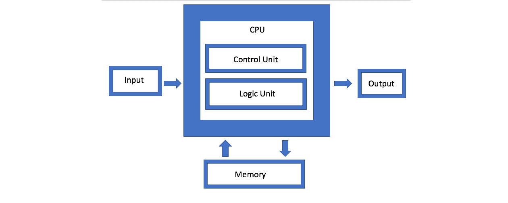

# Architecture des ordinateurs

## Qu'est-ce qu'une machine ?

Un ordinateur, c'est avant tout un ensemble de composants électroniques qui
travaillent ensemble. Mais comment ? Qui fait quoi ? Comment les informations
circulent-elles ?

Pour répondre à ces questions, les informaticiens utilisent un **modèle**,
c'est-à-dire une représentation simplifiée de la réalité. Le modèle le plus
célèbre est celui proposé par **John von Neumann** en 1945.

---

## Le modèle de Von Neumann

### L'idée fondamentale

Avant Von Neumann, les machines étaient **câblées** pour effectuer une tâche
précise. Changer de tâche signifiait recâbler physiquement la machine. C'était
long, coûteux, et peu pratique.

Von Neumann propose une idée révolutionnaire : et si on stockait le **programme
en mémoire**, au même endroit que les données ? La machine pourrait alors
exécuter n'importe quel programme, juste en changeant ce qu'elle lit en mémoire.

C'est le principe de l'**ordinateur à programme enregistré**, et c'est encore
le principe de tous les ordinateurs modernes.

### Les 4 composants

Le modèle de Von Neumann décompose l'ordinateur en **4 éléments** :



#### 1. Le processeur (CPU)

C'est le **cerveau** de l'ordinateur. Il lit les instructions du programme et
les exécute. Il se divise lui-même en deux parties :

- **L'Unité de Contrôle (UC)** : elle lit les instructions en mémoire et
  coordonne le travail des autres composants. C'est elle qui décide "quelle
  est la prochaine instruction à exécuter ?"
- **L'Unité Arithmétique et Logique (UAL)** : elle effectue tous les calculs
  (additions, soustractions...) et les opérations logiques (comparaisons,
  ET, OU...).

#### 2. La mémoire

C'est là que sont stockés **les programmes ET les données** pendant l'exécution.
C'est le principe clé de Von Neumann : tout est dans la même mémoire.

On peut imaginer la mémoire comme une très longue liste de cases numérotées.
Chaque case contient une valeur (une instruction ou une donnée), et chaque case
a une **adresse** unique.

#### 3. Les entrées/sorties

Ce sont les composants qui permettent à l'ordinateur de **communiquer avec
l'extérieur** :

- **Entrées** : clavier, souris, capteurs, microphone, webcam...
- **Sorties** : écran, haut-parleurs, imprimante...

Sans entrées/sorties, un ordinateur ne pourrait ni recevoir d'informations ni
en communiquer.

#### 4. Le bus

Ce n'est pas vraiment un composant isolé, mais c'est ce qui **relie tout le
reste**. Le bus est un ensemble de fils électriques qui permettent aux
composants d'échanger des données.

On distingue généralement :

- le **bus de données** : transporte les données
- le **bus d'adresses** : indique où lire ou écrire en mémoire

---

## La mémoire en détail

### Mémoire vive (RAM)

La **RAM** (Random Access Memory) est la mémoire principale de l'ordinateur.
C'est là que sont chargés les programmes et les données **en cours
d'utilisation**.

- Elle est **rapide** : le processeur peut y accéder en quelques nanosecondes.
- Elle est **volatile** : son contenu **disparaît** quand on coupe
  l'alimentation.
- Sa capacité se mesure en **Gio** (gibioctets) sur les machines modernes.

### Mémoire morte (ROM)

La **ROM** (Read Only Memory) est une mémoire **non volatile** : son contenu
est conservé même sans alimentation, mais elle ne peut pas être modifiée
(ou très difficilement).

Elle contient en général les instructions de démarrage de la machine
(le **BIOS** ou l'**UEFI**).

### Le stockage permanent (SSD, disque dur)

Le **SSD** (Solid State Drive) ou le disque dur permettent de stocker des
données **de façon permanente** : fichiers, programmes, système d'exploitation...

- Beaucoup plus **lent** que la RAM
- Beaucoup plus **grand** (des centaines de Gio, voire des Tio)
- **Non volatile** : les données survivent à l'extinction

### Les unités de mesure

| Unité | Symbole | Valeur approximative |
|-------|---------|----------------------|
| Octet | o | 1 caractère |
| Kibioctet | Kio | 1 024 octets |
| Mébioctet | Mio | 1 024 Kio |
| Gibioctet | Gio | 1 024 Mio |
| Tébioctet | Tio | 1 024 Gio |

> **Attention :** On voit souvent Go (gigaoctet = 10⁹ octets) dans les
> publicités, et Gio (gibioctet = 2³⁰ octets) en informatique. Ce ne sont
> pas exactement les mêmes valeurs.

---

## Monoprocesseur et multiprocesseur

### Monoprocesseur

Un ordinateur **monoprocesseur** possède un seul cœur de calcul. Il ne peut
exécuter qu'**une seule instruction à la fois**.

Quand plusieurs programmes semblent tourner en même temps (musique +
navigateur + traitement de texte), c'est en réalité le système d'exploitation
qui **alterne très rapidement** entre les programmes, si vite que l'utilisateur
a l'impression de simultanéité.

### Multiprocesseur

Un ordinateur **multiprocesseur** (ou multi-cœurs) possède plusieurs unités
de calcul. Il peut exécuter **réellement plusieurs instructions en parallèle**.

Les processeurs modernes ont généralement 4, 8, voire 16 cœurs ou plus.

---

## Le langage machine

### Les registres

Pour effectuer ses calculs, le processeur dispose de petites zones de
stockage ultrarapides appelées **registres**. On peut les voir comme des
**variables internes** au processeur.

Contrairement à la mémoire (grande mais lente), les registres sont en
nombre limité (une dizaine en général) mais accessibles instantanément.

On les nomme généralement A, B, C... ou R0, R1, R2...

### Le Compteur de Programme (CP)

Le processeur dispose d'un registre spécial : le **Compteur de Programme**
(CP). Il contient en permanence **l'adresse de la prochaine instruction
à exécuter**.

À chaque instruction exécutée, le CP s'incrémente automatiquement pour
passer à la suivante. C'est lui qui donne au processeur sa progression dans
le programme.

### Les instructions de base

Un programme en langage machine est une suite d'instructions très simples.
En voici les principales :

| Instruction | Signification |
|---|---|
| `LOAD R, valeur` | Charge une valeur dans le registre R |
| `LOAD R, @adresse` | Charge en R la valeur stockée à cette adresse mémoire |
| `STORE R, @adresse` | Copie la valeur de R vers cette adresse mémoire |
| `ADD R1, R2` | Additionne R1 et R2, stocke le résultat dans R1 |
| `ADD R, valeur` | Additionne une valeur directe à R, stocke le résultat dans R |
| `SUB R1, R2` | Soustrait R2 à R1, stocke le résultat dans R1 |
| `CMP R1, R2` | Compare R1 et R2, met à jour les flags internes |
| `JE label` | Saute au label si R1 = R2 lors du dernier CMP |
| `JNE label` | Saute au label si R1 ≠ R2 lors du dernier CMP |
| `JL label` | Saute au label si R1 < R2 lors du dernier CMP |
| `JG label` | Saute au label si R1 > R2 lors du dernier CMP |
| `JUMP label` | Saute toujours au label |
| `HALT` | Arrête le programme |

**Les Labels**

Un label est un **nom** qu'on donne à une ligne du programme. Au lieu d'écrire "saute à l'adresse 6", on écrit "saute au label FIN". C'est le processeur qui calcule les adresses réelles, pas le programmeur. Un label se note suivi de `:` sur la ligne qu'il désigne.

**CMP et les JUMP**

Quand on écrit CMP A, B, le processeur compare les deux valeurs et mémorise le résultat de la comparaison dans un endroit interne invisible (on appelle ça des flags, mais ce détail n'est pas important). Ce qui compte c'est que l'instruction de saut qui suit (JE, JL...) sait automatiquement ce que CMP vient de comparer. JE saute
si les deux valeurs étaient égales, JL saute si la première était plus petite, etc.

CMP et le saut qui suit fonctionnent toujours en binôme :

```
CMP A, B    ← on compare
JE 6        ← on agit selon le résultat
```

### Exemple de programme simple

On souhaite calculer 8 - 3 et stocker le résultat à l'adresse mémoire 10.

```
        LOAD A, 8       ; A ← 8
        LOAD B, 3       ; B ← 3
        SUB A, B        ; A ← A - B = 5
        STORE A, @10    ; écrit 5 à l'adresse mémoire 10
        HALT
```

À la fin de l'exécution :
- Le registre A contient **5**
- L'adresse mémoire 10 contient **5**

> **Remarque :** Le `;` introduit un commentaire, ignoré par le processeur.
> C'est une bonne habitude d'expliquer chaque ligne.

### Exemple avec une boucle while

Voici un programme Python et sa traduction en langage machine :

```python
i = 0
while i < 3:
    i = i + 1
```

On utilise le registre A pour `i` et le registre B pour la limite 3.

```
        LOAD A, 0       ; A ← 0  (i = 0)
        LOAD B, 3       ; B ← 3  (limite)
DEBUT:  CMP A, B        ; compare A et B, met à jour les flags
        JE FIN          ; si A = B (i = 3), saute à FIN
        ADD A, 1        ; A ← A + 1  (i = i + 1)
        JUMP DEBUT      ; retourne au début de la boucle
FIN:    HALT
```

Déroulé de l'exécution :

| Tour | A | B | CMP | Saut ? |
|------|---|---|-----|--------|
| 1 | 0 | 3 | 0 ≠ 3 | Non → ADD → A = 1 |
| 2 | 1 | 3 | 1 ≠ 3 | Non → ADD → A = 2 |
| 3 | 2 | 3 | 2 ≠ 3 | Non → ADD → A = 3 |
| 4 | 3 | 3 | 3 = 3 | Oui → HALT |

> **Idée clé :** Une boucle `while` en langage machine c'est toujours la
> même structure :

> 1. un ligne au début de la boucle
> 2. un `CMP` pour tester la condition
> 3. un saut conditionnel vers la sortie
> 4. le corps de la boucle
> 5. un `JUMP` inconditionnel vers le ligne du début

---

<span style="color:red">Exercices</span>

**1.** Dérouler le programme suivant instruction par instruction.
Indiquer à chaque étape le contenu des registres A et B.

```
        LOAD A, 10
        LOAD B, 4
        ADD A, B
        LOAD B, 2
        SUB A, B
        STORE A, @20
        HALT
```

*Que contient l'adresse mémoire 20 à la fin ?*

**2.** On dispose de la mémoire suivante :

| Adresse | Valeur |
|---|---|
| 5 | 12 |
| 6 | 7 |

Dérouler le programme :

```
        LOAD A, @5
        LOAD B, @6
        ADD A, B
        STORE A, @7
        HALT
```

*Que contient l'adresse mémoire 7 à la fin ?*

**3.** Écrire un programme en langage machine qui calcule 3 + 5 + 2
et stocke le résultat à l'adresse mémoire 15.

**4.** Que fait ce programme ? Expliquer son effet.

```
        LOAD A, @0
        ADD A, A
        STORE A, @0
        HALT
```

**5.** On souhaite calculer le périmètre d'un rectangle de longueur 8
et de largeur 3. Le périmètre vaut 2 × (longueur + largeur).

Écrire un programme en langage machine qui calcule ce périmètre et stocke
le résultat à l'adresse mémoire 20.

**6.** On donne le code Python suivant :

```python
i = 0
total = 0
while i < 4:
    total = total + 2
    i = i + 1
```

Traduire ce programme en langage machine en utilisant :

- A pour `total`
- B pour `i`
- C pour la limite

*Que contient A à la fin ?*

**7.** Écrire directement en langage machine un programme qui calcule
5 × 3 en utilisant une boucle. Stocker le résultat à l'adresse mémoire 10.
