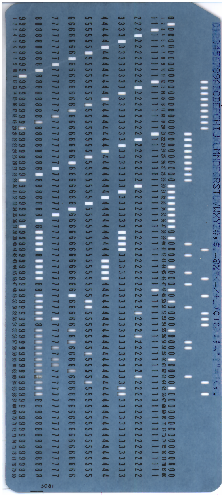
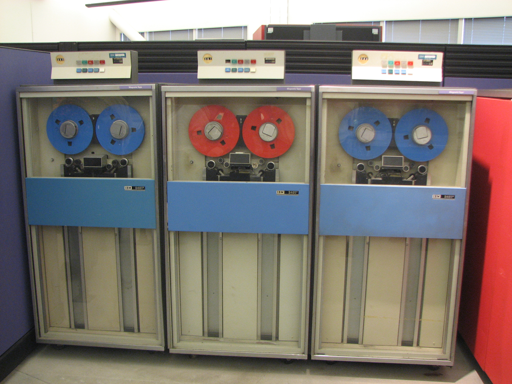
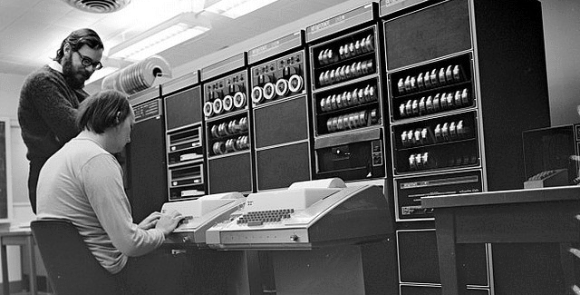
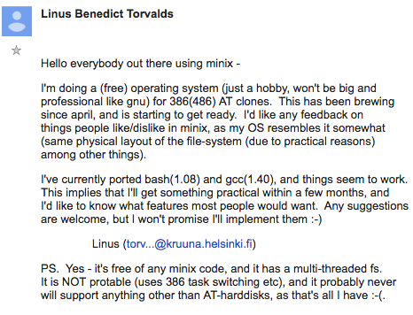
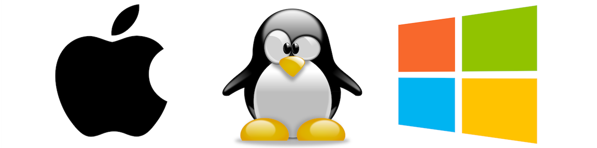
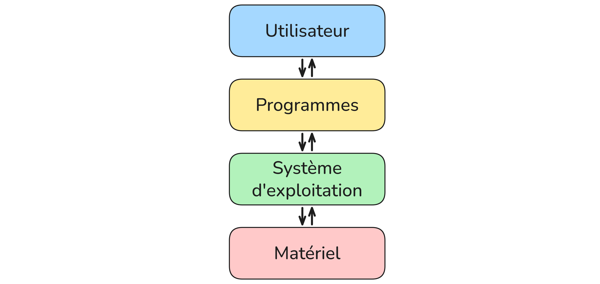

# Systèmes d'exploitation

## Qu'est-ce qu'un système d'exploitation ?

### Un peu d'histoire

Aux débuts de l'informatique, dans les années 1950, il n'existait aucun système d'exploitation. Les programmeurs devaient tout gérer eux-mêmes. Pour communiquer avec la machine, ils utilisaient des cartes perforées : de petits rectangles de carton dans lesquels on perçait des trous selon un code précis. Chaque carte représentait une instruction. Un programme pouvait nécessiter des centaines de cartes, qu'il fallait introduire dans la machine dans le bon ordre. Une erreur, et tout était à recommencer.

|||
|--|--|
|L'ENIAC fut le premier ordinateur entièrement numérique et à usage général|Une carte perforée|

Peu à peu, des programmes utilitaires ont été créés pour automatiser ces tâches répétitives. Ces programmes se sont regroupés pour former les premiers systèmes d'exploitation, dans les années 1960, sur les gros ordinateurs d'entreprise appelés mainframes. Ces machines occupaient des salles entières, nécessitaient une climatisation permanente et coûtaient des millions de francs. Seules les grandes entreprises et les universités pouvaient se les offrir.

|||
|--|--|
|IBM System/360|Bande magnétique (support de stockage de l'époque)|

Dans les années 1970, les chercheurs des laboratoires Bell développent Unix, un système d'exploitation simple, portable et modulaire, sur une machine appelée le PDP-11. Unix est fondateur : la plupart des systèmes modernes en sont directement inspirés. Ses créateurs, Ken Thompson et Dennis Ritchie, sont considérés comme deux des figures les plus importantes de l'histoire de l'informatique.

||
|--|
|PDP-11 (la machine sur laquelle Unix a été développé)|

L'arrivée des ordinateurs personnels dans les années 1980 change tout. En 1981, IBM lance son PC 5150, le premier ordinateur personnel destiné au grand public. Il est équipé d'un système simple appelé MS-DOS, développé par Microsoft. C'est un système entièrement en ligne de commande : pas d'interface graphique, on tape des instructions au clavier sur un écran noir. Les programmes s'échangeaient sur des disquettes, de grands carrés de plastique souple capables de stocker 360 Ko.

<iframe width="190" height="336" src="https://www.youtube.com/embed/n_Y6hHSichM" frameborder="0" allowfullscreen></iframe>  

En 1984, Apple lance le Macintosh, premier ordinateur grand public avec une interface graphique : fenêtres, icônes, souris. C'est une révolution : pour la première fois, on n'a plus besoin de taper des commandes pour utiliser un ordinateur. Steve Jobs le présente lui-même sur scène, dans une démonstration restée célèbre. La publicité de lancement, réalisée par Ridley Scott, est diffusée pendant le Super Bowl et marque l'histoire de la communication. Microsoft suit avec Windows en 1985, qui reprend le même principe d'interface graphique.

|<iframe width="190" height="336" src="https://www.youtube.com/embed/uXXzCXe4ln4" frameborder="0" allowfullscreen></iframe>|<iframe width="440" height="252" src="https://www.youtube.com/embed/ErwS24cBZPc" frameborder="0" allowfullscreen></iframe>|
|--|--|
|Présentation par Steve Jobs|Publicité réalisée par Ridley Scott|
|L'interface graphique|<iframe width="440" height="252" src="https://www.youtube.com/embed/3vq9p00T08I" frameborder="0" allowfullscreen></iframe>|

En 1991, un étudiant finlandais de 21 ans nommé Linus Torvalds publie sur Internet un message resté célèbre : il annonce qu'il développe un système d'exploitation libre et gratuit, "juste pour le fun". C'est la naissance de Linux. Son logo, le pingouin Tux, est choisi par Torvalds lui-même. Linux devient la base de nombreux systèmes comme Ubuntu sur ordinateur, mais aussi d'Android sur smartphones — ce qui en fait aujourd'hui le système d'exploitation le plus utilisé au monde.
Afficher l'image

|||
|--|--|
|Linus Torvalds|Capture d'écran du premier message de Torvalds annonçant Linux|

Aujourd'hui, les trois grands systèmes sont Windows (Microsoft), macOS (Apple) et les distributions Linux comme Ubuntu.
Sur smartphone, Android (basé sur Linux) et iOS (basé sur Darwin, lui-même issu de BSD/Unix) se partagent le marché.
Tous ces systèmes descendent, de près ou de loin, d'Unix.



---

### Rôle d'un système d'exploitation

Un **système d'exploitation** (ou OS, de l'anglais *Operating System*) est
un ensemble de programmes qui fait l'**intermédiaire entre le matériel et
les logiciels**.

Sans lui, impossible de lancer une application, d'enregistrer un fichier ou
même d'afficher quelque chose à l'écran.

Ses principales fonctions sont :

- **Gérer les fichiers et répertoires** : organiser, lire, écrire, supprimer
les données sur les disques
- **Gérer les processus** : lancer, suspendre, arrêter les programmes en
cours d'exécution
- **Gérer les utilisateurs et les droits** : définir qui a accès à quoi
- **Gérer la mémoire** : allouer la RAM aux programmes qui en ont besoin
- **Gérer les entrées/sorties** : faire communiquer les programmes avec le clavier, l'écran, le réseau...

Une manière simplifiée de voir les choses et d'imaginer le système d'exploitation comme l'intermédiaire entre les programmes/logiciels et le matériel (CPU, processeur, périphériques, ...).



---

## Logiciels libres et logiciels propriétaires

### Logiciels propriétaires

Un **logiciel propriétaire** est un logiciel dont le **code source est
fermé**. Seule l'entreprise qui l'a créé peut le modifier. L'utilisateur
achète une **licence** qui lui donne le droit de l'utiliser, mais pas de le
modifier ni de le redistribuer.

Exemples : **Windows**, **macOS**, **Microsoft Office**, **Photoshop**

### Logiciels libres

Un **logiciel libre** est un logiciel dont le **code source est ouvert**,
accessible à tous. N'importe qui peut le lire, le modifier et le
redistribuer librement.

Les 4 libertés fondamentales d'un logiciel libre (définies par la Free
Software Foundation) :

- Liberté d'**utiliser** le programme
- Liberté d'**étudier** son fonctionnement
- Liberté de le **modifier**
- Liberté de le **redistribuer**

Exemples : **Linux**, **LibreOffice**, **Firefox**, **VLC**

### Comparaison

| | Propriétaire | Libre |
|---|---|---|
| Code source | Fermé | Ouvert |
| Modification | Interdite | Autorisée |
| Prix | Souvent payant | Souvent gratuit |
| Exemples | Windows, macOS | Linux, LibreOffice |

---

## L'arborescence de fichiers

### Structure en arbre

Sur un système Linux, les fichiers sont organisés selon une **structure
arborescente** : c'est une hiérarchie de **répertoires** (dossiers) et de
**fichiers**, qui part d'un point unique appelé la **racine**, notée `/`.

```
/
├── home/
│   ├── alice/
│   │   ├── documents/
│   │   │   └── rapport.txt
│   │   └── images/
│   │       └── photo.jpg
│   └── bob/
└── etc/
```

Chaque élément de l'arborescence est soit :

- un **répertoire** : contient d'autres fichiers ou répertoires
- un **fichier** : contient des données

### Chemin absolu

Un **chemin absolu** part toujours de la racine `/`. Il décrit la position
complète d'un fichier, peu importe où on se trouve.

Exemple : `/home/alice/documents/rapport.txt`

### Chemin relatif

Un **chemin relatif** part du **répertoire courant** (là où on se trouve
actuellement). Il utilise :

- `.` pour désigner le répertoire courant
- `..` pour désigner le répertoire parent (remonter d'un niveau)

Exemple : si on est dans `/home/alice/`, le chemin relatif vers
`rapport.txt` est `documents/rapport.txt`

Pour remonter vers `/home/` depuis `/home/alice/documents/` :
`../../`

---

### Exercice

```
/
└── home/
    └── user/
        ├── lycee/
        │   ├── nsi/
        │   │   ├── tp1.py
        │   │   ├── tp2.py
        │   │   └── cours/
        │   │       ├── chapitre1.pdf
        │   │       └── chapitre2.pdf
        │   ├── maths/
        │   │   ├── dm1.pdf
        │   │   └── dm2.pdf
        │   └── anglais/
        │       └── essay.docx
        └── perso/
            ├── musique/
            │   ├── playlist.txt
            │   └── favoris.txt
            └── photos/
                ├── vacances/
                │   ├── plage.jpg
                │   └── montagne.jpg
                └── famille.jpg
```
 
**1.** Donner le chemin absolu de chaque fichier suivant :
 
- `tp2.py`
- `chapitre2.pdf`
- `essay.docx`
- `montagne.jpg`

**2.** Le répertoire courant est `nsi`. Donner le chemin relatif pour accéder à :
 
- `tp1.py`
- `chapitre1.pdf`
- `dm1.pdf`
- `famille.jpg`

**3.** Le répertoire courant est `vacances`. Donner le chemin relatif pour accéder à :
 
- `playlist.txt`
- `tp1.py`
- `essay.docx`

---

## Premières commandes Linux

### Lire l'invite de commande
 
Quand on ouvre un terminal, on voit une ligne comme :
 
```
alice@monordinateur:~$
```
 
Elle se décompose ainsi :
 
| Élément | Signification |
|---|---|
| `alice` | Nom de l'utilisateur connecté |
| `monordinateur` | Nom de la machine |
| `~` | Répertoire courant (`~` = répertoire personnel de l'utilisateur) |
| `$` | Invite standard (utilisateur normal, pas administrateur) |

### Le terminal

Le **terminal** (ou console) est une interface en **ligne de commande** :
on tape du texte, la machine répond par du texte. C'est une façon directe
et puissante d'interagir avec le système.

Contrairement à une interface graphique, le terminal permet d'effectuer des
opérations précises, rapides et automatisables.

### Commandes de navigation

| Commande | Rôle | Exemple |
|---|---|---|
| `pwd` | Afficher le répertoire courant | `pwd` |
| `ls` | Lister le contenu du répertoire | `ls` |
| `ls -l` | Lister avec les permissions | `ls -l` |
| `cd chemin` | Changer de répertoire | `cd documents` |
| `mkdir nom` | Créer un répertoire | `mkdir projets` |
| `cp source dest` | Copier un fichier | `cp tp1.py tp1_copie.py` |
| `mv source dest` | Déplacer ou renommer | `mv ancien.txt nouveau.txt` |
| `rm fichier` | Supprimer un fichier | `rm notes.txt` |
| `rmdir` | Supprime un dossier ssi il est vide | `rmdir projets` |
| `rm -R dossier` | Supprimer un dossier et son contenu | `rm -R projets` |
| `cat fichier` | Afficher le contenu d'un fichier | `cat notes.txt` |
| `head fichier` | Afficher les premières lignes | `head notes.txt` |
| `tail fichier` | Afficher les dernières lignes | `tail notes.txt` |
| `wc fichier` | Compter les lignes, mots et caractères | `wc notes.txt` |
| `sort fichier` | Trier les lignes d'un fichier | `sort liste.txt` |
| `cut` | Extraire des colonnes d'un fichier | `cut -d',' -f1 data.csv` |
| `echo texte` | Afficher un texte | `echo "Bonjour"` |
| `man commande` | Afficher la documentation | `man ls` |
| `tree`| Afficher l'arborescence des fichiers |`tree`|

> **Astuce :** La touche `Tab` permet de compléter automatiquement un nom
> de fichier ou de répertoire. Les flèches ↑ et ↓ permettent de naviguer
> dans les commandes précédentes.

---

### Exercice

Vous êtes chargé de réorganiser la base de données du Muséum National d'Histoire Naturelle. Un stagiaire a tout mis en vrac dans un seul dossier. Vous devez reclasser chaque espèce dans la bonne classification taxonomique.

Voici le dossier en question : [museum](museum.zip).  
Allez sur le site : [JSLinux](https://bellard.org/jslinux/vm.html?cpu=x86_64&url=alpine-x86_64.cfg&mem=256) et cliquez sur le bouton de telechargement en bas.  
Sélectionnez le dossier et utiliser la commande `unzip museum.zip`. Vous êtes prêt à y aller !

L'arborescence souhaitée est la suivante :

```
/home/museum/
└── animaux/
    └── vertebres/
        ├── mammiferes/
        │   ├── felins/
        │   │   ├── lion.png
        │   │   ├── panthere.png
        │   │   ├── leopard.png
        │   │   └── chat.png
        │   └── primates/
        │       ├── humain.png
        │       └── chimpanze.png
        ├── oiseaux/
        │   ├── rapaces/
        │   │   └── aigle_royal.png
        │   ├── passereaux/
        │   │   └── moineau.png
        │   └── psittacides/
        │       └── perroquet.png
        ├── poissons/
        │   ├── osseux/
        │   │   ├── saumon.png
        │   │   ├── truite.png
        │   │   └── espadon.png
        │   ├── cartilagineux/
        │   │   └── requin_blanc.png
        │   └── cetaces/
        │       ├── dauphin.png
        │       └── baleine_bleue.png
        ├── amphibiens/
        │   ├── grenouille_verte.png
        │   └── crapaud.png
        └── reptiles/
            ├── cobra.png
            ├── vipere.png
            ├── gecko.png
            ├── salamandre.png
            └── tortue_mer.png
```

1) Utilise les commandes vues plus tôt pour remettre de l'ordre dans ce répertoire.

>Les commandes nécessaires sont : `pwd`, ``ls``, ``tree``, ``cd``, ``mkdir``, ``mv``.

2) Après vérification par les biologistes du muséum, plusieurs erreurs de classification ont été détectées. Voici les corrections à apporter :

>- Tu savais que le panthère et le léopard sont le même animal ? Il faut donc supprimer l'un des deux.  

>- La salamandre n'est pas un reptile mais un amphibien.  

>- Les cétacés ne sont pas des poissons mais des mammiferes. On veut donc déplacer le fichier dans son intégralité.

3) On a pas encore d'image pour l'aigle royal, on a donc mis une image provisoire en attendant. On voudrait aussi ajouter le faucon plus tard. Pour ne pas oublier copions le contenu du ficher de l'aigle vers un nouveau fichier avec le nom `faucon` sans supprimer le fichier d’origine.

---
 
## Permissions et droits d'accès
 
Sur Linux, chaque fichier et répertoire a des **permissions** qui définissent
qui peut faire quoi. C'est ce qui permet à un système multi-utilisateurs de
protéger les fichiers de chacun.
 
### Les trois types d'utilisateurs
 
Pour chaque fichier, Linux distingue trois catégories d'utilisateurs :
 
- **user (u)** : le propriétaire du fichier
- **group (g)** : les utilisateurs appartenant au même groupe que le fichier
- **other (o)** : tous les autres utilisateurs
> **Analogie :** C'est comme dans une entreprise : le propriétaire d'un
> document, son équipe, et le reste de l'entreprise n'ont pas forcément
> les mêmes droits sur ce document.
 
### Les trois types de droits
 
Pour chaque catégorie, trois droits sont possibles :
 
| Lettre | Droit | Signification |
|---|---|---|
| `r` | read | Lire le fichier / lister le répertoire |
| `w` | write | Modifier le fichier / créer des fichiers dans le répertoire |
| `x` | execute | Exécuter le fichier / entrer dans le répertoire |
| `-` | aucun | Permission non accordée |
 
### Lire les permissions avec `ls -l`
 
La commande `ls -l` affiche les permissions de chaque fichier :
 
```
-rwxr-x r-- alice eleves 1024 tp1.py
drwxr-xr-- alice eleves 4096 cours
```
 
Les 10 premiers caractères se décomposent ainsi :
 
```
- r w x r - x r - -
↑ ↑↑↑ ↑↑↑ ↑↑↑
│ │   │   └── other : r--
│ │   └────── group : r-x
│ └────────── user  : rwx
└──────────── type  : - (fichier) ou d (répertoire)
```
 
**Exemples de lecture :**
 
| Permissions | Signification |
|---|---|
| `-rwxr-xr--` | Fichier : user=rwx, group=r-x, other=r-- |
| `drwxr-xr-x` | Répertoire : user=rwx, group=r-x, other=r-x |
| `-rw-r--r--` | Fichier : user=rw-, group=r--, other=r-- |
 
### Modifier les permissions avec `chmod`
 
La commande `chmod` permet de modifier les permissions d'un fichier.
Elle s'utilise de deux façons : en notation **symbolique** ou en notation **octale**.
 
#### Notation symbolique
 
On indique **qui** (`u`, `g`, `o`, `a` pour all), **l'opération** (`+` ajoute, `-` retire, `=` fixe) et **le droit** (`r`, `w`, `x`).
 
```bash
chmod g-wx fichier     # retire w et x au groupe
chmod u+x fichier      # ajoute l'exécution au propriétaire
chmod o-r fichier      # retire la lecture aux autres
chmod a+r fichier      # ajoute la lecture à tout le monde
```
 
#### Notation octale
 
Chaque droit correspond à un bit binaire :
 
| Droit | Binaire | Valeur |
|---|---|---|
| `r` | 1 | 4 |
| `w` | 1 | 2 |
| `x` | 1 | 1 |
| `-` | 0 | 0 |
 
On additionne les valeurs pour chaque groupe (user, group, other) :
 
| Permissions | Binaire | Octal |
|---|---|---|
| `rwx` | 111 | 7 |
| `rw-` | 110 | 6 |
| `r-x` | 101 | 5 |
| `r--` | 100 | 4 |
| `---` | 000 | 0 |
 
Exemples :
```bash
chmod 754 fichier    # user=rwx(7), group=r-x(5), other=r--(4)
chmod 644 fichier    # user=rw-(6), group=r--(4), other=r--(4)
chmod 700 fichier    # user=rwx(7), group=---(0), other=---(0)
```
 
<span style="color:red">Exercices</span>
 
On exécute `ls -l` dans le répertoire `nsi` et on obtient :
 
```
-rw-r--r-- alice eleves  1024 tp1.py
-rwxr-x--- alice eleves  2048 tp2.py
drwxr-xr-- alice eleves  4096 cours
```
 
**1.** Quel est le type de `cours` ? Pourquoi ?
 
**2.** Quels droits a le groupe `eleves` sur `tp1.py` ?
 
**3.** Quels droits a le groupe `eleves` sur `tp2.py` ?
 
**4.** Est-ce qu'un autre utilisateur (ni alice, ni dans le groupe eleves)
peut modifier `tp1.py` ?
 
**5.** Alice veut que personne d'autre qu'elle ne puisse lire `tp2.py`.
Écrire la commande `chmod` correspondante en notation symbolique puis en
notation octale.
 
**6.** Donner la représentation symbolique des permissions suivantes :
- `chmod 777`
- `chmod 644`
- `chmod 700`
- `chmod 640`
**7.** Donner la notation octale des permissions suivantes :
- `-rwxrwxrwx`
- `-rw-r--r--`
- `-rwx------`
- `-r-xr-x---`
---
 
<span style="color:red">TP — Terminus</span>
 
Tu vas découvrir les commandes Linux en jouant à **Terminus**, un jeu d'aventure en ligne de commande.
 
Rends-toi sur : **http://luffah.xyz/bidules/Terminus/**