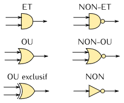
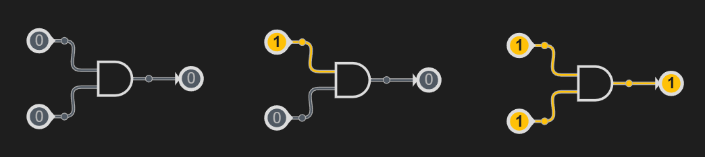
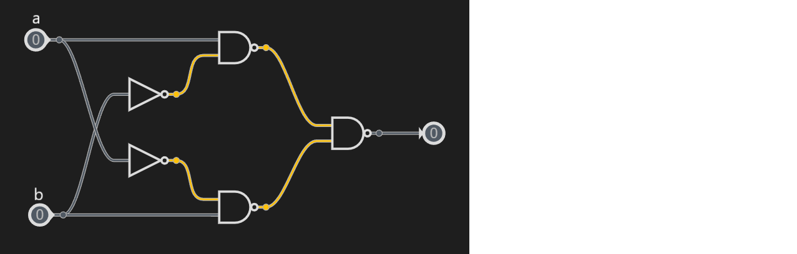
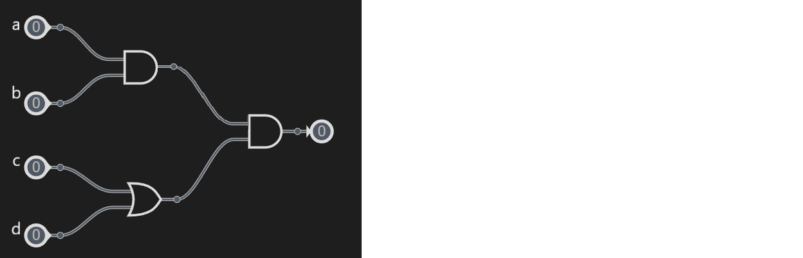

# Les Booléens

## Introduction

En informatique, en plus des nombres, il existe un type fondamental : le type **booléen**.  
Il sert à représenter des **valeurs logiques** :  

- **Vrai** (noté <span style="color:blue">True</span>)  
- **Faux** (noté <span style="color:red">False</span>)  

Ce type porte le nom de **George Boole**, mathématicien du XIXᵉ siècle, qui a formalisé l’algèbre logique.  
C’est un type essentiel en programmation car il permet de **prendre des décisions** et de contrôler le déroulement d’un programme.  

---

## Valeurs booléennes

En Python (et dans la plupart des langages), on a deux constantes :  

- <span style="color:blue">True</span> → représente le vrai  
- <span style="color:red">False</span> → représente le faux  

Ces deux valeurs peuvent aussi être obtenues à partir de comparaisons :  

```python
3 < 5    # True
10 == 2  # False
```

---

## Comparaisons

Les booléens apparaissent très souvent à la suite de comparaisons.  
Voici les principaux opérateurs en Python :

|Opérateur  |Signification |Exemple 1 |Résultat 1|Exemple 2|Résultat 2|
|--|--|--|--|--|--|
|==|égal à|5 == 5|<span style="color:blue">True</span>|3 == 5|<span style="color:red">False</span>|
|!=|différent de|3 != 5|<span style="color:blue">True</span>|5 != 5|<span style="color:red">False</span>|
|<|strictement inférieur|5 < 10|<span style="color:blue">True</span>|5 < 5|<span style="color:red">False</span>|
|<=|inférieur|5 <= 10|<span style="color:blue">True</span>|5 <= 5|<span style="color:blue">True</span>|
|>|strictement supérieur|5 > 10|<span style="color:red">False</span>|5 > 5|<span style="color:red">False</span>|
|>=|supérieur|5 >= 10|<span style="color:red">False</span>|5 >= 5|<span style="color:blue">True</span>|

Ces comparaisons ne sont pas exclusives aux entiers, on peut les appliquer sur tous les types naturels :

Exemples :

3.5 < 8.2 = <span style="color:blue">True</span>  
"abc" > "def" = <span style="color:red">False</span>  
"a" > "A" = <span style="color:blue">True</span>  
<span style="color:red">False</span> != <span style="color:red">False</span> = <span style="color:red">False</span>  
<span style="color:red">False</span> < <span style="color:blue">True</span>  = <span style="color:blue">True</span>   

<span style="color:red">Exercice</span>  

Évalue mentalement chaque comparaison ci-dessous puis vérifie avec Python.  
Écris le résultat attendu (**True** ou **False**) dans la colonne vide.  

| Expression | Résultat attendu |
|------------|------------------|
| "z" < "a"  |                  |
| "abc" <= "abd" |              |
| "chat" <= "Chat" |            |
| "bonjour" != "bonsoir" |      |
| 7 >= 7     |                  |
| 12 != 15   |                  |
| 3.14 == 3  |                  |
| 10 < 2     |                  |
| -5 < 0     |                  |
| False != True |               |
| True == (5 < 3) |             |

---

## Logique booléenne

### Les opérateurs logiques

Le langage Python propose trois opérateurs logiques principaux :

|Opérateur|	Syntaxe python| Syntaxe logique|	Signification|	Exemple|	Résultat|  
|--|--|--|--|--| --|
|NON	|not	|$\overline{a}$ (non a)|inverse la valeur	|not <span style="color:blue">True</span>	|<span style="color:red">False</span>|  
|ET	|and	|.|vrai si les deux sont vrais	|<span style="color:blue">True</span> and <span style="color:red">False</span>	|<span style="color:red">False</span>|  
|OU	|or	|+|vrai si au moins un est vrai|	<span style="color:blue">True</span> or <span style="color:red">False</span>|	<span style="color:blue">True</span>|

Il existe aussi un opérateur important qui n'est pas naturel en python :

|OU EXCLUSIF| xor |vrai si l'un est faux et l'autre est vraie|<span style="color:blue">True</span> xor <span style="color:blue">True</span>| <span style="color:red">False</span>|
|--|--|--|--|--|

Exemple :

```Python
a = True
b = False

print(not a)      # False
print(a and b)    # False
print(a or b)     # True
```

<span style="color:red">Exercice</span>  

Évalue mentalement chaque expression booléenne puis vérifie avec Python.  
Écris le résultat attendu (**True** ou **False**) dans la colonne vide.  

| Expression | Résultat attendu |
|------------|------------------|
| not (3 < 5) |                  |
| (7 >= 7) and (2 != 3) |        |
| (3.14 == 3) or (10 < 20) |     |
| ("z" < "a") or (4 == 4) |      |
| not (False) and (5 > 2) |      |
| (6 <= 6) xor (2 > 10) |        |
| (True and (8 != 8)) or (1 < 2) | |
| not ("abc" == "def") |         |
| (False or (9 >= 9)) and (3 < 1) | |
| (7 != 7) xor (not (2 < 5)) |   |
| ("chat" < "chien") or (not (4 <= 4)) | |
| ((5 > 1) and (2 == 2)) or (False) | |

---

### Les tables de vérité

|a|b|a . b|a + b| ! a|a XOR b|
|--|--|--|--|--|--|
|<span style="color:red">False</span>|<span style="color:red">False</span>|<span style="color:red">False</span>|<span style="color:red">False</span>|<span style="color:blue">True</span>|<span style="color:red">False</span>|
|<span style="color:red">False</span>|<span style="color:blue">True</span>|<span style="color:red">False</span>|<span style="color:blue">True</span>|<span style="color:blue">True</span>|<span style="color:blue">True</span>|
|<span style="color:blue">True</span>|<span style="color:red">False</span>|<span style="color:red">False</span>|<span style="color:blue">True</span>|<span style="color:red">False</span>|<span style="color:blue">True</span>|
|<span style="color:blue">True</span>|<span style="color:blue">True</span>|<span style="color:blue">True</span>|<span style="color:blue">True</span>|<span style="color:red">False</span>|<span style="color:red">False</span>|

<span style="color:red">Exercice</span> 

Complétez ces tables de vérité.

|a|b|a.b|$\overline{a.b}$|a+b|$\overline{a+b}$|  
|--|--|--|--|--|--|
|<span style="color:red">False</span>|<span style="color:red">False</span>|--|--|--|--|
|<span style="color:red">False</span>|<span style="color:blue">True</span>|--|--|--|--|
|<span style="color:blue">True</span>|<span style="color:red">False</span>|--|--|--|--|
|<span style="color:blue">True</span>|<span style="color:blue">True</span>|--|--|--|--|

|a|b|$\overline{a}$|$\overline{b}$|$\overline{a}$+$\overline{b}$|$\overline{a}$.$\overline{b}$|
|--|--|--|--|--|--|
|<span style="color:red">False</span>|<span style="color:red">False</span>|--|--|--|--|
|<span style="color:red">False</span>|<span style="color:blue">True</span>|--|--|--|--|
|<span style="color:blue">True</span>|<span style="color:red">False</span>|--|--|--|--|
|<span style="color:blue">True</span>|<span style="color:blue">True</span>|--|--|--|--|

On remarque que :   
$\overline{a+b} = \overline a . \overline b$  
$\overline{a.b} = \overline a + \overline b$  
C'est ce qu'on appelle les **lois de Morgan**.

---

## Les conditions

En programmation, les **conditions** permettent de **prendre des décisions** :  
le programme exécute certaines instructions seulement si une condition est vraie.  
En Python, cela s’écrit avec les mots-clés `if`, `elif` et `else`.

### Structure de base

```python
if condition1:
    # instructions exécutées si la condition1 est vraie
elif condition2 :
    # instructions exécutées si la condition1 est fausse mais que la condition2 est vraie
    # on peut enchaîner plusieurs elif
else:
    # instructions exécutées si les conditions 1 et 2 sont fausses
```

On peut le lire ainsi :

- Si `condition1` est vraie, je fais ça ...  
- Sinon, si `condition2` est vraie, je fais ça ...  
- Dans tous les autre cas, je fais ça ...  

<span style="color:blue">Exemple :<span>
```Python
age = 15

if age >= 18:
    print("Majeur")
else:
    print("Mineur")
```

---

## Circuits logiques

Jusqu’ici, nous avons vu la logique booléenne **dans le langage Python**.  
En électronique, ces mêmes opérations logiques sont réalisées grâce à des **portes logiques**.  

Chaque porte est un petit circuit qui applique une opération logique (`ET`, `OU`, `NON`, etc.) sur ses entrées pour produire une sortie.  

### Symboles des principales portes logiques

Voici les symboles normalisés utilisés en électronique :  



### Exemple de circuit

Un circuit combinant plusieurs portes peut être représenté par un schéma.  
Exemple :  



<span style="color:red">Exercice</span> 

**Exercice 1**

Recopiez le circuit et indiquez ses états intermédiaires et son état final :



Utilisez les lois de Morgan pour simplifier l'expression.

**Exercice 2**

On considère le schéma logique suivant :  



1. Donner la table de vérité de ce schéma logique.  
2. Traduire ce schéma en une expression Python utilisant `and` et `or`.  
3. Vérifier en Python que votre expression donne les mêmes résultats que la table de vérité.

**Exercice 3**

On considère les expressions booléennes suivantes :  
1. `(A or B) and (not C)`  
2. `not(A and B) or C`  

Pour chacune d’elles :  
- Dessiner le schéma logique correspondant.  
- Compléter la table de vérité.

**Exercice 4**

Un feu de circulation piéton s’allume en **vert** si :  
- le bouton d’appel a été pressé (`bouton == True`),  
- et **il n’y a pas de voiture détectée** (`voiture == False`) **ou** qu’il est minuit (`heure == 0`).  

1. Dessiner le schéma logique correspondant.  
2. Écrire en Python une fonction `feu_pieton(bouton, voiture, heure)` qui retourne `True` si le feu doit être vert.  
3. Tester la fonction avec quelques cas concrets.

## Exercices Python

### Exercice 1 : Entrée gratuite ou payante ?
On organise une soirée :   
- L’entrée est gratuite si la personne a **moins de 12 ans** ou **plus de 65 ans**.  
- Sinon, elle coûte 10 €.  

Écrire un programme qui demande l’âge et affiche si l’entrée est gratuite ou payante.  

### Exercice 2 : Accès réservé
Un site web n’autorise l’accès que si l’utilisateur a au moins 13 ans, et a accepté les conditions d’utilisation (réponse `"oui"` ou `"non"`).  

Écrire un programme qui affiche `"Accès autorisé"` ou `"Accès refusé"` en fonction des deux variables.

### Exercice 3 : L’année bissextile
Une année est bissextile si elle est divisible par 4 et non divisible par 100, ou si elle est divisible par 400.  

Écrire un programme qui demande une année et affiche si elle est bissextile ou non.  

### Exercice 4 : Jeu de devinette
On choisit un nombre secret aléatoire :

```
import random

n = random.randint(0,1000)
```

L’utilisateur doit proposer un nombre, et le programme répond :  
- `"Trop petit"`,  
- `"Trop grand"`,  
- ou `"Bravo !"`.  
en fonction des tentatives du joueur jusqu'à ce qu'il trouve lé nombre secret.

### Exercice 5 : Triangle possible ?
Écrire un programme qui demande trois longueurs `a`, `b`, `c`.  
On rappelle qu’un triangle est possible si **chaque côté est inférieur à la somme des deux autres**.  
Le programme doit afficher `"Triangle valide"` ou `"Triangle impossible"`.  

### Exercice 6 : Nombre premier (version booléens)
Écrire un programme qui demande un entier `n` et affiche s’il est premier ou non.  
On pourra utiliser une boucle `for` pour chercher un diviseur, mais le résultat final doit être stocké dans une variable booléenne `est_premier` qui est `True` ou `False`.  

### Exercice 7 : Accès à la bibliothèque
On donne accès à une salle de bibliothèque si :
- la personne est **enseignant**,
- ou bien **élève** mais avec une carte valide,
- et **pas en retard** de plus de 3 jours.

**Consignes :**
1. Demander le rôle (`"enseignant"` ou `"élève"`).  
2. Demander si la carte est valide (`"oui"/"non"`).  
3. Demander le nombre de jours de retard.  
4. Écrire l’expression booléenne.  
5. Afficher `"Accès autorisé"` ou `"Accès refusé"`.  

### Exercice 8 : Sécurité d’un coffre
Un coffre s’ouvre si :
- le **code est correct**  
- et si **l’utilisateur est admin** ou qu’il a utilisé **sa clé physique**.

**Consignes :**
1. Définir une constante `code_secret = 1234`.  
2. Demander le code entré.  
3. Demander si l’utilisateur est `"admin"` ou `"utilisateur"`.  
4. Demander s’il a une clé (`"oui"/"non"`).  
5. Traduire la règle en Python avec `and` / `or`.  
6. Afficher `"Coffre ouvert"` ou `"Accès refusé"`.  

### Exercice 9 : Capteur de sécurité
Une alarme se déclenche si :
- **au moins une porte** est ouverte,
- et **aucune fenêtre** n’est fermée correctement,
- ou si le **capteur de mouvement** est activé.

**Consignes :**
1. Demander l’état de deux portes (ouverte/fermée).  
2. Demander l’état de deux fenêtres (ouverte/fermée).  
3. Demander si un mouvement est détecté (`"oui"/"non"`).  
4. Construire une formule logique combinant ces trois conditions.  
5. Afficher `"Alarme déclenchée"` ou `"Tout est normal"`.  

### Exercice 10 : Admission en université
Un étudiant est accepté si :
- sa moyenne est **au moins 12**  
- et il a **validé le bac**  
- ou bien s’il a une **recommandation spéciale**.

**Consignes :**
1. Demander la moyenne (nombre).  
2. Demander si le bac est validé (`"oui"/"non"`).  
3. Demander si une recommandation est présente (`"oui"/"non"`).  
4. Écrire une condition booléenne.  
5. Afficher `"Admis"` ou `"Refusé"`.  

## Exercice avancé : Générateur de table de vérité

On veut écrire un programme qui construit la **table de vérité** d’une expression booléenne donnée par l’utilisateur.

L’utilisateur doit pouvoir :  
1. Donner la liste des variables (par exemple `["A", "B", "C"]`).  
2. Donner une expression booléenne en Python (par exemple `(A or B) and (not C)`).  
3. Le programme affiche toutes les combinaisons possibles des variables, et le résultat de l’expression pour chacune.  

---

## Exemple attendu

Si l’utilisateur choisit les variables `A`, `B` et l’expression `(A and not B)`, le programme doit produire :  

A | B | Résultat  
--+---+---------  
0 | 0 | 0  
0 | 1 | 0  
1 | 0 | 1  
1 | 1 | 0  


---

## La fonction `eval()` en Python

- La fonction **`eval()`** signifie *evaluate* ("évaluer").  
- Elle prend en paramètre une **chaîne de caractères** qui contient une expression Python valide.  
- Python exécute alors cette expression **comme si elle avait été écrite directement dans le code**.  

### Exemple simple  
```python
x = 2
print(eval("x + 3"))  # affiche 5

```
Ici, "x + 3" est une chaîne de caractères. eval() va l’interpréter comme une expression Python et calculer 2 + 3.  

---

Application à notre problème  

Grâce à eval(), on peut écrire une expression booléenne sous forme de texte (par exemple "(A and not B)") et la faire évaluer automatiquement pour chaque combinaison de valeurs possibles de A et B.  

⚠️ Attention : eval() exécute directement le texte donné, donc en pratique il faut l’utiliser avec prudence (jamais avec du texte écrit par un inconnu). Ici, dans un exercice scolaire, on peut l’utiliser en toute sécurité.  

# Exercice : Générer une table de vérité en Python

On souhaite écrire un programme qui génère la **table de vérité** d’un opérateur logique (`OR`, `AND` ou `NOT`) donné par l’utilisateur.

---

## Étapes de l’exercice

1. Demander à l’utilisateur de saisir un opérateur logique (sous forme de texte) parmi :  
   - `"OR"`
   - `"AND"`
   - `"NOT"`

2. Selon l’opérateur choisi :  
   - Si c’est **`OR`** ou **`AND`**, la table de vérité aura **deux variables** (`A` et `B`).  
   - Si c’est **`NOT`**, la table de vérité aura **une seule variable** (`A`).  

3. Le programme affiche la table de vérité correspondante.  

---

## Exemple d’exécution attendue

### Cas 1 : opérateur `AND`

