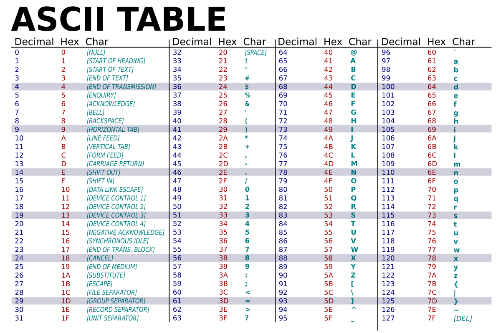

# Les chaînes de caractères (`str`)

## 1. Définition
Une **chaîne de caractères** est une suite ordonnée de symboles (lettres, chiffres, ponctuation, espaces…).  
En Python, une chaîne est de type `str`.  
On peut l’écrire entre **guillemets simples** `'...'` ou **guillemets doubles** `"..."`.

Exemples :
```python
mot = "Bonjour"
lettre = 'A'
phrase = "Ceci est une phrase."
```

---

## 2. Caractères et encodage
ASCII signifie American Standard Code for Information Interchange
(en français : Code américain standard pour l’échange d’informations).  

C’est une norme de codage des caractères créée dans les années 1960.
Elle associe chaque symbole (lettre, chiffre, ponctuation, contrôle) à un nombre entier.  

- L’idée : comme l’ordinateur ne comprend que des nombres (en binaire), il faut une correspondance caractère ↔ nombre.  



<span style="color:blue">Exemple</span>  

Un texte encodé ressemeble donc à ce ceci :

"NSI" -> 4E 53 49 -> 01001110 01010011 01001001

<span style="color:red">Exercices</span> 

### Exercice 1 : Conversion binaire → texte
On te donne la suite binaire suivante (chaque octet correspond à un caractère ASCII) :

`0100100001100101011011000110110001101111`

1. Séparer chaque octet et convertis-le en décimal.  
2. Trouver le caractère ASCII correspondant à chaque nombre.  
3. Recomposer la chaîne de caractères.  

**Question** : Quelle est la chaîne finale ?

### Exercice 2 : Conversion hexadécimal → texte
On te donne la suite hexadécimale suivante :

`54 75 74 6F 72`


1. Convertis chaque code hexadécimal en décimal.  
2. Trouve le caractère ASCII correspondant.  
3. Recompose le mot complet.  

**Question** : Quel est le mot obtenu ?

## ISO-8859-1 et manipulation des caractères en Python

Après la norme ASCII, une extension appelée **ISO-8859-1** (ou Latin-1) a été créée pour représenter les caractères utilisés dans les langues européennes. Contrairement à ASCII qui utilise 7 bits (128 caractères), ISO-8859-1 utilise **8 bits** et peut coder **256 caractères**, incluant les lettres accentuées (é, à, ü, etc.), ainsi que certains symboles supplémentaires. Cette norme permet donc de gérer beaucoup plus de textes européens qu’ASCII.

En Python, on peut manipuler facilement les codes des caractères grâce aux fonctions intégrées :  

- `ord(caractère)` : retourne le code numérique du caractère (ASCII ou ISO-8859-1).  
```python  
  >>> ord('é')
  233
```
- `chr(code)` : retourne le caractère correspondant à un code numérique.


```python
>>> ord(233)
é
```

---

## 3. Opérations de base
On peut appliquer différentes opérations sur une chaîne :

### a) Concaténation (`+`)
```python
prenom = "Ada"
nom = "Lovelace"
print(prenom + " " + nom)  # Ada Lovelace
```

### b) Répétition (`*`)
```python
rire = "ha"
print(rire * 3)  # hahaha
```

### c) Longueur (`len`)
```python
texte = "Bonjour"
print(len(texte))  # 7
```

### d) Accès par indice
Chaque caractère est accessible par son **indice** (position, en commençant à 0) :
```python
mot = "Python"
print(mot[0])  # P
print(mot[3])  # h
```

### e) Tranches (slices)
On peut extraire une partie de la chaîne :
```python
mot = "Python"

print(mot[1:4])    # yth   (du 2e caractère inclus au 4e exclu)
print(mot[-2:])    # on    (les 2 derniers caractères)
print(mot[:-2])    # Pyth  (tout sauf les 2 derniers)
print(mot[::2])    # Pto   (un caractère sur deux)
print(mot[1::2])   # yhn   (un caractère sur deux en commençant à l’indice 1)
print(mot[::-1])   # nohtyP (toute la chaîne à l’envers)
print(mot[3:0:-1]) # hty   (du 4e caractère vers le 1er en sens inverse)
```

---

## 4. Fonctions utiles
Quelques méthodes très utilisées :

```python
texte = "bonjour"
print(texte.upper())   # BONJOUR
print(texte.capitalize())  # Bonjour
print(texte.isalpha()) # True si uniquement des lettres
print(texte.isdigit()) # True si uniquement des chiffres
print("123".isdigit()) # True
```

---

## 5. Exercices

### Exercice 1
Demander un mot et afficher son premier et son dernier caractère.

### Exercice 2
Demander une phrase et afficher sa longueur.

### Exercice 3
Vérifier si une chaîne donnée contient uniquement des chiffres.

### Exercice 4
Écrire un programme qui inverse une chaîne de caractères.

### Exercice 5
Demander un mot et afficher `"Palindrome"` s’il se lit dans les deux sens.

### Exercice 6
Le code de César est une méthode de chiffrement très simple utilisée par Jules César dans ses correspondances secrètes (ce qui explique le nom).  L'idée est simple, nous choisissons une clé qui correspond à un décalage que nous allons appliquer sur chacun des caractéres du message.  

Exemple :  

Message : NSI  
Clé : 1  
Message codé : OTJ  

Message : NSI  
Clé : 25  
Message codé : MRK  

Imaginer un programme qui demande un message et une clé et qui affiche le message codé correspondant.  

---

## 6. Résumé
- Une chaîne est de type `str` et se note avec `'...'` ou `"..."`.  
- Chaque caractère est codé par un nombre (ASCII/Unicode).  
- On peut : concaténer, répéter, mesurer (`len`), extraire (`[]`).  
- Les méthodes permettent de transformer ou tester des chaînes.
