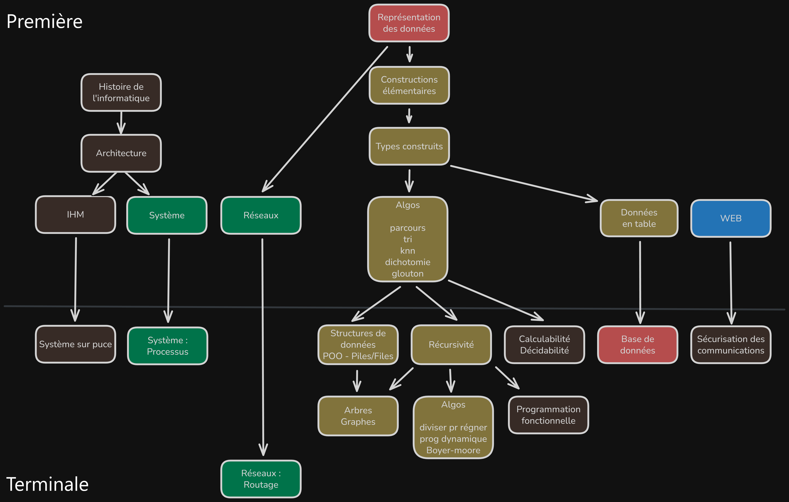

# NSI - Premières

## Chapitres

[🟥 1 - Types de bases](Chapitres/Types/Types_de_base.md)  
[🟨 2 - Bases de Python](Chapitres/Bases/bases.md)  
[🟨 3 - Tableaux](Chapitres/Tableaux/Tableaux.md)  
[🟩 4 - Réseaux](Chapitres/Réseaux/Réseaux.md)  
[🟨 5 - Algorithmique](Chapitres/Algos/Algos.md)  
[🟩 6 - Architecture & Systèmes d'exploitation](Chapitres/Systèmes/A&S.md)  

## Projets

[🔵 Puissance 4](https://kxs.fr/cours/projets/puissance-4) (du site [kxs.fr](https://kxs.fr/cours/))  
[🔵 Dessine ta rue](dtr.zip)

## Plan des chapitres

