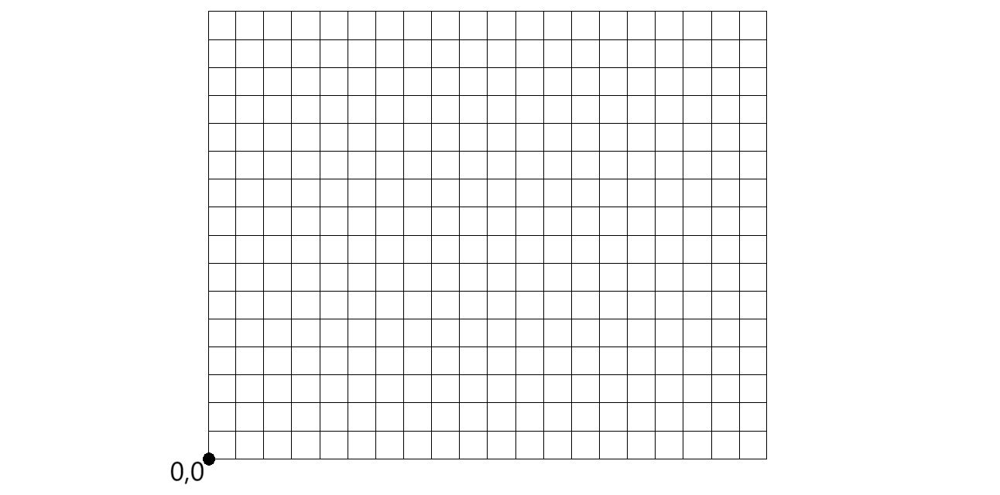

# Séance 1 — GPS & Galileo : comment se localiser ?

## Objectifs
- Comprendre le principe de la géolocalisation par satellite
- Comprendre la trilatération

## 1. Activité — Vidéos & questions

### Vidéos

Nous allons regarder deux vidéos pour comprendre le fonctionnement des systèmes de localisation.

<iframe width="400" height="300"
        src="https://www.youtube.com/embed/V51dGqHw_24"
        title="GPS, comment ça marche ?"
        frameborder="0"
        allow="accelerometer; autoplay; clipboard-write; encrypted-media; gyroscope; picture-in-picture"
        allowfullscreen>
</iframe>

<iframe width="400" height="300"
        src="https://www.youtube.com/embed/e79tSIpLiDk"
        title="Galileo : fonctionnement du GPS européen"
        frameborder="0"
        allow="accelerometer; autoplay; clipboard-write; encrypted-media; gyroscope; picture-in-picture"
        allowfullscreen>
</iframe>

### Questions

1. Combien de satellites sont nécessaires pour déterminer la position d'une personne sur Terre ?

2. Comment s'appelle le procédé qui permet de trouver une position à partir de distances ?

3. Quelle est la formule qui donne une distance à partir d'un temps et d'une vitesse ?

4. Quel type d'horloge y a-t-il dans un satellite GPS ou Galileo ?

5. Quelles sont les deux informations qu'un satellite Galileo ou GPS envoie en permanence ?

6. Pourquoi avons-nous besoin d'un quatrième satellite ?

7. Un récepteur GPS/Galileo envoie-t-il des données aux satellites ?

8. Y a-t-il une limite du nombre d'utilisateurs à Galileo ?

9. De combien de satellites la constellation Galileo est-elle constituée ?

10. À quoi sert le « segment sol » du système Galileo ?

11. Pourquoi l'Europe tenait-elle à créer Galileo ?

---

## 2. Activité — Trilatération sur quadrillage

### Contexte

On considère le quadrillage ci-dessous avec un repère dont l'origine est en bas à gauche.  
Le signal des satellites se déplace à la vitesse **v = 2 m/s**.

L'utilisateur reçoit à **14h50min29s00** les messages suivants :

| Satellite | Position | Heure d'émission |
|-----------|----------|-----------------|
| sat1 | (2, 14) | 14h50min22s68 |
| sat2 | (16, 13) | 14h50min21s57 |

### Questions

(20 colonnes, 16 lignes)

**12.** Placez les deux satellites sur le quadrillage.

**13.** Calculez les temps t₁ et t₂ mis par les signaux pour arriver jusqu'à l'utilisateur.

**14.** Déduisez-en les distances d₁ et d₂ entre chaque satellite et l'utilisateur.

**15.** Tracez les deux cercles et donnez la position de l'utilisateur.

