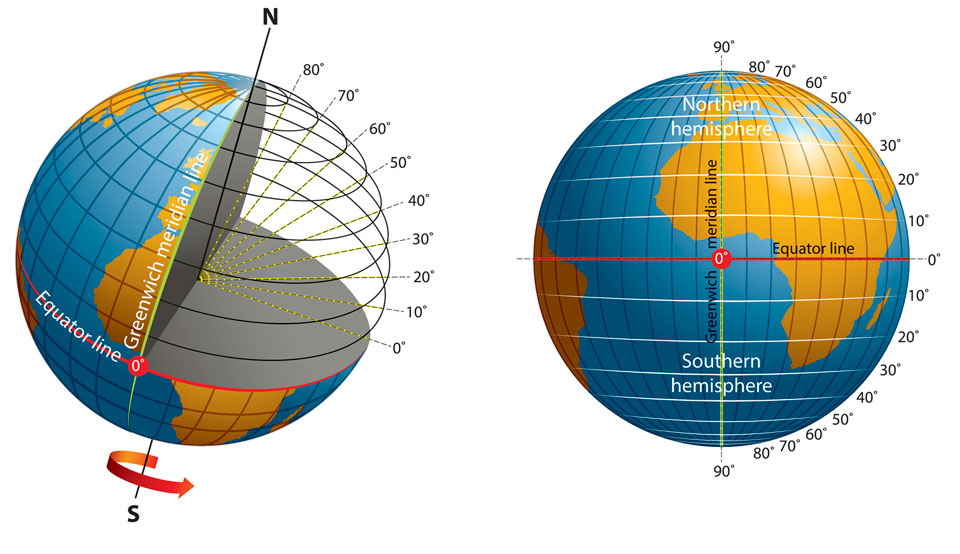
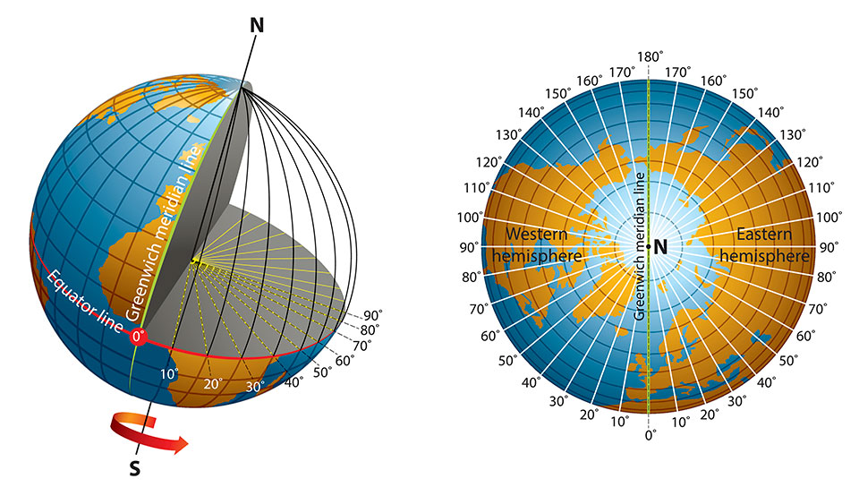
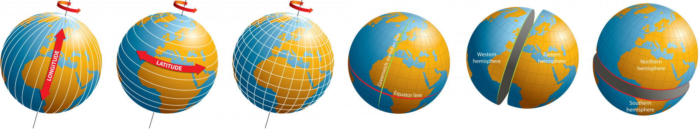
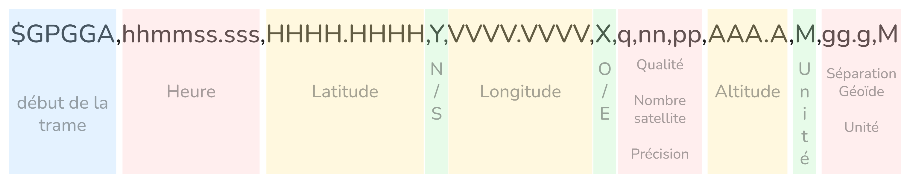

# Coordonnées géographiques & protocole NMEA

---

## Coordonnées géographiques

La position d'un point sur Terre est définie par deux angles, lus sur deux familles de cercles imaginaires tracés sur le globe.

### Les parallèles et la latitude

Les **parallèles** sont des cercles horizontaux parallèles à l'équateur.  
L'**équateur** est le parallèle de référence (0°).

On les numérote par leur **latitude** : l'angle entre le parallèle et l'équateur, mesuré depuis le centre de la Terre.

- de **0°** (équateur) à **+90°** (pôle Nord)
- de **0°** (équateur) à **-90°** (pôle Sud)

Plus on monte vers le **Nord**, plus la latitude augmente (valeurs **positives**).  
Plus on descend vers le **Sud**, plus la latitude diminue (valeurs **négatives**).

*Exemple :* Rio se trouve environ à 22° au Sud.  
**Question 1 :** À quel degré se situe Marrakech ?

### Les méridiens et la longitude

Les **méridiens** sont des demi-cercles verticaux reliant les deux pôles.
Le **méridien de Greenwich** (qui passe par Londres) est le méridien de référence (0°).

On les numérote par leur **longitude** : l'angle entre le méridien et celui de Greenwich, mesuré depuis le centre de la Terre.

- de **0°** à **+180°** vers l'Est
- de **0°** à **-180°** vers l'Ouest

*Exemple :* Rome se trouve environ à 12° à l'Est.  
**Question 2 :** À quel degré se situe New York ?

### Repérer un point

Un point sur Terre est repéré par le **parallèle** et le **méridien** qui se croisent en ce point :

---

### Deux notations

1) La notation **DMS (Degré Minute Seconde)** est la notation traditionnelle, encore utilisée sur les cartes papier et les GPS de randonnée. 

Comme pour les heures, les degrés peuvent être subdivisés en **minutes** et **secondes** :

- 1 degré = 60 minutes
- 1 minute = 60 secondes

Ce n'est pas du temps, c'est juste le même système de subdivision, appliqué aux angles.

| Notation | Exemple (Paris) |
|----------|----------------|
| Degrés / minutes / secondes (DMS) | 48° 51' 24" N, 2° 21' 03" E |
| Degrés décimaux (DD) | 48.8567° N, 2.3508° E |
 
---

2) La notation **DD (Degré Décimal)** est la notation numérique, utilisée par les logiciels et les trames NMEA.

Formule de conversion DMS → DD :

On ramène tout en degrés :

>>>>>>>> $DD = \text{degrés} + \frac{\text{minutes}}{60} + \frac{\text{secondes}}{3600}$

**Exemple :**  
$48° \ 51' \ 24'' N = 48 + \frac{51}{60} + \frac{24}{3600} = 48{,}8567° N$

*On divise les minutes par 60 car 1 minute = 1/60 de degré, et les secondes par 3600 car 1 seconde = 1/3600 de degré.*

---

**Question 3 :**

Rendez-vous un des sites suivants pour voir les paralléles et les méridiens :
- [arcgis](https://www.arcgis.com/apps/dashboards/e24199255cb640b499af3724e9a1ba2e)
- [geoportail](https://www.geoportail.gouv.fr/carte)
- [map-tools](https://tool-online.com/map-tools.php)

Avec l'aide du site, donner les coordonnées approximatives des villes suivantes :

- Osaka (Japon)
- Alger (Algérie)
- Montréal (Canada)

>*On se contentera de donner les degrés et des minutes approchées.*

Indiquer quelle ville se trouve à ces coordonnées :

- 34° 36′ 29″ S 58° 22′ 13″ O
- 1° 17′ 00″ S 36° 49′ 00″ E
- 6° 10′ 31″ S 106° 49′ 37″ E

>**Par soucis de simplicité, on n'utilisera plus que les degrés et les minutes pour les prochaines questions.**

---

**Question 4 :**

Convertir les coordonnées suivantes au format **DD** :

- 75° 40' N 2° 0' E
- 35° 30' N 127° 15' W
- 13° 12' S 73° 48' W

---

## Le protocole NMEA 0183

Le protocole **NMEA 0183** (National Marine Electronics Association) est le format standard utilisé par les récepteurs GPS pour transmettre les données de position à un ordinateur ou une application.

Les données sont transmises sous forme de **trames** — des lignes de texte commençant par `$`.

### La trame $GPGGA

C'est la trame principale contenant la position. Sa structure :

### Lire les coordonnées dans une trame NMEA

> Dans une trame NMEA, les coordonnées ne sont **pas** en DMS classique — elles sont en **degrés + minutes décimales**.  
> Il n'y a pas de secondes.

La formule de conversion est donc simplifiée :

$DD = \text{degrés} + \frac{\text{minutes décimales}}{60}$

**Comment séparer les degrés des minutes ?**

- **Latitude** : les **2 premiers chiffres** sont les degrés, le reste sont les minutes
- **Longitude** : les **3 premiers chiffres** sont les degrés, le reste sont les minutes

> La longitude va jusqu'à 180°, elle a donc besoin de 3 chiffres pour les degrés.

**Exemple pas à pas :**

Trame : `$GPGGA,123519.00,4851.24,N,00221.03,E,...`

*Latitude :* `4851.24 N`
$48° \ 51,24' → 48 + \frac{51,24}{60} = 48 + 0,854 = \textbf{48,854° N}$

*Longitude :* `00221.03 E`
$2° \ 21,03' → 2 + \frac{21,03}{60} = 2 + 0,3505 = \textbf{2,3505° E}$

---

### Exemple de trame complète

> $GPGGA,**123519.00**,**4851.24,N**,**00221.03,E**,1,**08**,0.9,**545.4,M**,46.9,M,,*47

Lecture :

- Heure : 12h 35min 19s UTC
- Latitude : 48° 51,24' N → **48,854° N**
- Longitude : 2° 21,03' E → **2,3505° E**
- 8 satellites
- Altitude : 545,4 m

---

**Question 5a :**

Décoder la trame suivante et identifier la ville correspondante sur [arcgis](https://www.arcgis.com/apps/dashboards/e24199255cb640b499af3724e9a1ba2e) :

> `$GPGGA,143022.00,4926.36,N,00105.95,E,1,07,1.1,21.0,M,47.6,M,,*XX`

- Extraire la latitude et la longitude brutes
- Les convertir en DD
- Identifier la ville

---

**Question 5b :**

Décoder la trame suivante et identifier la ville correspondante :

> `$GPGGA,091504.00,4349.37,N,00519.83,E,1,09,0.8,12.5,M,47.2,M,,*XX`

- Extraire la latitude et la longitude brutes
- Les convertir en DD
- Identifier la ville

---

**Question 6 :**

Sur arcgis, trouvez les coordonnées DD de la ville de votre choix (hors France).  
Construire une trame NMEA fictive `$GPGGA` cohérente pour cette ville en remplissant les champs suivants (et expliquer les infos qu'elle contient) :

> `$GPGGA,HHMMSS.00,LLLL.LL,N,DDDDD.DD,E,1,08,1.0,XXX.X,M,47.0,M,,*XX`

*Pensez à bien respecter le format : 2 chiffres pour les degrés de latitude, 3 pour la longitude, et convertir les minutes décimales correctement.*