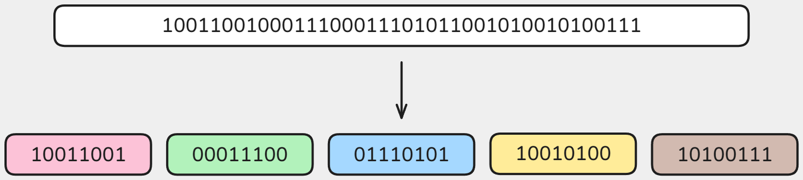
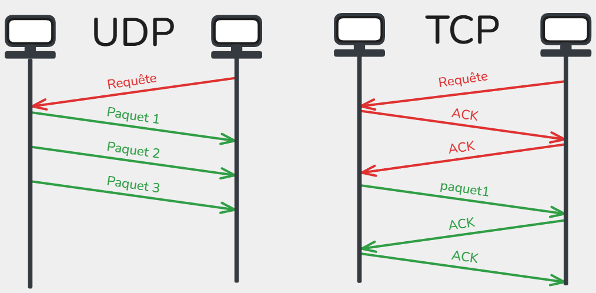
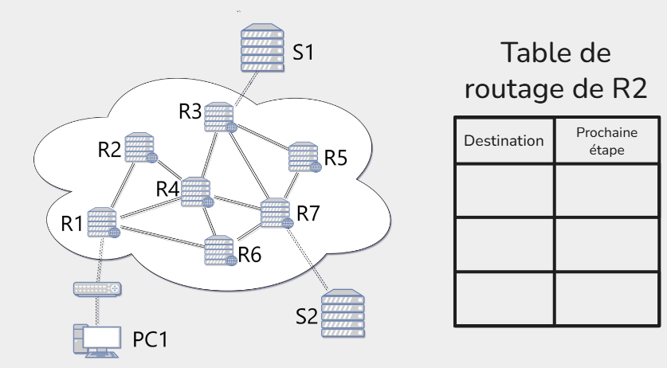
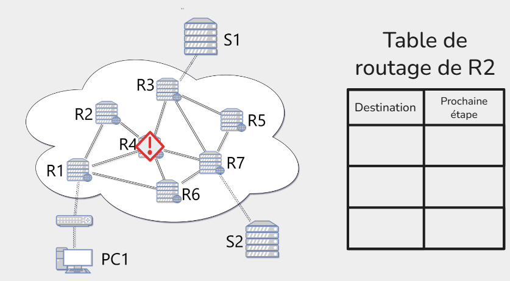

# 🌐 SNT – Internet  

---

## Internet = un réseau de réseaux
Internet n’est pas une seule machine géante.  
C’est en réalité **un immense ensemble de réseaux interconnectés** :  

- **Les réseaux locaux (LAN, Local Area Network)**  
  - Exemple : votre maison (box Internet + ordinateurs + téléphones connectés en Wi-Fi ou en câble).  
  - Exemple : le réseau du lycée (salles informatiques, imprimantes, serveurs pédagogiques).  
  - Exemple : le réseau d’une entreprise.  

Ces réseaux sont **privés et limités dans l’espace** (on les appelle des **réseaux locaux**).

---

### Les Fournisseurs d’Accès à Internet (FAI)
Pour communiquer avec le reste du monde, un réseau local doit se connecter à un **Fournisseur d’Accès à Internet (FAI)** :  
- En France : Orange, SFR, Free, Bouygues, etc.  
- Dans d’autres pays : AT&T, Deutsche Telekom, etc.  

Un FAI gère un **réseau beaucoup plus vaste** qui relie des millions de clients.  

---

### L’interconnexion mondiale
- Les réseaux des FAI sont eux-mêmes reliés **entre eux** par de très grandes lignes de communication (fibre optique, câbles sous-marins, satellites).  
- Les grandes entreprises (Google, Amazon, Microsoft, etc.) possèdent aussi leurs **propres réseaux** qui s’interconnectent avec les FAI.  

Résultat :  
Quand vous envoyez un message, il sort d’abord de votre réseau local → passe par le réseau de votre FAI → traverse plusieurs autres réseaux → atteint le réseau du destinataire.  

**Idée clé à retenir :**  
Internet, c’est **l’interconnexion de milliers de réseaux locaux et de fournisseurs d’accès** à l’échelle mondiale, qui communiquent tous grâce à des **protocoles communs**.

---

## Histoire de la création d'Internet

Internet trouve ses origines dans le contexte de la Guerre froide, où les États-Unis cherchaient à développer un réseau de communication résilient capable de fonctionner même en cas de panne partielle ou d’attaque.  

Dans les années 1960, les universités et laboratoires de recherche ont commencé à être reliés pour partager rapidement des informations et des ressources informatiques, ce qui a posé les bases des réseaux à grande échelle.  

En 1970, ARPANET a été créé par l’agence américaine ARPA comme premier réseau à transmission par paquets, permettant de découper les messages en petites unités envoyées indépendamment, puis réassemblées à l’arrivée.  
En parallèle, en France, le réseau expérimental Cyclades a été développé à partir de 1971 sous la direction de Louis Pouzin, apportant des idées fondamentales sur l’adressage des paquets et la logique de communication décentralisée.  

Ces expérimentations ont conduit à l’adoption, en 1983, du modéle TCP/IP, qui a standardisé la façon dont les ordinateurs communiquent entre eux, marquant ainsi la naissance officielle d’Internet tel que nous le connaissons aujourd’hui. Cette évolution a ouvert la voie à la généralisation des réseaux interconnectés à l’échelle mondiale et à l’émergence du Web dans les années 90.

---

## Modèle en couches TCP/IP

La communication sur un réseau se fait grâce à des protocoles, qui sont des règles définissant comment les données sont envoyées, reçues et comprises par les machines.

Le modéle TCP/IP organise la communication en **4 couches**, chacune ayant un rôle spécifique et ses protocoles.  

Quand on envoie un message ou un fichier sur Internet, il n’est jamais envoyé en un seul bloc, mais découpé en petits morceaux appelés **paquets**.  

Chaque couche y ajoute des informations spécifiques (adresse de destination, numéro du paquet, etc) avant de transmettre les données, c'est l'**encapsulation**.

À la réception, chaque couche retire son en-tête pour reconstituer les données originales c’est la **désencapsulation**.

## Le protocole IP et l’adressage

Chaque appareil connecté à Internet doit être identifiable de manière **unique**.  
Pour cela, deux types d’adresses existent :

### Adresse MAC (adressage local)
Chaque machine dispose d’une ou plusieurs **cartes réseau** (Wi-Fi, Ethernet…) à laquelle est attribuée une **adresse physique unique au monde** : l’adresse **MAC** qui n'est utilisée que **dans le réseau local**.  

Format : 6 blocs de 2 caractères hexadecimal (0->9 + a->f) (ex. `a1:b2:c3:d4:e5:f6`).

### Adresse IP (adressage global)

Chaque machine connectée à Internet reçoit une **adresse IP**, qui sert d’**identifiant logique** pour la retrouver parmi des milliards d’autres. Elle change réguliérement. 

- Composée de deux parties :  
  - **Réseau** → identifie le réseau auquel appartient la machine.  
  - **Hôte (machine)** → identifie l’appareil dans ce réseau.  

Les premières adresses IP étaient au format **IPv4**, c'est-à-dire 4 nombres décimaux entre 0 et 255, comme ceci:

`91.198.174.192` (serveur Wikipédia)
`127.0.0.1` → adresse spéciale **localhost** (sa propre machine)

Cependant, ce format ne nous permet d'utiliser que **4 milliards d’adresses**, insuffisant pour le nombre d’appareils connectés.  
Encore aujourd'hui, nous faisons la transition vers un nouveau format **IPv6** composée de 8 groupes de 4 caractères hexadécimaux (0–9, a–f), séparés par des deux-points :

`2001:0db8:100f:f000:0000:0000:0000:0001`(Wikipédia en IPv6).  

Nous avons désormais 18 millions de milliards d'adresses possibles.

### DNS – Domain Name System

Quand vous tapez un nom de site dans votre navigateur, par exemple `wikipedia.org`, votre ordinateur ne sait pas directement où envoyer les paquets, il a besoin de **l’adresse IP** correspondante.
Pour éviter d'avoir à se souvenir des IPs de tous les sites, nous utilisons le DNS.  

Le **DNS (Domain Name System)** est un service qui fait la correspondance entre le Nom symbolique et l'Adresse IP par le biais de serveurs DNS.

---

## TCP et UDP : deux façons de transmettre

Chaque message envoyé sur Internet est découpé en **paquets**.  
Mais la manière de gérer leur transmission dépend du protocole choisi :  

### UDP (User Datagram Protocol)
- **Rapide** : pas de vérification ni de réordonnancement.  
- Si un paquet est perdu → pas renvoyé.  
- Utilisé pour : visioconférence, streaming, jeux en ligne.  

### TCP (Transmission Control Protocol)
- **Fiable** : tous les paquets doivent arriver.  
- **Contrôle** : accusés de réception (ACK), réordonnancement.  
- Utilisé pour : mails, téléchargements, pages web.  

---

## 2. Routage : comment les paquets voyagent ?

Un paquet ne va **jamais en ligne droite**. Il traverse plusieurs routeurs, chacun choisissant le « meilleur chemin » au moment T.  

Un **routeur** est un appareil qui transmet les paquets de données d’un réseau à un autre.

- Chaque routeur connaît une **carte locale** seulement.
- Les paquets peuvent suivre des chemins différents.
- Si un routeur tombe en panne, le trafic est réorienté automatiquement.

Chaque routeur utilise une **table de routage** pour savoir où envoyer les paquets. Cette table liste toutes les destinations possibles et indique, pour chacune, vers quel appareil (routeur ou machine) envoyer le paquet afin de suivre le chemin le plus court jusqu’à sa destination.

**Exercice 1 :** Remplir la table de routage suivante.

**Exercice 2 :** Le routeur 4 tombe en panne, les tables de routage sont mise à jour. Remplir les tables de routages des routeurs.

---