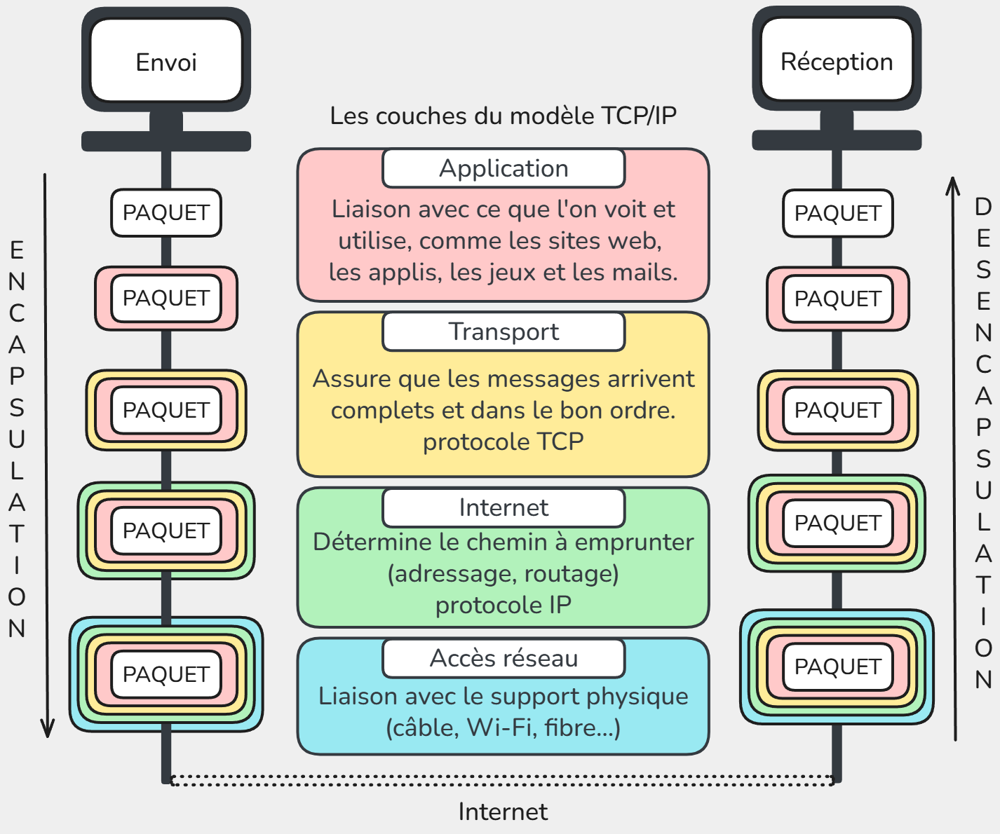

# 🌐 SNT – Internet  

---

## Internet = un réseau de réseaux
Internet n’est pas une seule machine géante.  
C’est en réalité **un immense ensemble de réseaux interconnectés** :  

- **Les réseaux locaux (LAN)**  
  - Exemple : votre maison (box Internet + ordinateurs + téléphones connectés en Wi-Fi ou en câble).  
  - Exemple : le réseau du lycée (salles informatiques, imprimantes, serveurs pédagogiques).  
  - Exemple : le réseau d’une entreprise.  

Ces réseaux sont **privés et limités dans l’espace** (on les appelle des **réseaux locaux**).

---

### Les Fournisseurs d’Accès à Internet (FAI)
Pour communiquer avec le reste du monde, un réseau local doit se connecter à un **Fournisseur d’Accès à Internet (FAI)** :  
- En France : Orange, SFR, Free, Bouygues, etc.  
- Dans d’autres pays : AT&T, Deutsche Telekom, etc.  

Un FAI gère un **réseau beaucoup plus vaste** qui relie des millions de clients.  

---

### L’interconnexion mondiale
- Les réseaux des FAI sont eux-mêmes reliés **entre eux** par de très grandes lignes de communication (fibre optique, câbles sous-marins, satellites).  
- Les grandes entreprises (Google, Amazon, Microsoft, etc.) possèdent aussi leurs **propres réseaux** qui s’interconnectent avec les FAI.  

📌 Résultat :  
Quand vous envoyez un message, il sort d’abord de votre réseau local → passe par le réseau de votre FAI → traverse plusieurs autres réseaux → atteint le réseau du destinataire.  

👉 **Idée clé à retenir :**  
Internet, c’est **l’interconnexion de milliers de réseaux locaux et de fournisseurs d’accès** à l’échelle mondiale, qui communiquent tous grâce à des **protocoles communs**.

---

## Modèle en couches TCP/IP

La communication sur un réseau se fait grâce à des protocoles, qui sont des règles définissant comment les données sont envoyées, reçues et comprises par les machines.

Le modéle TCP/IP organise la communication en **4 couches**, chacune ayant un rôle spécifique et ses protocoles.  

Quand on envoie un message ou un fichier sur Internet, il n’est jamais envoyé en un seul bloc, mais découpé en petits morceaux appelés **paquets**.  
Chaque couche y ajoute des informations spécifiques (adresse de destination, numéro du paquet, etc) avant de transmettre les données, c'est l'**encapsulation**.

À la réception, chaque couche retire son en-tête pour reconstituer les données originales c’est la **désencapsulation**.

## Le protocole IP et l’adressage

Chaque appareil connecté à Internet doit être identifiable de manière **unique**.  
Pour cela, deux types d’adresses existent :

### 📍 Adresse MAC (adressage local)
Chaque machine dispose d’une ou plusieurs **cartes réseau** (Wi-Fi, Ethernet…) à laquelle est attribuée une **adresse physique unique au monde** : l’adresse **MAC** qui n'est utilisée que **dans le réseau local**.  

Format : 6 blocs de 2 caractères hexadecimal (0->9 + a->f) (ex. `a1:b2:c3:d4:e5:f6`).

### 🌐 Adresse IP (adressage global)

Chaque machine connectée à Internet reçoit une **adresse IP**, qui sert d’**identifiant logique** pour la retrouver parmi des milliards d’autres. Elle change réguliérement. 

- Composée de deux parties :  
  - **Réseau** → identifie le réseau auquel appartient la machine.  
  - **Hôte (machine)** → identifie l’appareil dans ce réseau.  

Les premières adresses IP étaient au format **IPv4**, c'est-à-dire 4 nombres décimaux entre 0 et 255, comme ceci:

`91.198.174.192` (serveur Wikipédia)
`127.0.0.1` → adresse spéciale **localhost** (sa propre machine)

Cependant, ce format ne nous permet d'utiliser que **4 milliards d’adresses**, insuffisant pour le nombre d’appareils connectés.  
Encore aujourd'hui, nous faisons la transition vers un nouveau format **IPv6** (16 caractéres hexadécimaux) :

`2a02:ec80:0600:ed1a` (Wikipédia en IPv6).  

Nous avons désormais 18 millions de milliards d'adresses possibles.

### DNS – Domain Name System

Quand vous tapez un nom de site dans votre navigateur, par exemple `wikipedia.org`, votre ordinateur ne sait pas directement où envoyer les paquets, il a besoin de **l’adresse IP** correspondante.
Pour éviter d'avoir à se souvenir des IPs de tous les sites, nous utilisons le DNS.  

Le **DNS (Domain Name System)** est un service qui fait la correspondance entre le Nom symbolique et l'Adresse IP par le biais de serveurs DNS.

---

## Le protocole TCP (Transmission Control Protocol)

Chaque paquet contient :  
- l’adresse de l’**émetteur** (source),  
- l’adresse du **destinataire**,  
- une partie des **données** (texte, image, son…).  

| Adresse source | Adresse destination | Données |  
|----------------|---------|------------------|  

TCP est un **protocole de communication fiable**. Il s’assure que :  

1. **Tous les paquets arrivent à destination**.  
   - Si un paquet est perdu sur le chemin, TCP le redemande.  
2. **Les paquets sont remis dans le bon ordre**.  
   - Les paquets peuvent arriver dans le désordre, TCP les réorganise.  
3. **La congestion du réseau est gérée**.  
   - TCP ajuste la vitesse d’envoi pour ne pas saturer le réseau.  

---

### 🔄 Transmission et fiabilité
- Chaque paquet contient un **numéro d’ordre** et un **accusé de réception**.  
- Si un paquet n’est pas accusé dans un certain délai, il est **renvoyé automatiquement**.  

Ordinateur A ---> paquet #1 ---> Ordinateur B  
<--- ACK #1 ----  
Ordinateur A ---> paquet #2 ---> Ordinateur B  
<--- ACK #2 ----  

- Cela garantit que **tout le message est complet** à l’arrivée.  

---

### ⚠️ Limites de TCP
- TCP **ne garantit pas le temps d’arrivée** des paquets.  
  - Utile pour mails ou fichiers.  
  - Moins adapté pour les **vidéos en direct ou jeux en ligne**, car attendre les paquets manquants crée du **lag**.  
- Pour ces usages, on utilise souvent **UDP (User Datagram Protocol)**, qui envoie les paquets sans vérification ni réordonnancement → plus rapide mais moins fiable.

---

💻 Expérience : tester si un autre appareil ou site est joignable

- Ouvrir l’invite de commande.
- Taper : ping wikipedia.org
- Observer :
  - L’adresse IP de wikipedia.org
  - Le temps aller-retour des paquets
  - Si tous les paquets sont reçus

---

### 📌 À retenir
- TCP découpe les données en **paquets**, les envoie et les réassemble.  
- Il assure **la fiabilité** : tout paquet perdu est renvoyé et les paquets sont remis dans le bon ordre.  
- TCP est le protocole utilisé pour la majorité des communications **fiables** sur Internet (mail, web, transfert de fichiers).  
- Pour les applications **temps réel** (streaming, jeux), UDP est utilisé à la place.

---

## Le routage
Les paquets ne vont pas directement de l’émetteur au destinataire.  
Ils passent par plusieurs **routeurs**, qui choisissent à chaque étape le **meilleur chemin possible**.  

Schéma simplifié :  

Ordinateur A → [Routeur 1] → [Routeur 2] → [Routeur 3] → Ordinateur B

- Chaque routeur connaît seulement une **carte locale**.  
- Si un chemin est bloqué, le paquet est envoyé ailleurs.  
- Certains paquets peuvent être perdus → TCP les renvoie.  

💻 Expérience : suivre le chemin des paquets sur Internet

- Ouvrir l’invite de commande.
- Taper : tracert wikipedia.org
- Observer :
  - Les routeurs traversés
  - Les temps de passage
  - Les étoiles (*) pour routeurs qui ne répondent pas

---

### 🔹 Expérience pratique : nslookup

💻 **Objectif :** résoudre un nom de domaine en adresse IP et identifier le serveur DNS utilisé

1. Ouvrir l’invite de commande sur Windows.  
2. Taper la commande :

nslookup wikipedia.org  

3. Observer :
   - L’**adresse IP** retournée pour wikipedia.org
   - Le **serveur DNS** qui a répondu

4. Comparer avec l’adresse IP obtenue avec `ping wikipedia.org` pour voir que c’est la même.

💡 **Lien avec le cours :** cette expérience montre **comment un nom de site est traduit en adresse IP** avant que les paquets soient envoyés.

## Repères historiques

- **1950s-1960s** : premiers réseaux d’ordinateurs.  
- **1970** : ArpaNet (USA).
- **1983** : naissance officielle d’Internet avec le protocole **TCP/IP**.  

## Réseau pair-à-pair

## Indépendance au support physique

## Ordre de grandeur