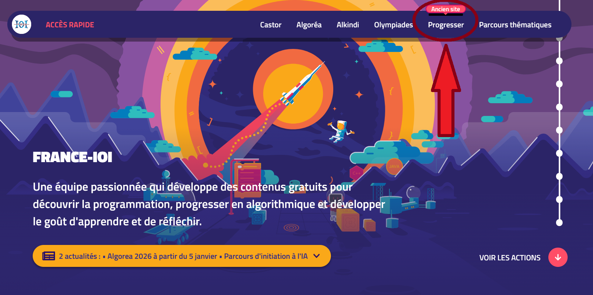
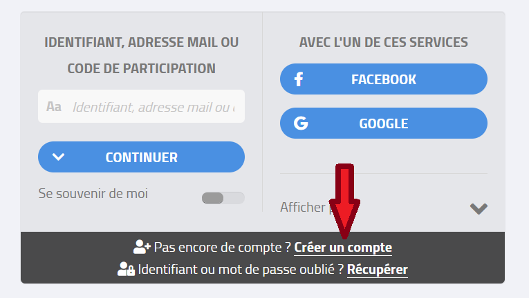
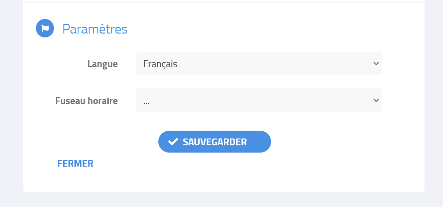
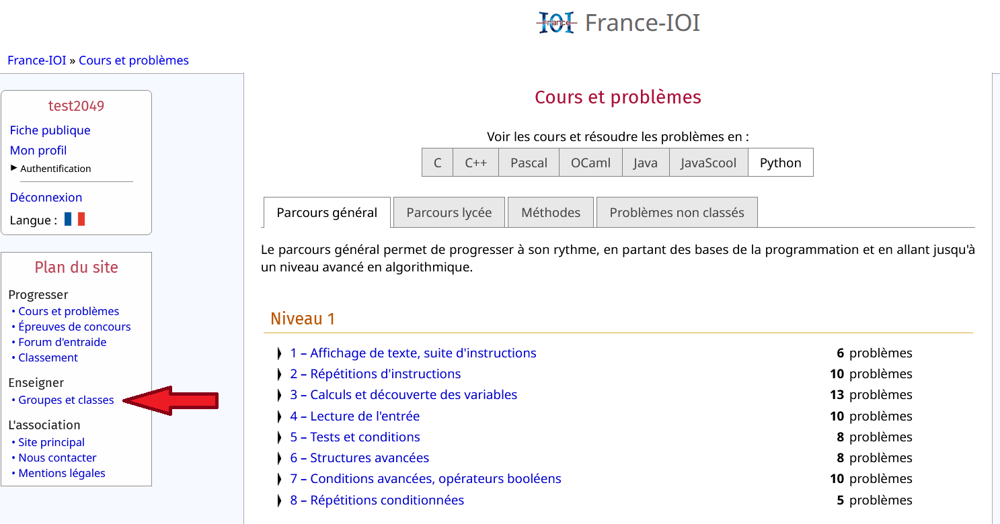
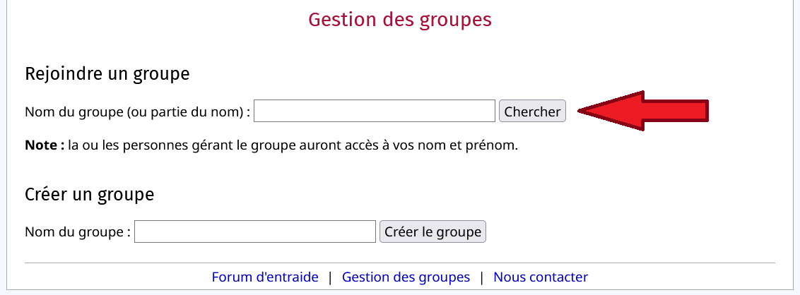
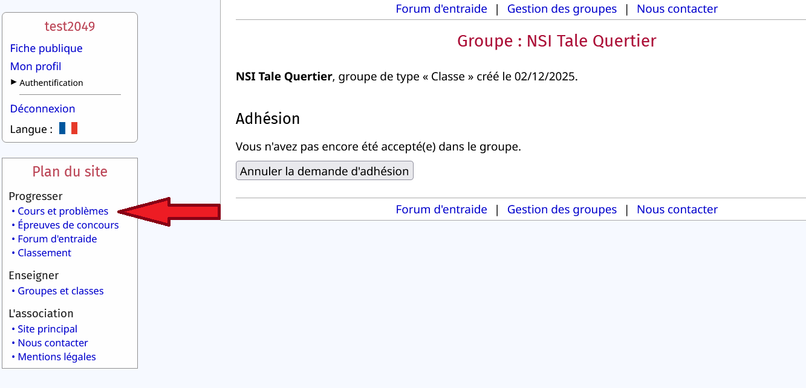

# Créer un compte France-IOI

France-IOI est une association française qui a pour objectif de promouvoir l’informatique et l’algorithmique auprès des élèves et des enseignants. Elle est notamment connue pour organiser et coordonner des concours de programmation, comme les Olympiades françaises d’informatique, et pour proposer une plateforme d’entraînement en ligne avec des exercices progressifs.
Très utilisée dans le cadre scolaire, France-IOI permet aux élèves de développer des compétences en algorithmique, en logique et en programmation (souvent en Python ou en C++) à travers une approche ludique et motivante, basée sur la résolution de problèmes.

## Création d'un compte

La section du site qui nous intéresse se trouve içi :

Ensuite nous irons sur la page de connexion :

Nous allons créer un compte :

>Pour éviter les oublis, vous devez **obligatoirement** faire en sorte que votre mot de passe soit **exactement identique** à votre identifiant.

Une fois cela fait, cliquez sur **autoriser**.

## Compléter le profil

Ensuite, on aura besoin d'enregistrer notre nom et prénom, rien de plus. 

Puis il faudra descendre en bas de la page et cliquer sur *sauvegarder*.

## Rejoindre le groupe de classe

Le nom du groupe sera écrit au tableau.

Cliquer ensuite sur le groupe en question puis sur rejoindre (pas besoin d'être accepté.e dans le groupe pour commencer).

## Commencer les exercices

Vous arriverez ici :

>>>>>>>>>>**Vous pouvez commencer !**