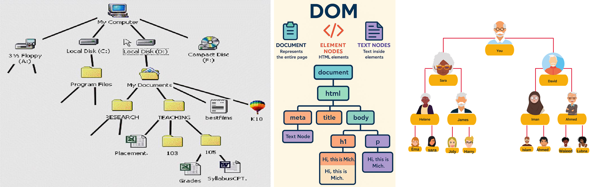
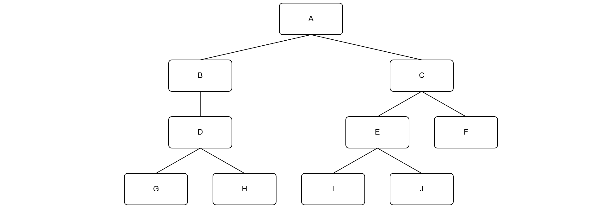
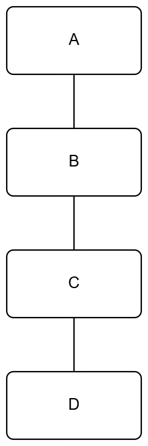
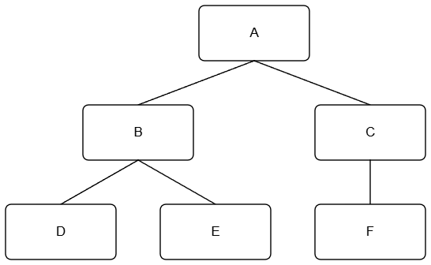
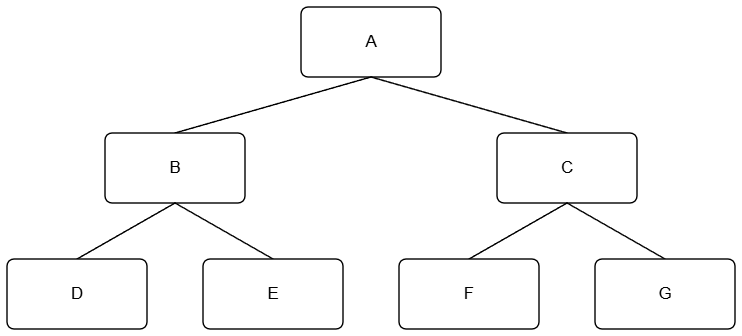
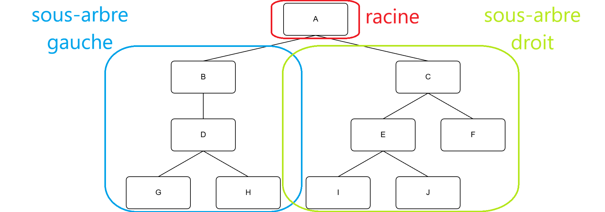
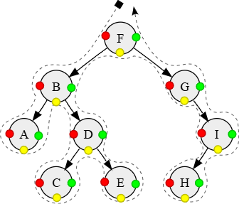
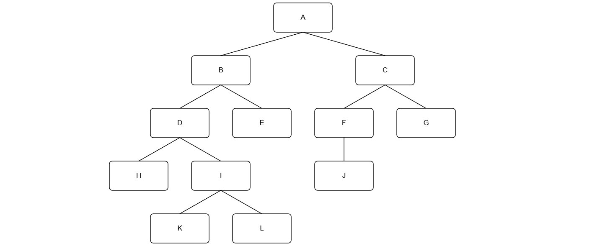

# Arbres binaires

## Introduction

### Définitions

Un arbre est une structure de données hiérarchique composée de **nœuds** reliés entre eux par des **arêtes**.
Chaque nœud suit deux règles simples :

- il peut donner accès à plusieurs nœuds **enfants**
- il n'est accessible que par au maximum un seul nœud **parent**

On retrouve cette structure partout :

- l'arborescence d'un système de fichiers
- le DOM d'une page HTML
- l'arbre généalogique d'une famille



On ne s'interessera ici qu'aux **arbres binaires**, c'est à dire des arbres dont les noeuds ne peuvent avoir qu'**au maximum deux enfants**.



### Vocabulaire

**Racine** : Le nœud **tout en haut** de l'arbre. Il est **unique** et n'a pas de parent.

**Feuille** : Un nœud **sans enfant**. C'est un nœud terminal, au bas de l'arbre.

La **hauteur** correspond au plus grand nombre de noeuds rencontrés en descendant de la racine jusqu'à une feuille (4 dans notre exemple).

La **taille** d'un arbre correspond au nombre de noeuds dont il est composé.

### Arbres particulier

Un arbre **vide** ne contient aucun noeud.

Tous les noeuds d'un **peigne** n'ont pas plus d'un fils. Si tous les noeuds (sauf la racine) sont des fils gauche, on dira que c'est un **peigne droit** (idem pour le **peigne gauche**).

Tous les niveaux d'un arbre **équilibré** sont entièrement remplis, sauf éventuellement le dernier niveau.

Tous les niveaux d'un arbre **complet** sont entièrement remplis, sauf éventuellement le dernier niveau, et ce dernier niveau est rempli à partir de la gauche.

Tous les noeuds d'un arbre **parfait** ont exactement deux enfants sauf les racines qui sont toutes au même niveau.

|peigne|complet|parfait|
|--|--|--|
||||

---

### Exercice

1) Dessiner tous les arbres binaires ayant :

- 1 noeud
- 2 noeuds
- 3 noeuds
- 4 noeuds

2) Indiquer pour chacun d'eux si ils appartient à une catégorie particulière d'arbre.

3) En déduire le nombre d'arbres possibles en fonctions du nombres de noeuds.

---

## Représentation Python

Un arbre binaire est défini **par lui-même** :

> Un arbre binaire est :

>- **soit un arbre vide**
>- soit composé d'un **nœud racine** qui pointe vers **deux sous-arbres binaires** : un sous-arbre gauche et un sous-arbre droit.

C'est ce qu'on appelle une **définition récursive** : on définit un arbre en termes d'arbres plus petits.



La définition récursive vue précédemment se traduit **directement** en Python par une classe. Chaque nœud porte trois informations : son fils gauche, sa valeur, et son fils droit.

```Python

class Noeud:
    """un noeud d'un arbre binaire"""

    def __init__(self, g : 'Noeud | None', v : any, d : 'Noeud | None'):
        self.gauche = g
        self.valeur = v
        self.droite = d

```

### Construire un arbre
 
On construit un arbre **de bas en haut** : on commence par les feuilles, puis on remonte vers la racine.
 
```
        A
       / \
      B   C
     / \
    D   E
```
 
```python
# Les feuilles en premier (pas d'enfants → None, None)
D = Noeud(None, 'D', None)
E = Noeud(None, 'E', None)
C = Noeud(None, 'C', None)
 
# Puis les nœuds internes
B = Noeud(D, 'B', E)
 
# Enfin la racine
A = Noeud(B, 'A', C)
```
 
---
 
### Lire un arbre
 
Une fois l'arbre construit, on accède aux nœuds via les attributs :
 
```python
print(A.valeur)          # 'A'
print(A.gauche.valeur)   # 'B'
print(A.droite.valeur)   # 'C'
 
print(A.gauche.gauche.valeur)   # 'D'
print(A.gauche.droite.valeur)   # 'E'
 
print(A.droite.gauche)   # None  ← C n'a pas d'enfant gauche
```
 
---

### Exercice

1) Programmer les fonctions suivantes : 

```python

def est_vide(a):
    " Renvoie True si l'arbre a est vide, False sinon "
    # à remplir

def est_feuille(a):
    " Renvoie True si l'arbre a une feuille, False sinon "
    # à remplir

def taille(a : 'Noeud') -> int :
    " Renvoie le nombre de noeuds l'arbre a "
    # à remplir

def hauteur(a : 'Noeud') -> int :
    " Renvoie la hauteur de l'arbre a "
    # à remplir

def racine(a):
    " Renvoie la racine de l'arbre a "
    # à remplir

def feuilles(a):
    " Renvoie la liste des feuilles de l'arbre a "
    # à remplir

def est_peigne(a):
    " Renvoie True si l'arbre a est un peigne, False sinon "
    # à remplir

def est_parfait(a):
    " Renvoie True si l'arbre a est parfait, False sinon "
    # à remplir

```

### Parcours

Un **parcours** consiste à visiter **tous les nœuds** d'un arbre exactement une fois, dans un ordre défini. Il existe deux grandes familles de parcours.

---

#### Parcours en profondeur

On descend le plus loin possible dans l'arbre avant de revenir en arrière. Il existe **3 variantes**, selon le moment où l'on traite la racine par rapport à ses sous-arbres.

L'arbre utilisé pour tous les exemples :

```
        A
       / \
      B   C
     / \   \
    D   E   F
```

---

**Parcours préfixe**

> Racine → Gauche → Droite

On traite le nœud **avant** de descendre dans ses enfants.

Résultat sur notre arbre : **A, B, D, E, C, F**

**Parcours infixe**

> Gauche → Racine → Droite

On traite le nœud **entre** ses deux sous-arbres.

Résultat sur notre arbre : **D, B, E, A, C, F**

**Parcours suffixe**

> Gauche → Droite → Racine

On traite le nœud **après** ses deux sous-arbres.

Résultat sur notre arbre : **D, E, B, F, C, A**

### Récapitulatif des 3 parcours en profondeur



<span style="color:red">Parcours préfixe : F B A D C E G I H</span>  
<span style="color:#cc9900">Parcours infixe : A B C D E F G H I</span>  
<span style="color:green">Parcours postfixe : A C E D B H I G F</span>  

---

#### Parcours en largeur

Au lieu de descendre en profondeur, on visite les nœuds **niveau par niveau**, de gauche à droite.

```
        A
       / \
      B   C
     / \   \
    D   E   F
```

Résultat : **A, B, C, D, E, F**

---

#### Exercice

1) Donner l'odre des noeuds de cet arbre en respectant les 4 parcours vus précédemment.



2) Programmer ensuite des fonctions Python qui affichent les noeuds d'un arbre pour chacun de ces parcours.

---

## Outils

[Site de création d'arbres](https://vgarciasc.github.io/tree-renderer/)