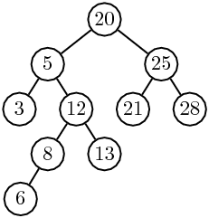
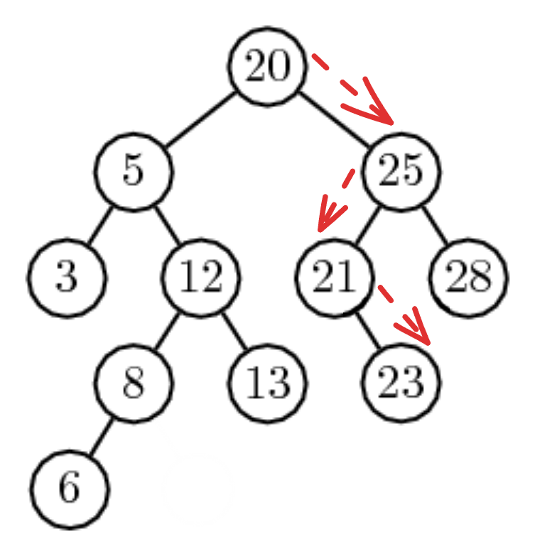
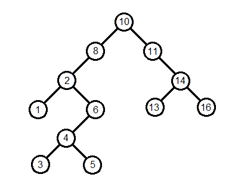

# Arbres Binaires de Recherche

## Introduction

Supposons qu'on dispose d'une liste de 1 000 000 d'entiers et qu'on cherche à savoir si la valeur `42` en fait partie.

- Dans une **liste non triée**, on est obligé de parcourir tous les éléments un par un → **O(n)**
- Dans une **liste triée**, on peut utiliser la recherche dichotomique → **O(log n)**
    - Mais insérer dans une liste triée reste coûteux, puisqu'il faudrait décaler tous les éléments plus grands → **O(n)**

Il nous faudrait donc une structure qui permette à la fois une recherche et une insertion efficaces.

Pour cela, nous allons utiliser un type particulier d'**arbre binaire** : l'**arbre binaire de recherche (ABR)**.



On remarque que pour **chaque nœud** :
- toutes les valeurs dans son sous-arbre **gauche** lui sont **inférieures**
- toutes les valeurs dans son sous-arbre **droit** lui sont **supérieures ou égales**.

**Exercice**

1) Donner tous les ABR formés de trois nœuds et contenant les entiers 1, 2 et 3.

2) Dans un ABR, où se trouve le plus petit élément? En déduire une fonction minimum(a) qui renvoie le plus petit élément de l'ABR a. Si l'arbre a est vide, alors cette fonction renvoie None.

3) Écrire une fonction compte(x, a) qui renvoie le nombre d'oсcurrences de x dans l'ABR a.

## Insertion d'un élément

Un nouvel élément inséré dans un ABR sera toujours une feuille.
En partant de la racine, nous allons chercher sa place :

- S'il est plus petit, nous allons à droite
- S'il est plus grand ou égal, nous allons à gauche
- Si nous tombons sur un arbre vide, c'est que nous pouvons l'insérer ici

*Exemple* : nous voulons insérer un Noeud contenant la valeur `23`.

- `23 >= 20` : nous allons à droite
- `23 < 25` : nous allons à gauche
- `23 >= 21` : nous allons à droite
- C'est un arbre **vide**, nous pouvons ajouter notre noeud.



**Exercices**

1) Proposer une fonction permettant d'insérer un élément dans un ABR. Quelle est la complexité de cette fonction ?

2) En déduire une fonction permettant de créer un ABR à partir de la liste des éléments qui le composera.

3) Proposer une variante de la fonction d'insertion qui n'ajoute pas l'élément x à l'arbre a s'il est déjà dedans.

## Suppression d'un élément

La suppression d'un noeud est un petit peu plus délicate à effectuer que l'insertion.

Trois situations sont possibles :

### Le Noeud n'a pas d'enfant

Facile : il suffit de le supprimer, il n'a pas d'enfant donc pas de problème.

*Exemple* : On veut supprimer la valeur `6`.

|Avant|Après|
|--|--|
|||

### Le noeud a un enfant

Facile également : il suffit de remplacer le noeud à supprimer par son seul enfant.

*Exemple* : On veut supprimer la valeur `8`.

|Avant|Après|
|--|--|
|||

### Le noeud a deux enfants

C'est le cas le plus délicat : on doit remplacer notre noeud par celui qui a la plus petite valeur **parmis son sous-arbre droit**.

Si on a de la chance, cela se fait assez vite :

*Exemple* : On veut supprimer la valeur `25`.

|Avant|Après|
|--|--|
|||

Si on a moins cela impliquera un ou plusieurs appels récursifs :

*Exemple* : On veut supprimer la valeur `5`.  
On va le remplacer par `8`, ce qui implique de supprimer `8`.  
On va donc impliquer le même raisonnement (récursivement) : ici `8` n'a qu'un enfant donc on le remplace par celui-ci.  

|Avant|Après|Final|
|--|--|--|
||||

**Exercices**

Voici un nouvel ABR : 



1) Sur papier, appliquer les suppressions suivantes sur l'ABR : `1`, `6` et `10`.

2) Lors de la suppression d'un nœud à deux enfants, on choisit de le remplacer par le minimum du sous-arbre droit. Aurait-on pu choisir une autre valeur ? Laquelle, et pourquoi serait-elle également valide ?

3) Voici une ébauche de la fonction de suppression. Compléter les ... sans rédiger les fonctions appelées :

```Python
def supprime(x, a):

    if est_vide(a):
        return a

    if x < a.valeur:
        return Noeud(supprime(x, a.gauche), a.valeur, a.droite)
    elif x > a.valeur:
        return Noeud(a.gauche, a.valeur, supprime(x, a.droite))

    else:  # x == a.valeur : c'est ce nœud qu'on supprime
        
        if est_vide(a.gauche):
            return ...          # cas : pas d'enfant gauche
        elif est_vide(a.droite):
            return ...          # cas : pas d'enfant droit
        else:
            m = minimum(...)    # minimum du sous-arbre droit
            return Noeud(a.gauche, m, supprime(m, ...))
```