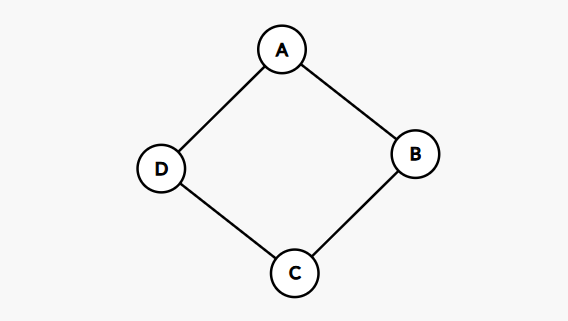
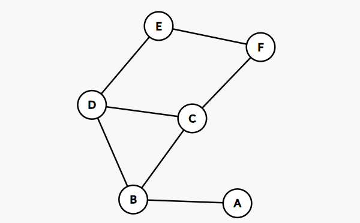
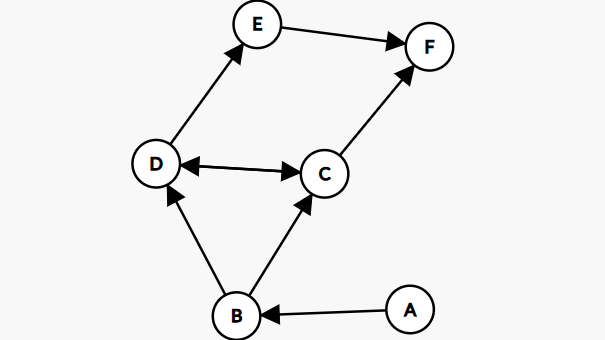
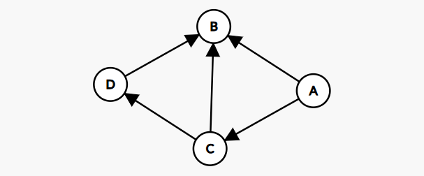

# Graphes

## Introduction

Les arbres que nous avons étudiés sont des structures **hiérarchiques** : chaque nœud n'a qu'un seul parent, les relations vont toujours du parent vers l'enfant.

Mais de nombreuses situations réelles sont plus complexes :

- Dans un **réseau routier**, une ville peut être reliée à plusieurs autres, dans les deux sens.
- Dans un **réseau social**, une personne peut suivre ou être suivie par de nombreuses autres.
- Sur **Internet**, un serveur peut être connecté à des dizaines d'autres.

Pour modéliser ces situations, on utilise une structure plus générale : le **graphe**.

---

## Définitions

Un **graphe** est un ensemble de **sommets** reliés entre eux par des **arêtes**.



Ici, `A`, `B`, `C`, `D` sont les **sommets**, et les traits sont les **arêtes**.

### Vocabulaire

- Le **degré** d'un sommet est le nombre d'arêtes qui lui sont reliées. Dans l'exemple ci-dessus, chaque sommet a un degré de 2.
- Deux sommets reliés par une arête sont dits **voisins** ou **adjacents**.
- Un **chemin** est une suite de sommets reliés les uns aux autres.
- Un **cycle** est un chemin qui revient à son point de départ.
- Un graphe est dit **connexe** s'il existe un chemin entre toute paire de sommets.

### Exercice

Soit le graphe suivant :



1) Quel est le degré de chaque sommet ?  
2) Donner un chemin de `A` à `E`.  
3) Ce graphe contient-il un cycle ? Si oui, lequel ?  
4) Ce graphe est-il connexe ?  

---

## Graphes orientés
 
Dans un graphe **orienté**, les arêtes (qu'on appelle alors des **arcs**) ont un sens, représenté par une flèche.
 

 
Si un arc va de `A` vers `B`, on dit que :
 
- `B` est un **successeur** de `A`
- `A` est un **prédécesseur** de `B`
> Exemple : les abonnements sur un réseau social. Je peux suivre quelqu'un sans qu'il me suive en retour.
 
Dans un graphe orienté, chaque arc ayant une direction, on distingue deux types de degrés pour un sommet :

- Degré sortant : nombre d'arcs qui partent du sommet.
- Degré entrant : nombre d'arcs qui arrivent vers le sommet.

### Chemins et cycles dans un graphe orienté
 
L'orientation des arcs change la notion de chemin : on ne peut désormais se déplacer **que dans le sens des flèches**.
 
Dans le graphe ci-dessus, il existe un chemin de `A` vers `C` (en passant par `B`), mais il n'en existe pas de `C` vers `A`.
 
De même, un **cycle** dans un graphe orienté doit respecter le sens des arcs. Un ensemble de sommets peut former un cycle dans un sens, mais pas dans l'autre.
 
### Exercice
 
1) Dans le graphe orienté ci-dessus, donner les successeurs et les prédécesseurs de chaque sommet.  

2) Existe-t-il un chemin de `A` vers `D` ? De `D` vers `A` ? Justifier.  

3) Ce graphe contient-il un cycle ? Si oui, lequel ?  

4) Modéliser chacune des situations suivantes sous forme de graphe en identifiant les sommets et les arêtes.
Pour chacun d'entre eux dire :
- s'il est connexe
- le degré de chaque sommet (indiqué les voisins ou predecessurs/successeurs)
- s'il est cyclique


**Situation A** — Le réseau ferroviaire d'une région comporte les liaisons suivantes :

- Paris est relié à Lyon, Bordeaux et Lille.
- Lyon est relié à Marseille et Grenoble.
- Bordeaux est relié à Toulouse.
- Lille est relié à Strasbourg.

**Situation B** — Sur un réseau social, voici les abonnements entre utilisateurs :

- Alice suit Bob et Clara.
- Bob suit Clara.
- Clara suit Alice.
- David suit Alice et Bob.

**Situation C** — Dans une entreprise, voici les liens hiérarchiques :

- La PDG dirige les responsables Marketing, Technique et Commercial.
- Le responsable Technique dirige les développeurs Alice et Bob.
- Le responsable Commercial dirige la commerciale Clara.

---

## Représentation par matrice d'adjacence

On peut représenter un graphe sous forme de tableau : les lignes et les colonnes correspondent aux sommets, et on indique `1` s'il existe une arête entre deux sommets, `0` sinon.

|   | A | B | C | D |
|---|---|---|---|---|
| A | 0 | 1 | 1 | 0 |
| B | 1 | 0 | 0 | 1 |
| C | 1 | 0 | 0 | 1 |
| D | 0 | 1 | 1 | 0 |

### Exercice

Soit le graphe suivant :



1) Recopier et compléter la matrice d'adjacence de ce graphe.

2) Dessiner le graphe correspondant à la matrice suivante :

|   | A | B | C | D |
|---|---|---|---|---|
| A | 0 | 1 | 0 | 1 |
| B | 1 | 0 | 1 | 0 |
| C | 0 | 1 | 0 | 1 |
| D | 1 | 0 | 1 | 0 |

3) Comment pourrait-on reconnaitre un graphe non orienté, uniquement avec sa matrice d'adjacence ?

4) Comment lire le degré d'un sommet directement sur la matrice ?

### En Python

La matrice se traduit naturellement par une liste de listes :

```python
matrice = [
    [0, 1, 1, 0],  # A
    [1, 0, 0, 1],  # B
    [1, 0, 0, 1],  # C
    [0, 1, 1, 0],  # D
]
```

5) Écrire une fonction `est_predecesseur(matrice, i, j)` qui renvoie `True` si `i` est un predecesseur de `j`.

6) Écrire une fonction `est_successeur(matrice, i, j)` qui renvoie `True` si `i` est un successeur de `j`.

7) Écrire une fonction `degre(matrice, i)` qui renvoie le degré du sommet `i`.

---

## Représentation par liste d'adjacence

On peut aussi représenter un graphe sous forme d'un tableau à deux colonnes : pour chaque sommet, on liste ses voisins.

| Sommet | Voisins |
|--------|---------|
| A | B, C |
| B | A, D |
| C | A, D |
| D | B, C |

### Exercice

Soit le graphe suivant :


1) Recopier et compléter le tableau de liste d'adjacence de ce graphe.

2) Dessiner le graphe correspondant au tableau suivant :

| Sommet | Voisins |
|--------|---------|
| A | B, D |
| B | A, C, D |
| C | B |
| D | A, B |

### En Python

La liste d'adjacence se traduit naturellement par un dictionnaire :

```python
graphe = {
    'A': ['B', 'C'],
    'B': ['A', 'D'],
    'C': ['A', 'D'],
    'D': ['B', 'C'],
}
```

3) Écrire une fonction `est_predecesseur(matrice, i, j)` qui renvoie `True` si `i` est un predecesseur de `j`.

4) Écrire une fonction `est_successeur(matrice, i, j)` qui renvoie `True` si `i` est un successeur de `j`.

5) Écrire une fonction `degre(matrice, i)` qui renvoie le degré du sommet `i`.

6) Écrire une fonction `matrice_vers_liste(matrice)` qui convertit une matrice d'adjacence en dictionnaire d'adjacence.

---

### Quelle représentation choisir ?

Le choix dépend du graphe et de ce qu'on veut en faire.

Si le graphe est **dense** (beaucoup d'arêtes) ou qu'on a souvent besoin de tester si deux sommets sont voisins, la **matrice** est plus adaptée : la réponse est immédiate.

Si le graphe est **creux** (peu d'arêtes par rapport au nombre de sommets), la **liste** est plus adaptée : inutile de réserver une case pour chaque paire de sommets qui ne sont pas reliés. Un réseau routier avec 100 villes reliées chacune à 3 ou 4 voisines occuperait 10 000 cases en matrice, pour seulement quelques centaines d'arêtes réelles.

En pratique, la liste d'adjacence est la représentation la plus courante, car la plupart des graphes réels sont creux.

---

## Parcours de graphes

Comme pour les arbres, on peut **parcourir** tous les sommets d'un graphe. Mais attention : un graphe peut contenir des **cycles**. Il faut donc mémoriser les sommets déjà visités pour ne pas boucler indéfiniment.

### Parcours en profondeur (DFS)

On explore une branche aussi loin que possible avant de revenir en arrière. C'est le même principe que le parcours en profondeur d'un arbre.

```python
def dfs(graphe, depart):
    visites = set()

    def explorer(s):
        if s in visites:
            return
        visites.add(s)
        print(s)
        for voisin in graphe[s]:
            explorer(voisin)

    explorer(depart)
```

### Parcours en largeur (BFS)

On explore tous les voisins d'un sommet avant de passer au niveau suivant. On utilise une **file**.

```python
from collections import deque

def bfs(graphe, depart):
    visites = set()
    file = deque([depart])
    visites.add(depart)

    while file:
        s = file.popleft()
        print(s)
        for voisin in graphe[s]:
            if voisin not in visites:
                visites.add(voisin)
                file.append(voisin)
```

### Exercice

Soit le graphe suivant :

```python
graphe = {
    'A': ['B', 'C'],
    'B': ['A', 'D', 'E'],
    'C': ['A', 'F'],
    'D': ['B'],
    'E': ['B'],
    'F': ['C'],
}
```

1) Dessiner ce graphe.

2) Donner l'ordre de visite des sommets lors d'un parcours DFS depuis `A`.

3) Donner l'ordre de visite des sommets lors d'un parcours BFS depuis `A`.

4) Écrire une fonction `est_connexe(graphe)` qui renvoie `True` si le graphe est connexe. *(Indication : après un parcours depuis n'importe quel sommet, tous les sommets doivent avoir été visités.)*

5) Écrire une fonction `chemin(graphe, depart, arrivee)` qui renvoie une liste de sommets formant un chemin entre `depart` et `arrivee`, ou `None` s'il n'en existe pas.