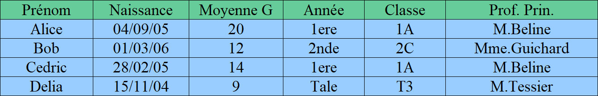
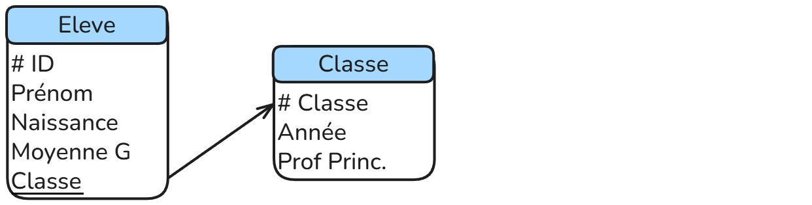

# Bases de données

## Objectifs du chapitre
À la fin de ce cours, vous devez être capables de :  
- Comprendre le modèle relationnel (tables, attributs, clés).  
- Distinguer structure et contenu d’une base de données.  
- Manipuler une base de données via SQL (interrogation et mise à jour).  
- Connaître le rôle d’un SGBD (sécurité, efficacité, persistance).  
- Porter un regard critique sur l’usage des données (confidentialité, RGPD).  

---

## Introduction

Une **donnée** est une représentation élémentaire d'une information, 
exprimée sous une forme interprétable par un système informatique.

Une **base de données** est un outil permettant de stocker, organiser et manipuler de grandes quantités de données.  
Exemples :  
- Amazon → millions de commandes et utilisateurs.  
- Spotify → catalogues de musiques, playlists personnelles.  
- Un lycée → notes, emplois du temps, enseignants, salles.  

Les simples **tableaux** vus en Première ne suffisent plus : il faut un modèle plus robuste → **le modèle relationnel**.

---

## Le modèle relationnel

Une **table** est une structure qui permet de stocker des données dans une base de données relationnelle.
Elle est composée :  
- de colonnes (appelées **attributs**) qui décrivent la nature des données  
- de lignes (appelées tuples ou **enregistrements**) qui contiennent les valeurs concrètes  

Voici un exemple :
La table : Eleve


Chaque attribut est défini sur un domaine de valeurs.  
Le domaine n’est pas seulement le type de donnée (entier, texte, date), mais aussi parfois des contraintes supplémentaires (ex. : âge ≥ 0, email respectant un format particulier, etc).

Pour identifier de manière unique chaque ligne (chaque enregistrement) d’une table, on utilisera ce qu'on appelle une **clé primaire** qui peut être un attribut ou un ensemble d’attributs.

- Elle doit être unique : deux lignes ne peuvent pas avoir la même valeur de clé primaire.
- Elle doit être non nulle (NOT NULL).
- Elle ne doit pas changer dans le temps (stabilité).

<span style="color:blue">Exercices</span> : Determiner la clé primaire ainsi que les domaines et contraintes des attributs de la classe Eleve.

Très souvent, la clé primaire est constituée d’un unique attribut défini comme un identifiant numérique unique et auto-incrémenté, garantissant l’unicité et la stabilité des enregistrements.

### Problèmes : Redondance et anomalies

- Professeurs répétés :  
Le professeur principal de la classe 1A (M. Beline) apparaît plusieurs fois (Alice et Cédric).  
Si le professeur principal devait changer, il faudrait alors le corriger partout, sinon incohérence.  

- Années liées aux classes :  
L’"Année" est implicitement liée à la "Classe". On stocke plusieur fois la même information : la 1A est une classe de première.

**Les anomalies :**  
- d'**insertion** : si on veut enregistrer une classe qui n'a pas encore d'élève, on ne peut pas  
- de **mise à jour** : si un professeur change de nom, il faut le modifier partout dans la base sinon incohérence  
- de **suppression** : Si on supprime tous les élèves de la classe 1A, on perd toute les informations sur cette dernière  

Afin d’éviter les redondances et les anomalies, on sépare les informations dans plusieurs tables reliées entre elles par des clés étrangères.  
Une **clé étrangère** est un attribut (ou un ensemble d’attributs) d’une table qui fait référence à la **clé primaire d’une autre table**.  
Elle permet de **lier deux tables entre elles** et d’assurer la cohérence des données.  

Dans notre exemple, il est pertinent d'utiliser deux classes : Eleve et Classe.


### Représentation : Le schéma relationnel

Le **schéma relationnel** décrit la **structure d’une base de données** relationnelle de manière formelle.  
Il précise pour chaque table :  
- Le **nom de la table**.  
- Les **attributs** (colonnes) avec leur domaine de valeurs et leurs contraintes (type, non null, valeurs autorisées).  
- La **clé primaire**, qui identifie de manière unique chaque enregistrement.  
- Les **clés étrangères**, qui établissent les liens avec d’autres tables.  

Le schéma relationnel est indépendant des données réelles (contenu).  
Il sert de **plan directeur** pour construire, maintenir et interroger la base de données tout en garantissant l’intégrité des informations et en évitant les redondances.  

Exemple simple : 


Le symbole `#` sert à identifier les clés primaires, les attributs soulignés sont les clés étrangères référencant la clé primaire pointée par la flèche.

Grâce à ce schéma, on sait **quelles tables existent**, **comment elles sont reliées**.

---

## Exercice : Base de données pour une bibliothèque

### Énoncé

Vous devez concevoir une base de données pour gérer les informations suivantes :  

Imaginez que vous travaillez dans une bibliothèque. Votre mission est de créer un système permettant de suivre toutes les informations importantes pour gérer les livres et leurs emprunts.  

Chaque livre possède des caractéristiques comme le titre, l’auteur et la date de publication. Pour ne pas confondre deux livres identiques, chaque exemplaire dispose d’un ISBN. Les clients qui fréquentent la bibliothèque ont chacune un prénom, un nom, une date de naissance et une adresse mail. On doit pouvoir distinguer facilement chaque lecteur. Enfin, la bibliothèque souhaite suivre les emprunts : pour chaque livre prêté, on connaît la date à laquelle il a été emprunté, la date prévue de retour, le livre concerné et la personne qui l’a emprunté.  

À partir de ce scénario, réfléchissez à la meilleure façon d’organiser ces informations pour éviter les répétitions et faciliter les recherches.


**Consignes :**

1. Identifiez les **tables** nécessaires.  
2. Pour chaque table, indiquez les **attributs**, leur **domaine de valeurs** et les **contraintes**.  
3. Déterminez la **clé primaire** pour chaque table.  
4. Identifiez les **clés étrangères** pour relier les tables entre elles.  
5. Dessinez le **schéma relationnel** correspondant.

### Énoncé

Vous devez concevoir une base de données pour gérer les informations d’un garage automobile.  
Votre mission est de créer un système permettant de suivre toutes les informations nécessaires sur les véhicules, les clients et les réparations effectuées.  

Chaque véhicule possède une immatriculation, un propriètaire, une marque, un modèle et une année de fabrication.  
Chaque client a un prénom, un nom, une adresse et un numéro de téléphone.  
Enfin, le garage souhaite suivre les réparations : pour chaque intervention, on doit enregistrer la date, la description des travaux réalisés, le véhicule concerné et le mécanicien responsable.  
Les mécaniciens sont identifiés par un matricule et ont un nom ainsi qu’une spécialité (moteur, carrosserie, électronique…).  

À partir de ce scénario, réfléchissez à la meilleure façon d’organiser ces informations pour éviter les répétitions et faciliter les recherches.

---

**Consignes :**

1. Identifiez les **tables** nécessaires.  
2. Pour chaque table, indiquez les **attributs**, leur **domaine de valeurs** et les **contraintes**.  
3. Déterminez la **clé primaire** pour chaque table.  
4. Identifiez les **clés étrangères** pour relier les tables entre elles.  
5. Dessinez le **schéma relationnel** correspondant.

---

## Le Système de Gestion de Bases de Données Relationnelles (SGBDR)

Jusqu’ici, nous avons étudié le **modèle relationnel** : tables, clés primaires, clés étrangères, schéma relationnel.  
Mais pour exploiter concrètement ces concepts, il faut un logiciel capable de **créer, gérer et interroger** des bases de données : c’est le rôle d’un **Système de Gestion de Bases de Données Relationnelles (SGBDR)**.

Un SGBDR (comme MySQL, PostgreSQL, SQLite, Oracle, SQL Server) rend plusieurs **services essentiels** :  

---

### 1. Persistance des données  
Un SGBDR assure que les données sont **stockées durablement** sur un support non volatil (disque, SSD).  
Contrairement aux simples structures en mémoire (listes, tableaux), les données sont conservées même après l’arrêt ou la panne du système.  
Exemple : les commandes d’Amazon ou les playlists Spotify ne disparaissent pas quand on éteint son ordinateur.

### 2. Gestion des accès concurrents  
Plusieurs utilisateurs ou programmes peuvent accéder à la base **en même temps**.  
Le SGBDR garantit que les données restent **cohérentes**, même si deux personnes modifient simultanément la même information.  
Exemple : deux employés de banque qui consultent et modifient le solde d’un compte en parallèle.

### 3. Efficacité du traitement des requêtes  
Le SGBDR optimise automatiquement l’exécution des requêtes SQL (sélection, jointures, filtrages) grâce à des mécanismes comme les **index**.  
L’utilisateur n’a pas besoin de savoir *comment* les données sont stockées physiquement : le système se charge d’obtenir la réponse **rapidement et efficacement**.  
Exemple : retrouver un client précis parmi des millions d’enregistrements en une fraction de seconde.

### 4. Sécurisation des accès  
Le SGBDR contrôle **qui a le droit** de lire, modifier ou supprimer certaines données.  
- Gestion des comptes utilisateurs.  
- Attribution de **privilèges** (ex. : un élève peut consulter ses notes, mais pas celles des autres).  
- Protection contre les accès non autorisés.  
Exemple : dans une base de données d’un hôpital, seuls les médecins ont accès aux dossiers médicaux des patients.

### 5. Bilan  
Le SGBDR n’est pas seulement un outil de stockage :  
- Il garantit la **durabilité** des données.  
- Il gère les **conflits d’accès simultanés**.  
- Il optimise l’**efficacité des recherches**.  
- Il sécurise l’**accès aux informations sensibles**.  

Ces services sont indispensables pour comprendre pourquoi les bases de données relationnelles sont utilisées partout dans le monde numérique.

## SQL

### Introduction
Le langage **SQL** (Structured Query Language) permet d’interroger et de modifier des bases de données relationnelles.  
Nous allons voir les principales instructions pour **sélectionner**, **ajouter**, **modifier** ou **supprimer** des données.

Pour illustrer les exemples, on utilisera la base suivante :

**Table `Eleve`**  

| id_eleve | nom      | prenom   | classe   | age |  
|----------|----------|----------|----------|-----|  
| 1        | Martin   | Alice    | TNSI     | 17  |  
| 2        | Dupont   | Lucas    | TNSI     | 18  |  
| 3        | Durand   | Emma     | TES      | 17  |  
| 4        | Bernard  | Hugo     | TNSI     | 18  |  

**Table `Note`**

| id_note | id_eleve | matiere | valeur |  
|---------|----------|---------|--------|  
| 1       | 1        | NSI     | 15     |  
| 2       | 2        | NSI     | 12     |  
| 3       | 1        | Maths   | 14     |  
| 4       | 3        | NSI     | 17     |  

---

### Les composants d’une requête SQL
Une requête SQL est composée de plusieurs parties :  
- **SELECT** : les colonnes à afficher  
- **FROM** : les tables utilisées  
- **WHERE** : condition(s) de filtrage (optionnel)  
- **JOIN** : pour relier plusieurs tables (optionnel)  

---

### Requêtes d’interrogation

**Afficher toutes les colonnes**
```sql
SELECT * 
FROM Eleve;
```
Affiche toutes les informations de la table `Eleve`.

---

**Sélectionner certaines colonnes**
```sql
SELECT nom, prenom
FROM Eleve;
```
Affiche uniquement le nom et le prénom des élèves.

---

**Supprimer les doublons avec DISTINCT**
```sql
SELECT DISTINCT classe
FROM Eleve;
```
Affiche la liste des classes sans répétition (`TNSI`, `TES`).

---

**Filtrer avec WHERE**
```sql
SELECT nom, prenom 
FROM Eleve
WHERE age = 18;
```
Affiche les élèves ayant 18 ans.

---

**Trier les résultats avec ORDER BY**
```sql
SELECT nom, prenom, age
FROM Eleve
ORDER BY age DESC;
```
Classe les élèves par âge décroissant.

---

**Utiliser les fonctions d’agrégation**
- **AVG()** : moyenne  
- **MIN()** / **MAX()** : minimum, maximum  
- **COUNT()** : compter le nombre de valeurs  
- **SUM()** : somme

Exemple :  
```sql
SELECT AVG(valeur) 
FROM Note
WHERE matiere = 'NSI';
```
Moyenne des notes en NSI.

---

**Requêtes imbriquées (sous-requêtes)**

Une **requête imbriquée** (ou *sous-requête*) est une requête SQL placée **à l’intérieur** d’une autre requête.  
Elle permet de filtrer ou de calculer des résultats intermédiaires.

Exemples :

```sql
SELECT nom, prenom
FROM Eleve
WHERE id_eleve IN (
    SELECT id_eleve
    FROM Note
    WHERE valeur > 15
);

SELECT nom, prenom
FROM Eleve
WHERE age = (
    SELECT MAX(age)
    FROM Eleve
);

SELECT nom, prenom,
       (SELECT AVG(valeur)
        FROM Note
        WHERE Note.id_eleve = Eleve.id_eleve) AS moyenne
FROM Eleve;

SELECT nom, prenom
FROM Eleve E
WHERE age > (
    SELECT AVG(age)
    FROM Eleve
    WHERE classe = E.classe
);

```

---

### Exercices

Voici un base de données repertoriant les 151 premiers pokemons :  
[💾 Télécharger pokemon.db](pokemon151.db)

|pokemon|
|---|
|# numero   (int)|
|nom    (text)|
|type1  (text)|
|type2  (text)|
|taille (float)|
|poids  (float)|
|<u>evolution</u>   (int)|

L'attribut `evolution` est une clé étrangère qui référence l'attribut `numero`.

Voici les différents types qui existent :

||||||
|--|--|--|--|--|
|Plante|Feu|Eau|Insecte|Normal|
|Poison|Électrik|Sol|Fée|Combat|
|Psy|Roche|Spectre|Glace|null|

Chaque pokemon a obligatoirement un ``type1``, mais ``type2`` peut être égal à `null`.

Pour vérifier qu'un élément est null on utilisera le mot clé `is` (exemple : evolution is null).

**Requêtes**

écrire en les requêtes SQL suivantes :

1. Afficher tous la table `pokemon`
2. Afficher tous les ``noms`` et ``numéro`` des pokemons
3. Afficher toutes les combinaisons de ``types`` présentes dans la table
4. Problème : on a beaucoup de fois la même combinaison : afficher toutes les combinaisons différentes
5. Afficher tous les pokemons de type ``Eau`` qui en sont à leur premier stade d'évolution (c'est à dire que l'attribut ``evolution`` est à ``null``)
6. Afficher les pokemons du plus grand au plus petit
7. Afficher les pokemons dans l'ordre alphabetique inverse
8. Afficher la ``taille`` moyenne des pokemons de type ``Insecte``
9. Afficher le plus petit des pokemons ainsi que le plus gros
10. Afficher le nombre de pokemon de type ``Spectre``
11. Afficher la somme des poids des pokemons de type ``Feu`` dont la ``taille`` dépasse le mètre
12. Afficher les Pokémon dont le deuxième type est ``Poison`` et dont la ``taille`` est supérieure à 1 mètre
13. Afficher les Pokémon dont le ``poids`` est supérieur à la moyenne du ``poids`` de tous les Pokémon
14. Afficher le ``nom`` et le ``type`` des Pokémon dont la ``taille`` est comprise entre 1 mètre et 2 mètres, triés par ``taille`` décroissante
15. Afficher les Pokémon dont la somme des ``tailles`` et des ``poids`` est supérieure à 50

---

**Relier plusieurs tables avec JOIN**
```sql
SELECT Eleve.nom, Eleve.prenom, Note.matiere, Note.valeur
FROM Eleve
JOIN Note ON Eleve.id_eleve = Note.id_eleve;
```
Affiche le nom, le prénom et les notes des élèves.

**Alias avec AS et auto-jointures**

- `AS` permet de donner un **nom temporaire** à une colonne ou une table.  
- Utile pour simplifier les requêtes et faire des jointures sur soi-même.  

Exemple d’**auto-jointure** : trouver les paires d’élèves d’une même classe.  

```sql
SELECT E1.nom AS Eleve1, E2.nom AS Eleve2
FROM Eleve AS E1
JOIN Eleve AS E2 ON E1.classe = E2.classe
WHERE E1.id_eleve < E2.id_eleve;
```

**Exercice**

écrire en les requêtes SQL suivantes :

1. Afficher le ``nom`` de chaque Pokémon ainsi que le ``nom`` de son ``evolution`` (si elle existe) en utilisant une auto-jointure sur la colonne `evolution`.
2. Afficher tous les Pokémon dont le ``type1`` est le même que celui de leur `evolution`.
3. Afficher le ``nom`` des Pokémon et les ``types`` de leur ``evolution`` lorsque le ``type1`` principal diffère.
4. Afficher le ``nom`` et le ``type`` des Pokémon dont le type principal diffère de celui de l’evolution mais qui partagent le même type secondaire.
5. Afficher les Pokémon et le ``nom`` de leur ``evolution`` uniquement si le ``taille`` de l’évolution est inférieur à celui du Pokémon initial.

---

### Requêtes de mise à jour

**Ajouter une donnée (INSERT)**
```sql
INSERT INTO Eleve (id_eleve, nom, prenom, classe, age)
VALUES (5, 'Lemoine', 'Clara', 'TES', 17);
```
Ajoute une nouvelle élève.

---

**Modifier une donnée (UPDATE)**
```sql
UPDATE Eleve
SET age = 19
WHERE nom = 'Dupont' AND prenom = 'Lucas';
```
Met à jour l’âge de Lucas Dupont.

---

**Supprimer une donnée (DELETE)**
```sql
DELETE FROM Eleve
WHERE id_eleve = 4;
```
Supprime Hugo Bernard de la base.


**Exercice**

écrire en les requêtes SQL suivantes (pour chacune d'entre elle, vérifier que les mises à jour ont bien étées effectuées avec des requêtes d'interrogation):

1. Ajouter les pokémons que vous voulez dans la table. Vous pouvez chercher les infos sur internet ou bien en inventer.
2. Modifier ces données
3. Afficher le nombre de pokémon de type `Eau`. Ensuite supprimer tous les pokémons de type `Eau` de la table. (Il y en a vraiment trop)

---

[Exercice type bac](https://www.lyceum.fr/tg/nsi/2-bases-de-donnees/3-langage-sql/exo/)