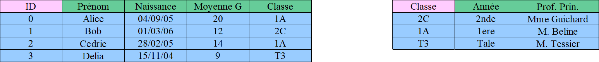

# Bases de données

## Objectifs du chapitre
À la fin de ce cours, vous devez être capables de :  
- Comprendre le modèle relationnel (tables, attributs, clés).  
- Distinguer structure et contenu d’une base de données.  
- Manipuler une base de données via SQL (interrogation et mise à jour).  
- Connaître le rôle d’un SGBD (sécurité, efficacité, persistance).  
- Porter un regard critique sur l’usage des données (confidentialité, RGPD).  

---

## 1. Introduction

Une **donnée** est une représentation élémentaire d'une information, 
exprimée sous une forme interprétable par un système informatique.

Une **base de données** est un outil permettant de stocker, organiser et manipuler de grandes quantités de données.  
Exemples :  
- Amazon → millions de commandes et utilisateurs.  
- Spotify → catalogues de musiques, playlists personnelles.  
- Un lycée → notes, emplois du temps, enseignants, salles.  

Les simples **tableaux** vus en Première ne suffisent plus : il faut un modèle plus robuste → **le modèle relationnel**.

---

## 2. Le modèle relationnel

Une **table** est une structure qui permet de stocker des données dans une base de données relationnelle.
Elle est composée :  
- de colonnes (appelées **attributs**) qui décrivent la nature des données  
- de lignes (appelées tuples ou **enregistrements**) qui contiennent les valeurs concrètes  

Voici un exemple :
La table : Eleve

Chaque attribut est défini sur un domaine de valeurs.  
Le domaine n’est pas seulement le type de donnée (entier, texte, date), mais aussi parfois des contraintes supplémentaires (ex. : âge ≥ 0, email respectant un format particulier, etc).

Pour identifier de manière unique chaque ligne (chaque enregistrement) d’une table, on utilisera ce qu'on appelle une **clé primaire** qui peut être un attribut ou un ensemble d’attributs.

- Elle doit être unique : deux lignes ne peuvent pas avoir la même valeur de clé primaire.
- Elle doit être non nulle (NOT NULL).
- Elle ne doit pas changer dans le temps (stabilité).

Exercices : Determiner la clé primaire ainsi que les domaines et contraintes des attributs de la classe Eleve.

Très souvent, la clé primaire est constituée d’un unique attribut défini comme un identifiant numérique unique et auto-incrémenté, garantissant l’unicité et la stabilité des enregistrements.

### Problèmes : Redondance et anomalies

- Professeurs répétés :  
Le professeur principal de la classe 1A (M. Beline) apparaît plusieurs fois (Alice et Cédric).  
Si le professeur principal devait changer, il faudrait alors le corriger partout, sinon incohérence.  

- Années liées aux classes :  
L’"Année" est implicitement liée à la "Classe". On stocke plusieur fois la même information : la 1A est une classe de première.

**Les anomalies :**  
- d'**insertion** : si on a veut enregistrer une classe mais qu'on a pas encore d'élève dedans on ne peut pas  
- de **mise à jour** : si un professeur change de nom, il faut le modifier partout dans la base sinon incohérence  
- de **suppression** : Si on supprime tous les élèves de la classe 1A, on perd toute les informations sur cette dernière  

Afin d’éviter les redondances et les anomalies, on sépare les informations dans plusieurs tables reliées entre elles par des clés étrangères.  
Une **clé étrangère** est un attribut (ou un ensemble d’attributs) d’une table qui fait référence à la **clé primaire d’une autre table**.  
Elle permet de **lier deux tables entre elles** et d’assurer la cohérence des données.  

Dans notre exemple, il est pertinent d'utiliser deux classes : Eleve et Classe.

### Représentation : Le schéma relationnel

Le **schéma relationnel** décrit la **structure d’une base de données** relationnelle de manière formelle.  
Il précise pour chaque table :  
- Le **nom de la table**.  
- Les **attributs** (colonnes) avec leur domaine de valeurs et leurs contraintes (type, non null, valeurs autorisées).  
- La **clé primaire**, qui identifie de manière unique chaque enregistrement.  
- Les **clés étrangères**, qui établissent les liens avec d’autres tables.  

Le schéma relationnel est indépendant des données réelles (contenu).  
Il sert de **plan directeur** pour construire, maintenir et interroger la base de données tout en garantissant l’intégrité des informations et en évitant les redondances.  

Exemple simple : 

Le symbole `#` sert à identifier les clés primaires, les attributs soulignés sont les clés étrangères référencant la clé primaire pointée par la flèche.

Grâce à ce schéma, on sait **quelles tables existent**, **comment elles sont reliées**.

---

## Exercice : Base de données pour une bibliothèque

### Énoncé

Vous devez concevoir une base de données pour gérer les informations suivantes :  

Imaginez que vous travaillez dans une bibliothèque. Votre mission est de créer un système permettant de suivre toutes les informations importantes pour gérer les livres et leurs emprunts.  

Chaque livre possède des caractéristiques comme le titre, l’auteur et la date de publication. Pour ne pas confondre deux livres identiques, chaque exemplaire dispose d’un ISBN. Les clients qui fréquentent la bibliothèque ont chacune un prénom, un nom, une date de naissance et une adresse mail. On doit pouvoir distinguer facilement chaque lecteur. Enfin, la bibliothèque souhaite suivre les emprunts : pour chaque livre prêté, on connaît la date à laquelle il a été emprunté, la date prévue de retour, le livre concerné et la personne qui l’a emprunté.  

À partir de ce scénario, réfléchissez à la meilleure façon d’organiser ces informations pour éviter les répétitions et faciliter les recherches.

**Consignes :**

1. Identifiez les **tables** nécessaires.  
2. Pour chaque table, indiquez les **attributs**, leur **domaine de valeurs** et les **contraintes**.  
3. Déterminez la **clé primaire** pour chaque table.  
4. Identifiez les **clés étrangères** pour relier les tables entre elles.  
5. Dessinez le **schéma relationnel** correspondant.

---