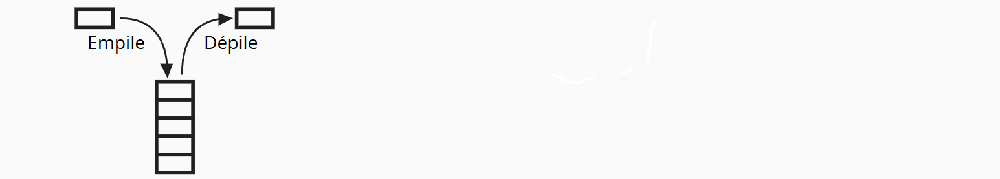

# Piles et Files

Les structures de données permettent d'organiser, de stocker et de manipuler des informations efficacement.

Dans ce chapitre, nous étudions deux structures fondamentales :

- Pile (stack) : structure LIFO (Last In, First Out).
- File (queue) : structure FIFO (First In, First Out).

## La pile

Une **pile (stack)** est une collection d'élément (comme les tuples ou les listes) qui suit le principe suivant: **LIFO -- Last In, First Out**.  
C'est-à-dire : le dernier élément ajouté est le premier retiré.

Exemples :  

- Pile d'assiettes  
- Historique de navigation  
- Appels de fonctions (pile d'exécution)

Il y a donc deux actions principales qu'elles doient pouvoir effectuer :  

- empiler : ajouter un élement à la fin  
- dépiler : enlever le dernier élément  



<span style="color:red">Exercices papier</span>  

Pour tous les exercices on considérera que le sommet de la pile se trouve à la fin de la liste.

**Trace d'execution**

On part d’une pile vide. On effectue les opérations suivantes :

- empiler(3)
- empiler(7)
- depiler()
- empiler(4)
- empiler(9)
- depiler()
- depiler()

Questions :

- Donner le contenu de la pile après chaque opération.
- Quelle valeur a été retirée à l’étape 3 ?
- Quelle est la valeur au sommet de la pile à la fin ?
- Combien d’éléments contient la pile à la fin ?

**Reconstitution**

On sait qu’après une suite d'opérations, la pile contient : [ 4, 12, 7 ].  
Et il est indiqué que 5 valeurs ont été empilées au total et 2 dépilées.  

Proposer une suite possible d’opérations `empiler()` et `depiler()` qui produit ce résultat.

<span style="color:red">Exercices python</span>

On souhaite représenter une pile en Python en utilisant une liste vide au départ.
Écrire les fonctions permettant de manipuler cette pile.

- Écrire une fonction qui renvoie une nouvelle pile vide (une liste vide).
- Écrire une fonction qui renvoie True si la pile est vide, sinon False.
- Écrire une fonction qui empile un élément.
- Écrire une fonction qui dépile un élément avant de le renvoyer (renvoie None si la pile est vide).

## La file

Une **file (queue)** est une collection d’éléments (comme les tuples ou les listes) qui suit le principe suivant : **FIFO — First In, First Out**.  
C’est-à-dire : le premier élément ajouté est le premier retiré.

Exemples :

- File d'attente à la caisse  
- File d’impression  
- Gestion des tâches dans un système d'exploitation  

Il y a donc deux actions principales qu’elle doit pouvoir effectuer :

- insérer : ajouter un élément à la fin  
- retirer : enlever l’élément au début  


<span style="color:red">Exercices papier</span>

Pour tous les exercices on considérera que la fin de la file se trouve à la fin de la liste.

**Trace d'exécution**

On part d’une file vide. On effectue les opérations suivantes :

- insérer("A")
- insérer("B")
- insérer("C")
- retirer()
- insérer("D")
- retirer()

Questions :

- Donner le contenu de la file après chaque opération.  
- Quelle valeur a été retirée à l’étape 4 ?  
- Quel est l’élément en tête de file à la fin ?  
- Combien d’éléments contient la file à la fin ?

**Reconstitution**

On sait qu’après une suite d’opérations, la file contient : [ 10, 15, 3, 8 ].

On sait aussi que **6 valeurs ont été insérées** au total.

Proposer une suite possible d’opérations `insérer()` et `retirer()` qui produit ce résultat.

<span style="color:red">Exercices python</span>

On souhaite représenter une file en Python en utilisant une liste vide au départ.  
Écrire les fonctions permettant de manipuler cette file.

- Écrire une fonction qui renvoie une nouvelle file vide (une liste vide).  
- Écrire une fonction qui renvoie True si la file est vide, sinon False.  
- Écrire une fonction qui insére un élément.  
- Écrire une fonction qui retire un élément avant de le renvoyer (renvoie None si la file est vide).

## Vers la Programmation Orientée Objet (POO)

Jusqu’ici, nous avons manipulé les piles et les files en Python à l’aide de **listes** et de **fonctions séparées**.  
Cela fonctionne, mais présente quelques limites :

- Si l’on utilise plusieurs piles ou plusieurs files, il faut bien choisir la bonne liste.  
- N’importe qui peut modifier directement la liste, ce qui peut « casser » la structure.  
- Les fonctions ne sont pas rattachées à la structure qu'elles manipulent.

Pour résoudre ces problèmes, nous devons regrouper **les données** et **les fonctions qui agissent sur ces données**. Ça tombe bien, c'est justement ce que nous permet de faire la **programmation orientée objet**.

### Créer ses propres objets : classes Pile et File

Nous allons créer deux classes :

- `Pile`
- `File`

Chaque classe devra contenir :

- **un attribut** : la liste interne (privée)  
- **des méthodes** : opérations sur la structure

Nous donnons ci-dessous uniquement **les noms des méthodes et des attributs nécessaires**.

Pour bien commencer, voici le squelette de la classe `Pile` à compléter.

```python
class Pile:
    def __init__(self):
        pass

    def __len__(self):
        """Renvoie la longueur de la pile."""
        pass

    def __str__(self):
        """Renvoie ce que doit affiche le compilateur quand on appelle la fonction print() sur l'objet"""
        return str(self.t)

    def est_vide(self):
        """Renvoie True si la pile est vide."""
        pass
__
    def empiler(self, element):
        """Ajoute element au sommet de la pile."""
        pass

    def depiler(self):
        """Retire et renvoie l'élément au sommet.
           Renvoie None si la pile est vide."""
        pass

    def sommet(self):
        """Renvoie l'élément au sommet sans le retirer.
           Renvoie None si la pile est vide."""
        pass
```

Faisons la même chose pour la classe `File` et testons les.