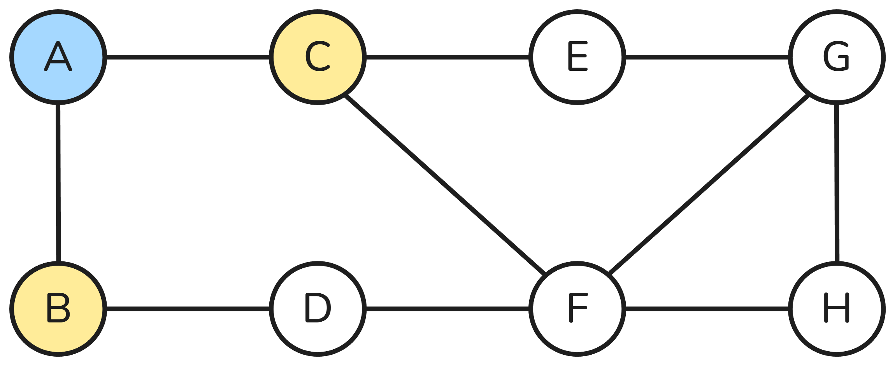
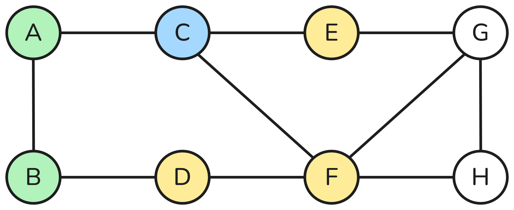
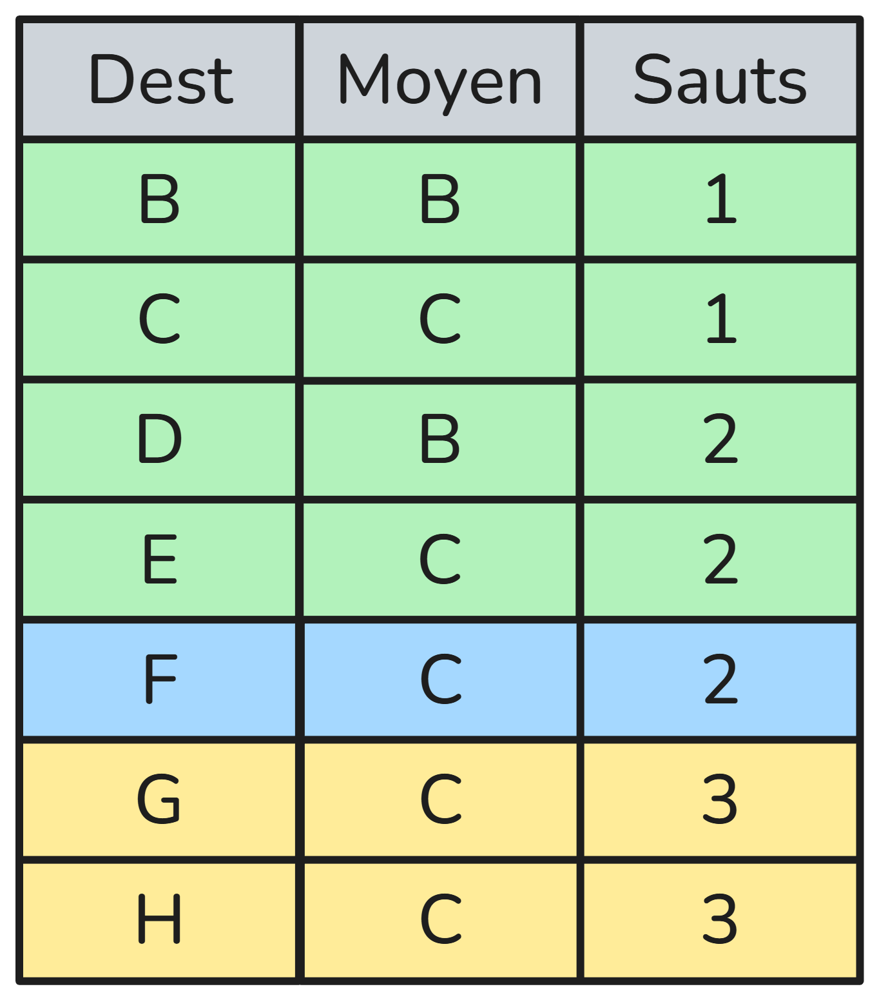
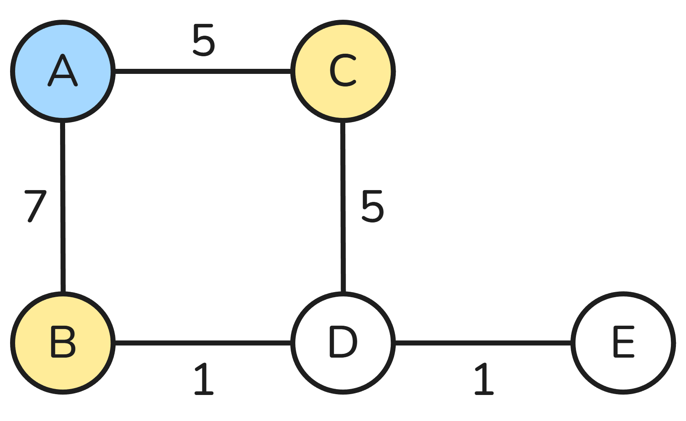

# Algorithmes de routage

Ce chapitre est une courte extension du chapitre de première sur [les réseaux](./../../../../Premieres/Chapitres/Réseaux/Réseaux)

---

## Rappel : qu'est-ce que le routage ?

Sur Internet, les données sont découpées en **paquets**. Chaque paquet doit être acheminé depuis un **ordinateur source** vers un **ordinateur destination**, en passant par plusieurs **routeurs intermédiaires**.

> Le **routage** correspond au choix du **chemin** suivi par les paquets dans un réseau.

Chaque routeur prend une décision locale : *vers quel routeur voisin envoyer le paquet ensuite ?*

---

## Modélisation d'un réseau

Pour étudier le routage, on modélise souvent un réseau sous la forme d’un **graphe**.

- Les **sommets** représentent les routeurs  
- Les **arêtes** représentent les liaisons entre routeurs  

> Le routage revient donc à un **problème de recherche de chemin dans un graphe**.

---

## Protocole RIP (Routing Information Protocol)

### Principe

Le protocole **RIP** (Routing Information Protocol) est un protocole de routage basé sur l’algorithme de **Bellman-Ford**.

- Les routeurs échangent leur **table de routage toutes les 30 secondes**
- Chaque routeur envoie sa table à ses **voisins directs**
- La métrique utilisée est le **nombre de sauts** (*hops*)

> Un **saut** correspond à un **lien** entre deux routeurs.

Chaque routeur met à jour sa table en ne conservant, pour chaque destination, que le **chemin avec le plus petit nombre de sauts**.

- Au départ, un routeur ne connaît que ses **voisins**
- Progressivement, les tables s’enrichissent
- Le réseau **converge** vers un état stable

---

### Exemple

Remplissons la table de routage de **A** :

|Graphe|Table|Description|
|--|--|--|
|||On part de **A**, connecté à **B** et **C**.|
|||On continue avec **B**.|
|||Puis **C**.|
|||On a deja vu **F**.|
||||
|||**Fini !**|

> On pourrait continuer, mais on voit bien qu'on a deja exploré tout le graphe. On ne trouvera pas de chemin plus court pour **G** et **H**.

Pour trouver **le plus court chemin vers un routeur en partant de A**, on va utiliser notre table de routage.

Par exemple pour atteindre le routeur **H** :

> Le plus court chemin de **A** vers **H** est : **A -> C -> F -> H**.

---

### Exercice

Trouver le plus court chemin de **A** vers **H** en utilisant l'algorithme du protocole **RIP**.

---

### Limites

Le protocole RIP limite le nombre de sauts à **15** :  
- **jusqu'à 15 sauts** : destination **atteignable**  
- **à partir de 16 sauts** : destination **injoignable**  

RIP est un protocole **simple**, mais il ne prend pas en compte la qualité des liens.

---

## Protocole OSPF (Open Shortest Path First)

Le protocole **OSPF** est un protocole de routage plus récent que RIP, conçu pour corriger ses limitations.  
Il est **largement utilisé sur Internet**.

OSPF est basé sur l’algorithme de **Dijkstra**, qui permet de déterminer le **chemin de coût minimal**.

- Les routeurs échangent des informations avec leurs **voisins**
- Chaque routeur **conserve ces informations en mémoire**
- Il calcule ensuite les meilleures routes à l’aide de l’algorithme de **Dijkstra**

> Contrairement à RIP, les routeurs ont une **vision plus globale du réseau**.

---

### La métrique utilisée

Avec OSPF, la métrique n’est **pas le nombre de sauts**, mais un **coût** :

- Le coût dépend de la **qualité de la liaison**
- En pratique, il est lié au **débit** de la connexion
- Le coût total d’un chemin est la **somme des coûts des liaisons**

> OSPF choisit donc le **chemin le plus rapide**, pas forcément le plus court en nombre de routeurs.

Par exemple, on pourrait representer un réseau (avec les débits des liaisons) comme ceci :

### L'algorithme de Dikstra

|Graphe|Table|Description|
|--|--|--|
|||On part de **A**.|
|||Le plus court chemin part vers **C**.|
|||On remplace chemin vers **D**.|
||||
|||**Fini!**|

On peut alors retrouver la table de routage de **A** :

|Destination|Moyen|Coût|
|--|--|--|
|B|B|7|
|C|C|5|
|D|B|8|
|E|D|9|

### Exercices

1) Rapeler les combiens il y a de **bits** dans un **kb**, un **Mb** et un **Gb** (avec des puissaces de 10).

Pour calculer le coût d'une liaison, par convention, on utilisera la formule suivante :
> $coût = 10^8 / débit$.

2) Modifier le graphe précedent en raplaçant les débits par les coûts des liaisons.

3) Appliquer l'algorithmes de Dijkstra pour faire la table de routage de **A**.

4) Comparer avec celle trouvée pour le protocole RIP. Expliquer les changements.

---

### Avantages

- Prend en compte la qualité des liens
- Adapté aux grands réseaux
- Les tables de routage ne sont recalculées que lorsqu'un changement de topologie est observé.

---

## Lien avec les algorithmes de graphes

Le routage est une application directe des **algorithmes de recherche de chemin** du chapitre sur [les graphes](./../../Graphes/graphes) que l'on verra plus tard dans l'année.

| Protocole | Type de graphe        | Algorithme associé        |
|----------|-----------------------|---------------------------|
| RIP      | Graphe non pondéré    | Parcours en largeur (BFS)|
| OSPF     | Graphe pondéré        | Algorithme de Dijkstra   |

> Les protocoles de routage sont des **applications concrètes** des algorithmes de graphes.