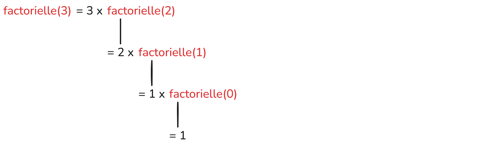

# La récursivité

## Introduction – Pourquoi parler de récursivité ?

En programmation, certains problèmes sont naturellement **auto-similaires** : ils peuvent être décrits comme une version plus simple d’eux-mêmes. C’est le cas, par exemple :

- d’un calcul mathématique (factorielle) ;
- d’une structure hiérarchique (arbre, dossiers) ;
- d’un parcours de graphe.

La **récursivité** est une manière élégante et puissante de résoudre ce type de problèmes. Elle est très utilisée en informatique, mais aussi délicate : une récursion mal conçue peut provoquer des erreurs graves (boucles infinies, dépassement de pile).

---

## Définition de la récursivité

Une **fonction récursive** est une fonction qui **s’appelle elle-même**.

Cependant, une fonction récursive correcte repose obligatoirement sur **deux éléments fondamentaux** :

1. un **cas de base** ;
2. un **appel récursif** sur un problème plus simple.

> ⚠️ Sans cas de base, la fonction s’appelle indéfiniment.

### Le cas de base

Le **cas de base** est la situation la plus simple du problème, celle pour laquelle la réponse est connue immédiatement.

Exemples :

- pour une factorielle : `0! = 1`
- pour une somme de liste : la somme d’une liste vide est `0`

Le cas de base permet à la récursion de **s’arrêter**.

### L’appel récursif

L’appel récursif correspond à l’appel de la fonction sur une version **plus simple** du problème initial.

Exemples :  

- `factorielle(n)` appelle `factorielle(n-1)`
- `somme(L)` appelle `somme(L[1:])`

Condition essentielle : à chaque appel récursif, on doit **se rapprocher du cas de base**.

---

## Exemple fondamental : la factorielle

### Définition mathématique

- `0! = 1`
- `n! = n × (n − 1)!`

Cette définition est **naturellement récursive**.

### Implémentation en Python

```python
def factorielle(n):
    if n == 0:
        return 1
    else:
        return n * factorielle(n - 1)
```

Analyse :

- le cas de base est `n == 0` ;
- l’appel récursif est `factorielle(n - 1)`.

---

## La pile d’appels (stack)

À chaque appel de fonction, Python empile les informations nécessaires à son exécution dans une **pile d’appels**.

Pour `factorielle(3)` :

- `factorielle(3)`
- `factorielle(2)`
- `factorielle(1)`
- `factorielle(0)`

Puis les retours se font dans l’ordre inverse.



---

## Récursion infinie et erreurs

Une récursion mal conçue peut provoquer :

- une **récursion infinie** ;
- une erreur de type `RecursionError` (dépassement de pile).

Causes fréquentes :

- oubli du cas de base ;
- cas de base jamais atteint ;
- problème qui ne se simplifie pas.

## Récursivité vs itération

| Récursivité | Itération |
|------------|-----------|
| Code souvent plus lisible | Plus efficace en mémoire |
| Proche de la définition du problème | Plus simple à exécuter |
| Risque de récursion infinie | Risque de boucle infinie |

---

## Bonnes pratiques

- Toujours identifier le cas de base avant de coder ;
- Vérifier que le problème se simplifie ;
- Tester sur de petites valeurs ;
- Éviter les récursions trop profondes.

---

## Exercices

### Niveau 1 – Comprendre le mécanisme

### Exercice 1 – Compter jusqu’à zéro
Écrire une fonction récursive `compte(n)` qui affiche les nombres de `n` jusqu’à `0`.

Exemple :

compte(3)

- 3
- 2
- 1
- 0


---

### Exercice 2 – Somme des entiers
Écrire une fonction récursive `somme_entiers(n)` qui calcule la somme des entiers de `1` à `n`.

---

### Exercice 3 – Puissance
Écrire une fonction récursive `puissance(a, n)` qui calcule $a^n$ (avec `n ≥ 0`).

---

### Exercice 4 – Longueur d’une liste
Écrire une fonction récursive `taille(L)` qui renvoie le nombre d’éléments de la liste `L`.

---

### Niveau 2 – Récursion et structures simples

### Exercice 5 – Somme d’une liste
Écrire une fonction récursive qui calcule la somme des éléments d’une liste.

---

### Exercice 6 – Maximum d’une liste
Écrire une fonction récursive `maximum(L)` qui renvoie le plus grand élément de `L`.
(On supposera la liste non vide.)

---

### Exercice 7 – Recherche dans une liste
Écrire une fonction récursive `appartient(x, L)` qui indique si `x` est présent dans `L`.

---

### Exercice 8 – Compter selon un critère
Écrire une fonction récursive qui compte le nombre d’éléments **positifs** dans une liste.

---

### Niveau 3 – Nombres et décomposition

### Exercice 9 – Somme des chiffres
Écrire une fonction récursive `somme_chiffres(n)` qui calcule la somme des chiffres de `n`.

Exemple :

somme_chiffres(2034)

- 9

---

### Exercice 10 – Nombre de chiffres
Écrire une fonction récursive qui renvoie le nombre de chiffres d’un entier strictement positif.

Exemple :

somme_chiffres(2034)

- 4

---

### Exercice 11 – Conversion en binaire
Écrire une fonction récursive qui affiche l’écriture binaire d’un entier positif.

Exemple :

binaire(13)

- "1101"

---

### Niveau 4 – Fibonacci et efficacité

### Exercice 12 – Suite de Fibonacci
La suite de Fibonacci est définie par :

- $F(0) = 0$
- $F(1) = 1$
- $F(n) = F(n-1) + F(n-2)$

Travail à faire :

1. Écrire une fonction récursive `fibonacci(n)`.
2. Tester la fonction pour des valeurs de plus en plus grandes.
3. Faire le schéma des appels récursifs.

---

### Niveau 5 – Récursion sur les chaînes et listes

### Exercice 13 – Palindrome
Écrire une fonction récursive `est_palindrome(mot)` qui indique si une chaîne est un palindrome.

Exemples :

"radar"

- True

"python"

- False

---

### Exercice 14 – Inverser une liste
Écrire une fonction récursive qui renvoie une nouvelle liste contenant les éléments de `L` dans l’ordre inverse.

---

### Niveau 6

### Exercice 15 – Recherche dichotomique
On suppose la liste triée.

Écrire une fonction récursive qui recherche un élément dans une liste par **dichotomie**.