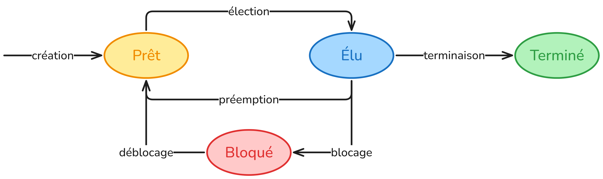
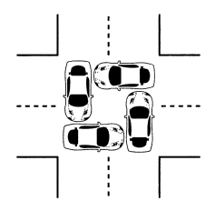

# Gestion des processus et des ressources

## Qu'est-ce qu'un processus ?

### Programme vs Processus

Un **programme** est un fichier stocké sur le disque : c'est une suite d'instructions écrites par un développeur, figée, qui attend d'être exécutée. Un **processus**, c'est ce même programme en train de s'exécuter en mémoire. C'est une entité dynamique, qui consomme des ressources (mémoire, temps accordé par le processeur, accés à des périphériques).

Concrètement, quand on double-clique sur un logiciel, le système d'exploitation crée un processus : il charge le programme en RAM, lui alloue des ressources, et lui donne la main sur le processeur.

Un même programme peut donner naissance à plusieurs processus simultanément. Par exemple, si on ouvre deux fenêtres de navigateur, deux processus distincts s'exécutent en parallèle.

---

### Création d'un processus

Sur un système Linux, chaque processus est créé par un autre processus : c'est le mécanisme du **fork**. Le processus qui crée s'appelle le **processus parent**, celui qui est créé s'appelle le **processus fils**.

Au démarrage de la machine, le tout premier processus lancé est `init` (ou `systemd` sur les systèmes modernes). Il a le **PID 1** (Process IDentifier = numéro unique attribué à chaque processus). Tous les autres processus en descendent.

```
init (PID 1)
├── systemd-journald (PID 45)
├── sshd (PID 312)
│   └── bash (PID 891)
│       └── python3 (PID 1024)
└── Xorg (PID 502)
    └── firefox (PID 788)
        ├── firefox (PID 789)
        └── firefox (PID 790)
```

La création d'un processus suit ces étapes :

1. Le processus parent appelle la fonction `fork()` : le système crée un nouveau processus
2. Le fils reçoit un **PID** unique
3. Le fils appelle `exec()` pour exécuter son programme
4. Le système alloue de la **mémoire**, des **descripteurs de fichiers**, un espace de **pile** au nouveau processus

---

### Les états d'un processus

Un processus ne tourne pas en permanence sur le processeur. Il passe par différents **états** au cours de sa vie :

| État | Description |
|---|---|
| **Prêt** | Le processus attend que le CPU soit disponible |
| **Élu** | Le processus utilise le CPU en ce moment |
| **Bloqué** | Le processus attend une ressource (lecture disque, réseau...) |
| **Terminé** | Le processus a fini son exécution |



---

### Les processus zombies

Quand un processus termine, il ne disparaît pas immédiatement. Il passe dans un état spécial appelé zombie : il n'existe plus vraiment (il n'exécute plus rien, il ne consomme plus de CPU), mais son entrée reste dans la table des processus du système.

Pourquoi ? Parce que le système d'exploitation conserve son code de retour : une valeur que le processus laisse en mourant pour signaler s'il s'est terminé normalement ou avec une erreur. Ce code de retour doit être lu par le processus parent via un appel système appelé ``wait()``. Tant que le parent ne l'a pas lu, le processus reste zombie.

---

## Observer les processus sur une machine

### La commande `ps`

La commande `ps` (process status) affiche un instantané des processus actifs.

```bash
ps aux
```

```
USER       PID  %CPU %MEM    VSZ   RSS   STAT  COMMAND
root         1   0.0  0.1  22544  4096   Ss    /sbin/init
alice      788   2.1  3.4 512048 69120   Sl    firefox
alice      891   0.0  0.1   8192  2048   S     bash
alice     1024   0.8  0.5  15360  9216   R     python3 script.py
```

Les colonnes importantes :

| Colonne | Signification |
|---|---|
| `PID` | Identifiant unique du processus |
| `%CPU` | Pourcentage d'utilisation du processeur |
| `%MEM` | Pourcentage de RAM utilisée |
| `STAT` | État du processus (`R`=running, `S`=sleeping, `Z`=zombie...) |
| `COMMAND` | Nom du programme |

### La commande `top`

La commande `top` affiche les processus en **temps réel**, actualisés automatiquement. Elle permet de voir les processus qui consomment le plus de ressources.

```bash
top
```

### La commande `kill`

Pour arrêter un processus, on utilise la commande `kill` suivie du PID :

```bash
kill 1024        # demande au processus 1024 de se terminer proprement
kill -9 1024     # force l'arrêt immédiat (signal SIGKILL)
```

### La commande `pstree`

La commande `pstree` affiche la hiérarchie des processus sous forme d'arbre :

```bash
pstree
```

```
systemd─┬─sshd───bash───python3
        ├─Xorg
        └─firefox─┬─firefox
                  └─firefox
```

---

## Ordonnancement des processus
 
### Le problème du partage du CPU
 
Un ordinateur moderne peut avoir des dizaines, voire des centaines de processus actifs en même temps. Pourtant, un processeur ne peut exécuter qu'**un seul processus à la fois** sur chacun de ses cœurs.
 
Le rôle de l'**ordonnanceur** (scheduler) est de décider quel processus a le droit d'utiliser le CPU, et pendant combien de temps. C'est l'une des fonctions les plus critiques du système d'exploitation.
 
Deux notions importantes pour évaluer un ordonnancement :
 
- **Temps de séjour** d'un processus : durée entre son arrivée et sa fin d'exécution
- **Temps d'attente** d'un processus : durée pendant laquelle il a attendu sans s'exécuter (= temps de séjour − durée d'exécution)
 
---
 
### Les algorithmes d'ordonnancement
 
Plusieurs stratégies existent. On va les illustrer avec le même exemple simple dans chaque cas.
 
**Exemple de référence :** trois processus arrivent dans cet ordre :
 
| Processus | Arrivée | Durée d'exécution |
|---|---|---|
| P1 | t = 0 | 4 cycles |
| P2 | t = 1 | 2 cycles |
| P3 | t = 2 | 5 cycles |
 
---
 
#### FIFO — Premier arrivé, premier servi
 
Le processus qui arrive en premier est exécuté jusqu'à la fin, puis on passe au suivant, et ainsi de suite. C'est la stratégie la plus intuitive.
 
**Déroulement :**

- t=0 : P1 arrive → le CPU est libre, P1 s'exécute
- t=1 : P2 arrive → le CPU est occupé par P1, P2 attend
- t=2 : P3 arrive → le CPU est occupé par P1, P3 attend
- t=4 : P1 termine → P2 est le suivant dans la file
- t=6 : P2 termine → P3 s'exécute
- t=11 : P3 termine
```
t :  0    1    2    3    4    5    6    7    8    9    10   11
     ├────┴────┴────┴────┼────┴────┼────┴────┴────┴────┴────┤
     │       P1          │   P2    │           P3           │
```
 
| Processus | Arrivée | Fin | Séjour | Attente |
|---|---|---|---|---|
| P1 | 0 | 4 | 4 | 0 |
| P2 | 1 | 6 | 5 | 3 |
| P3 | 2 | 11 | 9 | 4 |
 
> **Problème :** si P1 était très long (100 cycles), P2 et P3 attendraient très longtemps même s'ils n'ont besoin que de quelques cycles. C'est le problème du **convoi** : les petits processus sont bloqués derrière un gros.
 
---
 
#### SJF — Shortest Job First (plus court en premier)
 
Quand le CPU se libère, l'ordonnanceur choisit parmi les processus **en attente** celui qui a la **durée d'exécution la plus courte**.
 
**Déroulement :**

- t=0 : seul P1 est là → P1 s'exécute (pas le choix)
- t=1 : P2 arrive, mais P1 tourne, il attend
- t=2 : P3 arrive, il attend aussi
- t=4 : P1 termine. File d'attente : P2 (2 cycles), P3 (5 cycles) → on choisit **P2**
- t=6 : P2 termine. Il ne reste que P3 → P3 s'exécute
- t=11 : P3 termine
```
t :  0    1    2    3    4    5    6    7    8    9    10   11
     ├────┴────┴────┴────┼────┴────┼────┴────┴────┴────┴────┤
     │       P1          │   P2    │           P3           │
```
 
> Dans cet exemple FIFO et SJF donnent le même résultat car P1 est arrivé seul. L'intérêt de SJF se voit quand plusieurs processus sont déjà en attente au moment où le CPU se libère.
 
---
 
#### SRT — Shortest Remaining Time (plus petit temps restant)
 
C'est une version **préemptive** du SJF : l'ordonnanceur peut interrompre un processus en cours si un nouveau processus arrive avec un temps restant plus court.
 
**Déroulement :**

- t=0 : P1 (4 cycles restants) s'exécute
- t=1 : P2 arrive avec 2 cycles. P1 a 3 cycles restants. 2 < 3 → on **interrompt P1**, P2 prend la main
- t=2 : P3 arrive avec 5 cycles. P2 a 1 cycle restant. 1 < 5 → P2 continue
- t=3 : P2 termine. File : P1 (3 cycles), P3 (5 cycles) → P1 reprend
- t=6 : P1 termine → P3 s'exécute
- t=11 : P3 termine
```
t :  0    1    2    3    4    5    6    7    8    9    10   11
     ├────┼────┴────┼────┴────┴────┼────┴────┴────┴────┴────┤
     │ P1 │   P2    │      P1      │           P3           │
```
 
| Processus | Arrivée | Fin | Séjour | Attente |
|---|---|---|---|---|
| P1 | 0 | 6 | 6 | 2 |
| P2 | 1 | 3 | 2 | 0 |
| P3 | 2 | 11 | 9 | 4 |
 
---
 
#### Round Robin (tourniquet)
 
Chaque processus reçoit un **quantum de temps** fixe (par exemple 2 cycles). Quand son quantum est écoulé, il est mis en fin de file et le suivant prend la main. C'est l'algorithme le plus utilisé sur les systèmes interactifs modernes.
 
**Déroulement** (quantum = 2) :

- t=0 : P1 s'exécute (quantum : 2 cycles)
- t=2 : quantum de P1 écoulé. File : P2, P3. → P2 prend la main
- t=4 : P2 termine (il n'avait que 2 cycles). File : P3, P1. → P3 prend la main
- t=6 : quantum de P3 écoulé. File : P1, P3. → P1 prend la main
- t=8 : P1 termine. File : P3. → P3 reprend
- t=10 : quantum de P3 écoulé, mais il n'a plus qu'1 cycle → continue
- t=11 : P3 termine
```
t :  0    1    2    3    4    5    6    7    8    9    10   11
     ├────┴────┼────┴────┼────┴────┼────┴────┼────┴────┴────┤
     │   P1    │   P2    │   P3    │   P1    │      P3      │
```
 
> L'illusion du multitâche vient de là : les changements sont si rapides (quelques millisecondes) que l'utilisateur a l'impression que tout tourne en même temps.
 
---
 
### Comparaison des algorithmes
 
| Algorithme | Avantages | Inconvénients |
|---|---|---|
| FIFO | Simple à implémenter | Les processus longs bloquent les courts |
| SJF | Réduit l'attente moyenne | Nécessite de connaître les durées à l'avance |
| SRT | Optimal pour le temps d'attente moyen | Nombreuses interruptions, complexe |
| Round Robin | Équitable, très réactif | Overhead des changements de contexte |
 
---
 
### Exercice
 
Le processeur doit exécuter les 4 processus suivants :
 
| Processus | Cycle d'arrivée | Durée (en cycles) |
|---|---|---|
| P1 | 0 | 8 |
| P2 | 1 | 4 |
| P3 | 3 | 2 |
| P4 | 4 | 6 |
 
**1.** Dessiner le chronogramme de l'ordonnancement **FIFO** (premier arrivé, premier servi).
 
**2.** Dessiner le chronogramme **SJF** : quand le CPU se libère, le processus en attente avec la durée la plus courte est exécuté en premier.
 
**3.** Dessiner le chronogramme **SRT** : quand un nouveau processus arrive, l'ordonnanceur compare le temps restant de chacun et peut interrompre le processus en cours si le nouveau est plus court.
 
**4.** Dessiner le chronogramme **Round Robin** avec un quantum de 3 cycles.
 
**5.** Pour chacune de ces quatre méthodes, calculer le temps de séjour et le temps d'attente de chaque processus, puis les moyennes.
 
**6.** Comparer les résultats. Quelle méthode est la plus efficace ? Quelle méthode est la plus équitable ? Expliquer pourquoi ces deux objectifs peuvent être contradictoires.

---

## L'interblocage (Deadlock)

### Le problème

Un **interblocage** (ou *deadlock*) survient quand deux processus ou plus se bloquent mutuellement en attendant chacun une ressource que l'autre détient. Aucun ne peut avancer, aucun ne peut libérer ce qu'il tient. Le système est figé.

### Exemple concret

Imaginons deux processus P1 et P2, et deux ressources R1 (une imprimante) et R2 (un scanner) :

```
1. P1 obtient R1 (l'imprimante)
2. P2 obtient R2 (le scanner)
3. P1 demande R2  → bloqué, P2 l'a déjà
4. P2 demande R1  → bloqué, P1 l'a déjà
   ──────────────────────────────────────
   → Plus personne ne peut avancer !
```



### Les quatre conditions de Coffman

En 1971, Edward Coffman a montré que quatre conditions doivent être réunies **simultanément** pour qu'un interblocage se produise :

| Condition | Description |
|---|---|
| **Exclusion mutuelle** | Une ressource ne peut être utilisée que par un seul processus à la fois |
| **Possession et attente** | Un processus détient une ressource et attend d'en obtenir une autre |
| **Non-préemption** | On ne peut pas forcer un processus à libérer une ressource |
| **Attente circulaire** | Chacun attendant une ressource tenue par le suivant |

> Il suffit d'**empêcher l'une de ces conditions** pour éviter tout interblocage.