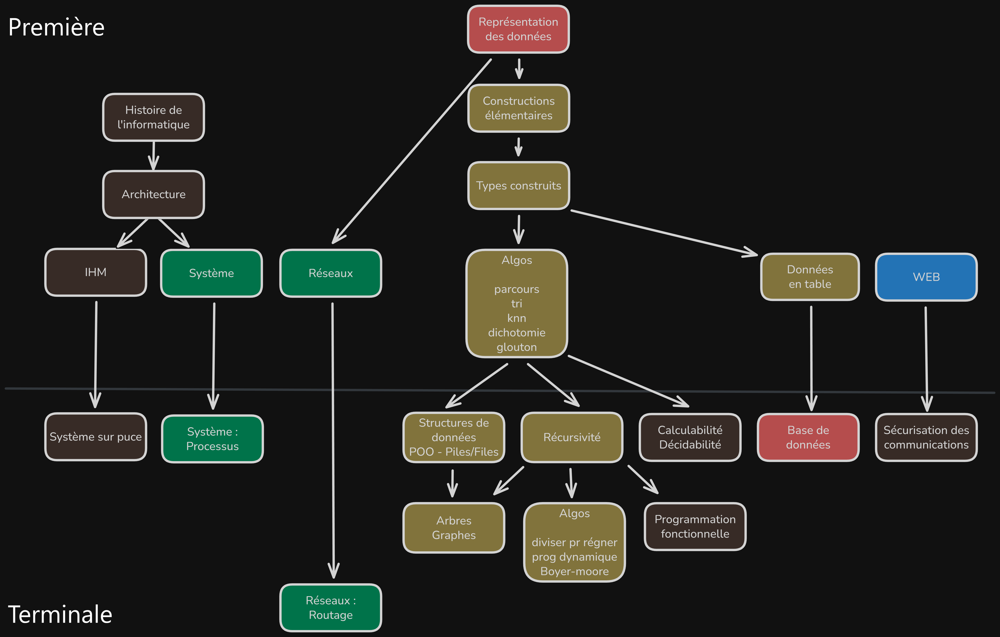

# NSI - Terminales

## Révisions

- [Rappels de premières](rappel.md)
- [Exercices de révision](revisions.md)

## Chapitres

- [🟦 1 - Programmation Orienté Objet](Chapitres/POO.md)
- [🟦 2 - Piles & Files](Chapitres/Piles&Files/Piles&Files.md)
- [🟨 3 - Bases de Données](Chapitres/BDD.md)

## Annales du BACCALAURÉAT GÉNÉRAL de NSI

Les annales du bac de nsi sont disponibles sur le site [sujetdebac.fr](https://www.sujetdebac.fr/annales/specialites/spe-numerique-informatique/).

## Plan des chapitres

